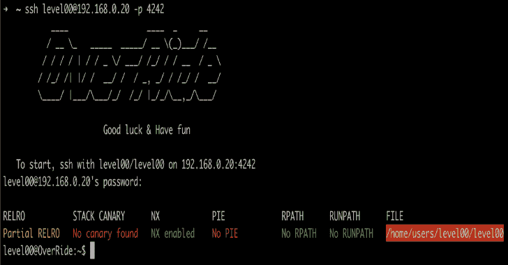
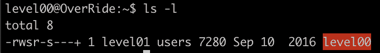
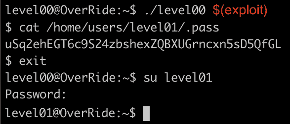

# 覆盖:二进制开发和逆向工程

> 原文：<https://kalilinuxtutorials.com/override/>

**OverRide** 是一个探索反汇编，二进制开发&逆向工程通过 10 个小挑战。

在每个级别的文件夹中，您可以找到:

*   **标志**–下一级密码
*   **readme . MD**–如何找到密码
*   **source . c**–逆向工程的二进制文件
*   **disassembly _ notes . MD**–ASM 上的注释

详见[主题](https://github.com/anyashuka/Override/blob/main/subject.pdf)。

**入门**

先从 42 [*OverRide.iso*](https://projects.intra.42.fr/uploads/document/document/2096/OverRide.iso) 下载。

**虚拟机设置**

在 Mac OSX 上，安装 [VirtualBox](https://www.virtualbox.org/) 。

在 VirtualBox 中创建一个新的虚拟机(单击“新建”)。

*   名称和操作系统–类型:Linux，版本:(Oracle 64 位)

使用默认设置继续完成所有后续步骤:

*   内存大小:4MB
*   硬盘:立即创建磁盘
*   硬盘文件类型:VDI(VirtualBox 磁盘映像)
*   物理硬盘上的存储:动态分配
*   文件大小:12，000 GB

接下来单击设置>网络>适配器 1 >连接到:桥接适配器。

仍然在设置中点击存储>在“控制器:IDE”的右边，有一个带+号的 CD 图标(添加光驱)。点击添加磁盘镜像，选择 *OverRide.iso* 。

单击 Start 启动虚拟机，一旦运行，它应该显示虚拟机的 IP 地址，并提示用户登录。

**SSH 连接**

使用用户 *level00* 和密码 *level00* 从单独的 shell 登录。

**ssh level00@{VM_IP} -p 4242**

**升一级**

作为用户 *level00* ，目标是读取用户 *level01* 的密码，该密码位于 */home/users/level01/。通过*。但是，用户 *level00* 没有权限读取该文件。

在用户*的主文件夹中，级别 00* 是一个二进制的*级别 00* ，设置了 SUID，拥有者*级别 01* 。

这意味着当我们执行二进制文件 *level00* 时，我们使用用户 *level01* 的权限来执行。

我们必须用 gdb 找到二进制 *level00* 中的漏洞。然后利用漏洞运行*系统("/bin/sh")* ，以用户 *level01* 身份打开一个 shell，在这里我们有权限读取密码。

**cat /home/users/level01/。通过**

然后以用户 *level01* 身份登录。

**苏 level01**

对每个级别重复上述步骤。

**逆向工程二进制码**

对于每个级别，我们通过检查二进制文件的 gdb 反汇编对原始的 *source.c* 进行逆向工程。

**关卡概述**

*   [0](https://github.com/anyashuka/Override/tree/main/level00)–硬编码密码
*   [1](https://github.com/anyashuka/Override/tree/main/level01)–ret 2 libc 攻击
*   [2](https://github.com/anyashuka/Override/tree/main/level02)–printf()格式字符串攻击
*   [3](https://github.com/anyashuka/Override/tree/main/level03)–暴力破解密码
*   [4](https://github.com/anyashuka/Override/tree/main/level04)–gets()堆栈溢出+返回到 libc 攻击
*   [5](https://github.com/anyashuka/Override/tree/main/level05)–env 变量中的外壳代码+ printf()格式的字符串攻击
*   [6](https://github.com/anyashuka/Override/tree/main/level06)–可通过 gdb 发现的哈希值
*   [7](https://github.com/anyashuka/Override/tree/main/level07)–ret 2 libc 攻击未受保护的数据表
*   [8](https://github.com/anyashuka/Override/tree/main/level08)–二进制通过符号链接备份密码
*   [9](https://github.com/anyashuka/Override/tree/main/level09)–一个误差