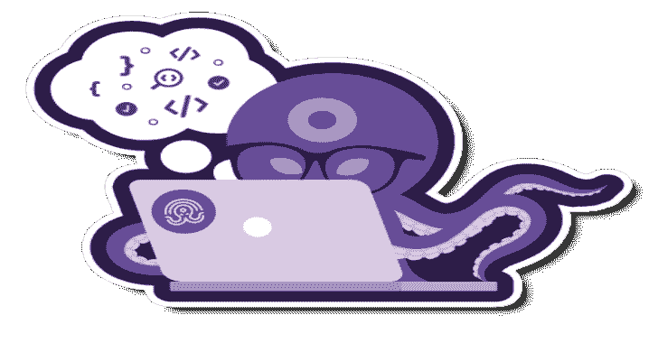
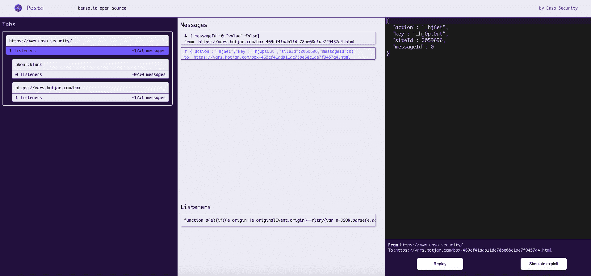
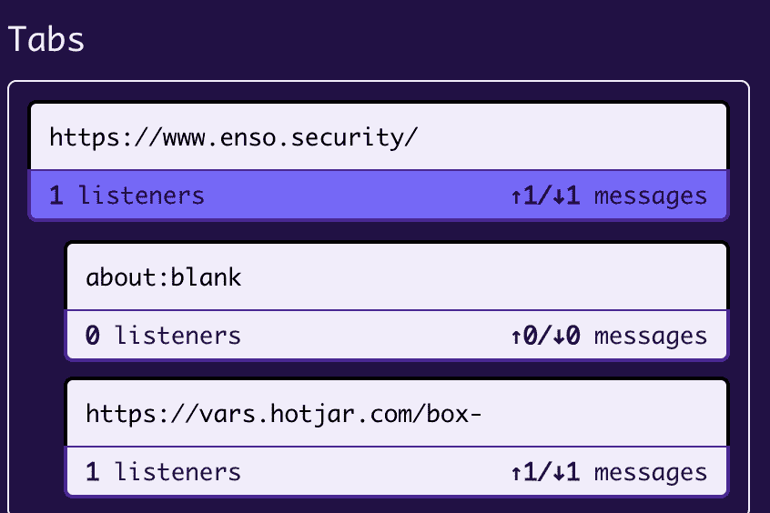
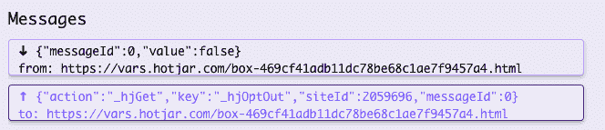
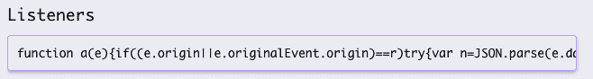
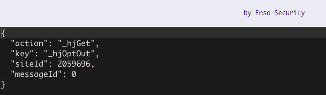
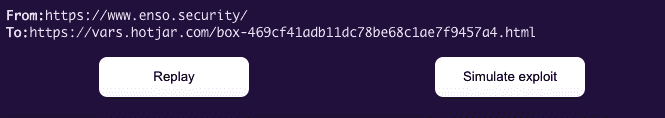
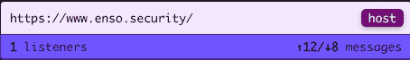
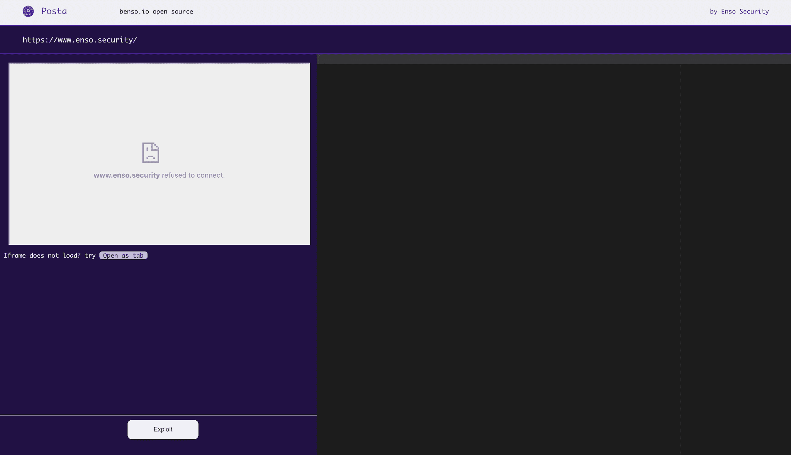

# Posta:跨文档消息安全研究工具

> -= the last fantasy =-荣誉出品本字幕仅供学习交流，严禁用于商业途径

Posta 是一个研究跨文档信息交流的工具。它允许您跟踪、探索和利用`postMessage`漏洞，并包括在任何连接的浏览器中重放窗口之间发送的消息等功能。

**先决条件**

*   谷歌浏览器/ Chromium
*   [Node.js](https://nodejs.org/en/download/) (可选)

**安装**

**开发环境**

在带有专用浏览器(Chromium)的完整开发环境中运行 Posta:

*   安装 *Posta*

git 克隆 https://github.com/benso-io/posta
CD posta
NPM 安装

*   使用以下命令启动专用的 Chromium 会话:

**邮件节点<URL>t1**

*   单击 Posta 扩展导航到用户界面

开发模式包括一个本地 web 服务器，为一个小型测试站点和漏洞页面提供服务。在开发模式下运行时，您可以访问位于[http://localhost:8080/exploit/](http://localhost:8080/exploit/)的漏洞利用页面

**镀铬扩展**

运行 *Posta* 作为铬/铬扩展

克隆回购:

git 克隆 https://github.com/benso-io/posta.git

1.  导航至`c**hro**me://extensions`
2.  确保**开发者模式**已启用
3.  点击**加载解包**
4.  在 *Posta* 中选择`chrome-extension`目录，并上传到你的浏览器
5.  加载扩展
6.  将扩展固定到您的浏览器
7.  浏览到您想要检查的网站
8.  点击 *Posta* 扩展导航到用户界面

**标签页**

在**选项卡**部分，我们可以找到我们的主源，以及它通过会话托管和通信的 iframes。我们可以通过点击它来选择特定的帧，并且只观察与该帧相关的 postMessages。

**消息**

在*消息*部分，我们可以检查从源发送到 iframes 的所有`postMessage`流量，反之亦然。我们可以通过单击来选择特定的通信进行进一步检查。*监听器*区展示负责处理通信的代码，我们可以点击复制其内容进行 JS 代码观察。

**控制台**

在控制台部分，我们可以修改原始的`postMessage`流量，并重放带有被篡改值的消息，这些消息将从源发送到它的 iframe。

我们应该进行测试，看看是否可以通过改变`postMessage`内容来影响网站的行为。如果我们设法这样做，它的时间来尝试和利用如果从一个不同的来源，通过点击"模拟利用"。

**利用**

单击“主机”按钮，以导航到开发窗口。

在 *Exploit* 部分， *Posta* 将尝试作为 iframe 托管指定的源，以便发起`postMessage`通信。大部分时间我们不能这样做，因为 X-Frame-Options 在 origin 网站上被启用了。

因此，为了继续我们的开发，我们需要通过启动`window.open`方法来获得与我们的源的通信参考，这可以通过点击**“打开为标签”**来实现。

我们右边的控制台将帮助我们修改和制作我们指定的有效载荷，并在跨源通信中测试它们，通过点击 **Exploit** 按钮启动。

[**Download**](https://github.com/benso-io/posta)