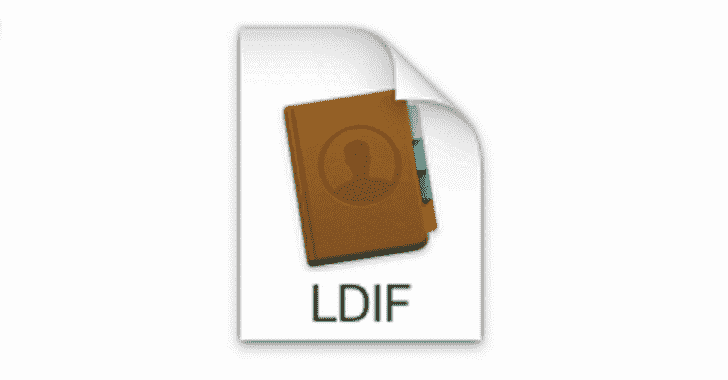

# LDS view:LDIF 格式的 LDAP 目录转储的离线搜索工具

> 原文：<https://kalilinuxtutorials.com/ldsview/>

Ldsview 是一个离线搜索工具，用于 LDIF 格式的 LDAP 目录转储。

**特性**

*   LDIF 文件的快速高效内存解析
*   构建 **`ldapsearch`** 命令从目录中提取 LDIF
*   显示目录结构
*   UAC 和目录时间格式翻译

**配置**

配置选项可以作为 CLI 标志、环境变量或通过 [viper](https://github.com/spf13/viper) 的配置文件 courtsey 传递。请参考项目文档，了解提供配置的所有不同方式。

*   默认情况下，`**ldsview**`会在用户的主目录中查找名为`**.ldsview.{json,toml,yaml}**`的文件
*   前缀为`**LDSVIEW**`的环境变量将由应用程序读入。

**用途**

详细的使用信息可通过`**ldsview**`和所有子命令的`**--help**`标志或`**help**`命令获得。

**搜索语法**

**`ldsview`**的搜索机制基于 [entityfilter](https://github.com/kgoins/entityfilter) 项目。关于搜索过滤器语法的详细信息可以在那个项目的 [README](https://github.com/kgoins/entityfilter/blob/master/README.md) 中找到。

**例题**

*   构建`**ldapsearch**`命令从目录中提取 LDIF 文件:`**ldsview cmdbuilder**`
    *   该命令将提示您输入所需的任何信息
    *   准备好以下物品:
        *   目录主机 FQDN 或 IP
        *   域 DN
        *   运行时使用的用户
        *   用户的密码
*   快速查找 LDIF 文件中的特定实体:`**ldsview -f myfile.ldif entity myuser**`
*   解析广告中的 UAC 标志:`**ldsview uac 532480**`
*   搜索 LDIF 文件:`**ldsview -f myfile.ldif search "adminCount:=1,sAMAccountName:!=krbtgt"**`
    *   该命令将返回所有非`**krbtgt**`的`**adminCount**`为 1 的实体
    *   `**-i**`可用于限制匹配实体返回哪些属性
    *   `**--tdc**`将把目录时间戳翻译成人类可读的格式

**工具目录**

用于管理 LDIFs 的其他工具和实用程序:

**Makefile** :将 Makefile 放在与导出的 LDIF 相同的目录中，并运行 make。

**> >令-j9 LDIF=。/my.domain.ldif**

这将拆分并创建以下默认 LDIFs:

*   users.ldif
*   计算机. ldif
*   groups.ldif
*   域 _ 管理. ldif
*   poss_svc_accnts.ldif
*   pass_not_reqd.ldif
*   pass_cant_change.ldif
*   users_dont_expire.ldif
*   trusted_4_delegation.ldif
*   preauth_not_reqd.ldif
*   password_expired.ldif
*   trust2auth4delegation.ldif

[**Download**](https://github.com/kgoins/ldsview)