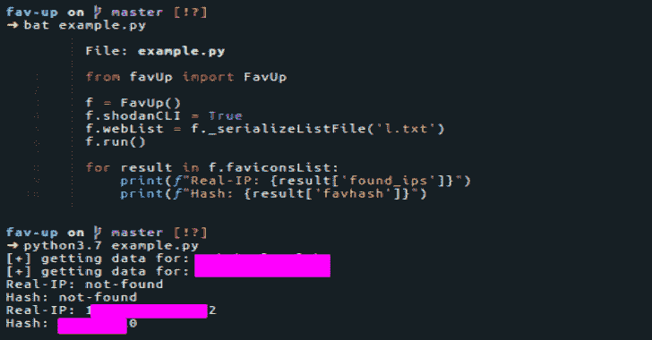
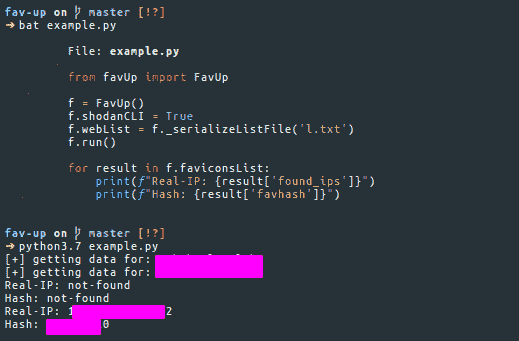
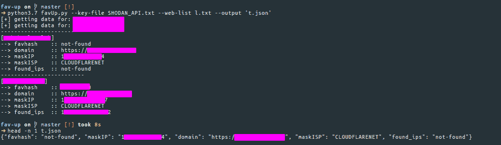

# Fav-Up:通过 Favicon 使用 Shodan 进行 IP 查找

> 原文：<https://kalilinuxtutorials.com/fav-up/>

F **av-Up** 是一个从 favicon 图标开始使用 Shodan 查找真实 IP 的工具。

**安装**

**pip 3 install-r requirements . txt**

Shodan API 密钥(**不是**自由密钥)

**用途**

CLI

首先定义如何传递 API 键:

*   **`-k`或`--key`** 将密钥传递给 stdin
*   **`-kf`或`--key-file`** 来传递从中获取密钥的文件名
*   **`-sc`或`--shodan-cli`** 从 Shodan CLI 获取密钥(如果您已初始化)

到目前为止，这个工具有三种不同的使用方式

*   **`-ff`或`--favicon-file` :** 你在本地存储一个你想查找的图标
*   **`-fu`或`--favicon-url` :** 你不在本地存储图标，但你知道它所在的确切网址
*   **`-w`或`--web` :** 你不知道 favicon 图标的网址，但你仍然知道它在那里
*   **`-fh`或`--favicon-hash` :** 你知道 hash，想搜索整个互联网。

您可以指定输入文件，其中可能包含域的 URL、favicon 图标或本地存储图标的简单位置:

*   **`-fl`，`--favicon-list` :** 该文件包含了您要查找的所有图标的完整路径
*   **`-ul`，`--url-list` :** 该文件包含您要查找的所有图标的完整 URL
*   **`-wl`，`--web-list` :** 包含您要查找的所有域

您也可以将结果保存到 CSV/JSON 文件中:

**`-o`，`--output` :** 指定输出和格式，例如:`**results.csv**`将保存到一个 CSV 文件(该类型由输出文件的扩展名自动识别)

**例题**

*   **图标-文件**

**python 3 favup . py–favicon-file favicon . ico-sc**

*   **图标网址**

**python 3 favup . py–favicon-URL https://domain.behind.cloudflare/assets/favicon.ico-sc**

*   **网页**

**python 3 faup . py–web domain . behind . cloud flare-sc**

**模块**

**从 favUp 导入 favUp
f = favUp()
f . shodancli = True
f . web = " domain . behind . cloud flare "
f . show = True
f . run()
for result in f . faviconslist:
print(f " Real-IP:{ result[' found _ IPS ']} "
print(f " Hash:{ result[' fav Hash ']} "**

**所有属性**

| 可变的 | 类型 |
| --- | --- |
| FavUp.show | 弯曲件 |
| FavUp.key | 潜艇用热中子反应堆（submarine thermal reactor 的缩写） |
| FavUp.keyFile | 潜艇用热中子反应堆（submarine thermal reactor 的缩写） |
| FavUp.shodanCLI | 弯曲件 |
| FavUp.faviconFile | 潜艇用热中子反应堆（submarine thermal reactor 的缩写） |
| FavUp.faviconURL | 潜艇用热中子反应堆（submarine thermal reactor 的缩写） |
| FavUp .网路 | 潜艇用热中子反应堆（submarine thermal reactor 的缩写） |
| FavUp.shodan | 肖丹级 |
| FavUp.faviconsList | 列表[词典] |

**faup . faviconslist**存储所有结果，关键字段取决于您想要执行的查找类型。

*   对于**–favicon-file 或–favicon-list:**
    *   **favhash** 存储图标图标的散列值
    *   **文件**存储路径
*   如果是–favicon-URL 或–URL-list:
    *   **favhash** 存储图标图标的散列值
    *   **url** 存储图标图标的 url
    *   **域**存储域名
    *   **maskIP** 存储“假”IP(例如 cloud flare IP)
    *   **maskISP** 存储与 maskIP 相关的 ISP 名称
*   如果是–web 或–web-list:
    *   **favhash** 存储图标图标的散列值
    *   **域**存储域名
    *   **maskIP** 存储“假”IP(例如 cloud flare IP)
    *   **maskISP** 存储与 maskIP 相关的 ISP 名称

(在这种情况下，favicon 图标的 URL 由 HTML 元素的 href 属性返回)

如果在搜索 favicon 图标时，没有找到任何有用的内容，将返回 not-found。

在所有这三种情况下，都会为每个选中的条目添加 found_ips 字段。如果未找到任何 IP，将显示“未找到”

**兼容性**

由于辛辣的语法，至少需要`python3.6`。

**免责声明**

该工具仅用于教育目的。作者和贡献者对此工具的误用不承担任何责任。使用风险自担！

[**Download**](https://github.com/pielco11/fav-up#cli)