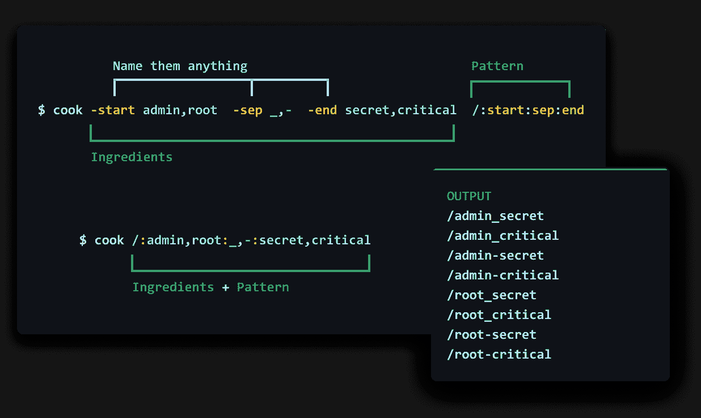
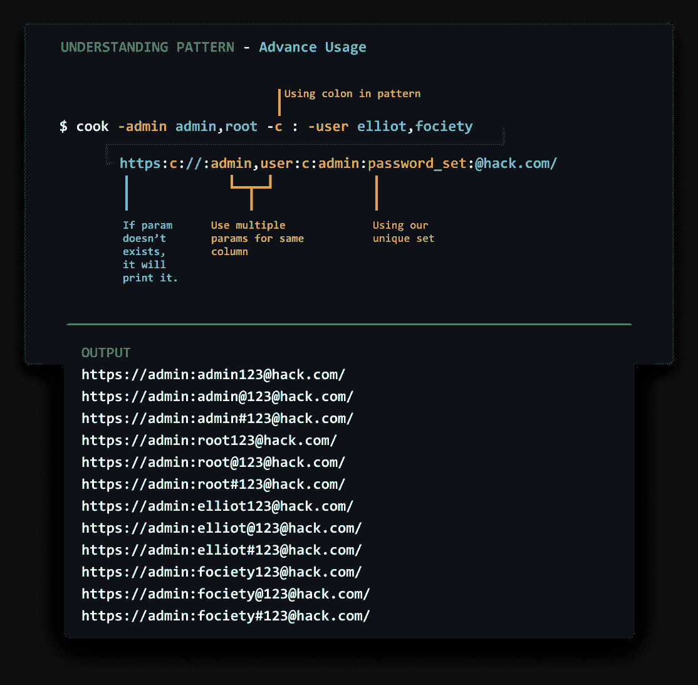
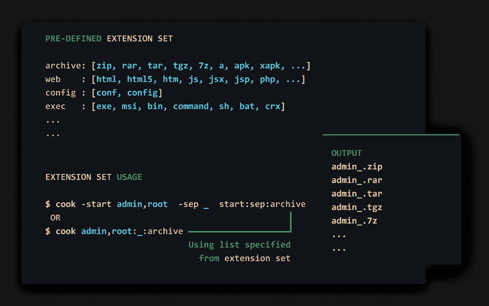
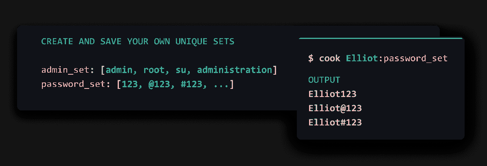
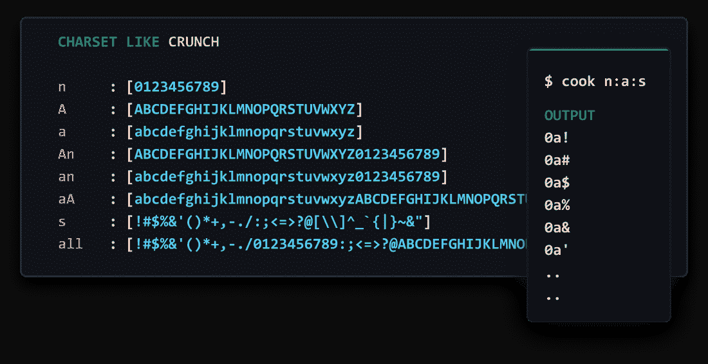
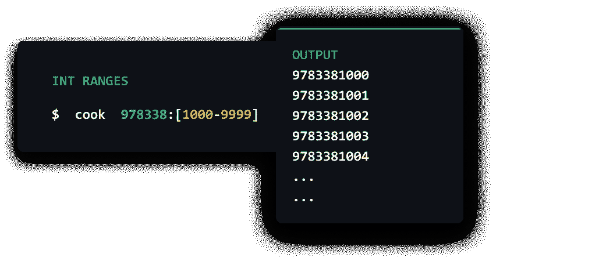
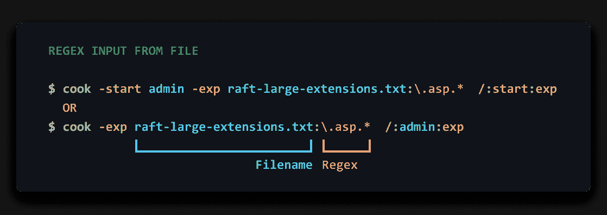
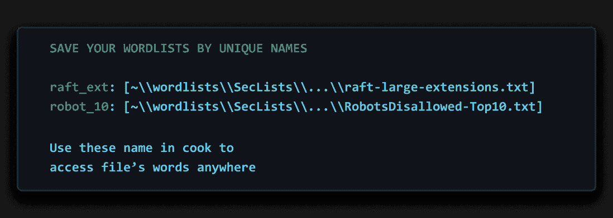
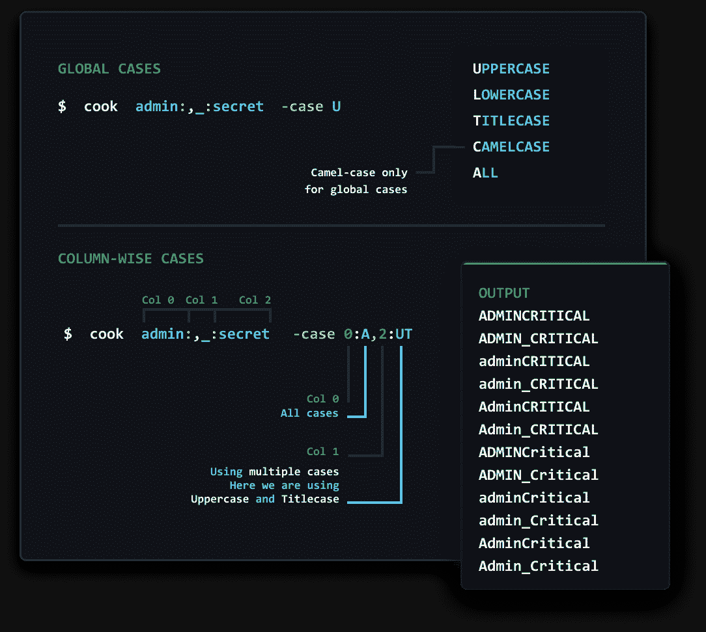

# Cook:一个可定制的单词表和密码生成器

> 原文：<https://kalilinuxtutorials.com/cook/>

库克是一个可定制的单词表和密码生成器。使用预定义的扩展集、单词和模式/功能轻松创建单词的排列和组合，以创建复杂的端点、单词列表和密码。简单的 UX，结帐使用。

*   [安装](https://github.com/giteshnxtlvl/cook#installation)
*   使用
    *   [基本排列](https://github.com/giteshnxtlvl/cook#basic-permutation)
    *   [高级排列](https://github.com/giteshnxtlvl/cook#advance-permutation)
    *   [定制工具](https://github.com/giteshnxtlvl/cook#customizing-tool)
*   预定义集合
    *   [扩展集](https://github.com/giteshnxtlvl/cook#predefined-sets)
    *   [文字集](https://github.com/giteshnxtlvl/cook#create-your-own-unique-sets)
    *   [字符集–像嘎吱嘎吱一样使用它](https://github.com/giteshnxtlvl/cook#use-it-like-crunch)
    *   [模式/功能](https://github.com/giteshnxtlvl/cook#patternsfunctions)
    *   [Int 范围](https://github.com/giteshnxtlvl/cook#int-ranges)
*   使用文件
    *   [来自文件](https://github.com/giteshnxtlvl/cook#regex-input-from-file)的正则表达式输入
    *   [文件未找到](https://github.com/giteshnxtlvl/cook#regex-input-from-file)
    *   用唯一的名字保存你的单词表
*   [大写、小写、标题大写、茶色或全部](https://github.com/giteshnxtlvl/cook#cases)
*   [投稿](https://github.com/giteshnxtlvl/cook#contribute)
    *   [配合其他工具使用 COOK】](https://github.com/giteshnxtlvl/cook#using-cook-with-other-tools)
    *   [有用的资源](https://github.com/giteshnxtlvl/cook#useful-resources)
*   [待办事项](https://github.com/giteshnxtlvl/cook#todo)
*   [所有预定义集合列表](https://github.com/giteshnxtlvl/cook#all-sets)

**安装**

**使用 Go**

去找 github.com/giteshnxtlvl/cook

运筹学

**GO111MODULE=on go 获得 github.com/giteshnxtlvl/cook**

**更新**

**go get-u github.com/giteshnxtlvl/cook**

**下载最新版本**

[https://github.com/giteshnxtlvl/cook/releases/](https://github.com/giteshnxtlvl/cook/releases/)

**定制工具**

通过定制，您将能够制作和使用自己的列表和模式/功能。

1.  创建名为`cook.yaml` *或*的空文件下载 [cook.yaml](https://github.com/giteshnxtlvl/cook/blob/main/cook.yaml)
2.  创建一个环境变量`COOK` = `Path of file` [如何设置环境变量？](https://www.schrodinger.com/kb/1842)
3.  完成，运行`cook -config`

**注意**:如果你不想自定义工具，那么就不要在 env 变量中设置`COOK`。

**基本排列**

**配方**

**cook -start admin，root -sep _，-end secret，critical start:sep:end**

**库克管理员，root:_，-:机密，关键**

**高级排列**

理解概念很重要！

**预定义集合**

**配方**

**cook -start admin，root-sep _-end secret start:sep:archive**

**cook admin，root:_:archive**

**创造自己独特的布景**

**像嘎吱嘎吱一样使用**

**模式/功能**

**配方**

库克-姓名埃利奥特-出生日期(1994 年 9 月 17 日)姓名:出生日期

**Int 范围**

**文件**

**来自文件**的正则表达式输入

**配方**

**cook-exp raft-large-extensions . txt:. ASP . */:admin:exp**

**用唯一的名字保存单词表**

**文件未找到**

如果参数中提到的文件没有找到，那么将不会有错误，相反，它会这样做

**cook-file file _ not _ exists . txt admin，root:_:file**

**admin _ file _ not _ exists . txt
root _ file _ not _ exists . txt**

**案例**

**投稿**

*   分享你的牛逼食谱。创建[问题](https://github.com/giteshnxtlvl/cook/issues)。
*   分享对厨师有用的清单和模式。创建[问题](https://github.com/giteshnxtlvl/cook/issues)。
*   分享想法或新功能请求。创建[讨论](https://github.com/giteshnxtlvl/cook/discussions)
*   更新以下主题。(给出直接的 PRs)
    *   [有用的资源](https://github.com/giteshnxtlvl/cook#useful-resources)
    *   [配合其他工具使用 COOK】](https://github.com/giteshnxtlvl/cook#using-cook-with-other-tools)

**配合其他工具使用 COOK】**

**用[GoBuster](https://github.com/OJ/gobuster)直接模糊化**

**cook admin，root:_:archive | gobuster dir-u https://example.com/-w-**

**有用的资源**

| 目录 | 描述 |
| --- | --- |
| [raft-large-extensions . txt](https://github.com/danielmiessler/SecLists/blob/master/Discovery/Web-Content/raft-large-extensions.txt) | 所有扩展名的列表 |
| [all_tlds.txt](https://raw.githubusercontent.com/publicsuffix/list/master/public_suffix_list.dat) | 所有顶级域名列表 |
| 提示作者[乔尔·威格斯](https://twitter.com/krizzsk) | 模糊 cdn–逻辑模糊 |

**待办事项**

*   端点分析器
*   配置`cook.yaml`的交互模式

[Download](https://github.com/giteshnxtlvl/cook#installation)