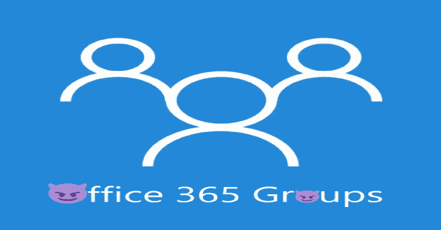

# M365_Groups_Enum:枚举租户中的 Microsoft 365 组及其元数据

> 原文：<https://kalilinuxtutorials.com/m365_groups_enum/>

**M365_Groups_Enum** 是允许枚举 Azure AD 租户中所有微软 365 组及其元数据的`**all_groups.py**`脚本:

*   名字
*   可见性:公共或私人
*   描述
*   电子邮件地址
*   业主
*   成员
*   团队已启用？
*   SharePoint URL(例如团队共享文件)

所有这一切，即使是对私人团体！请阅读我的博客文章[“微软团队和微软 365 团队的风险”](https://clement.notin.org/blog/2021/03/01/risks-of-microsoft-teams-and-microsoft-365-groups/)了解更多信息

**`reporting.py`** 脚本将从`**all_groups.py**`获取 JSON 输出，并生成一个 CSV 文件，允许快速识别敏感的私有或公共组。

**安装**

**要求:**

*   下载存储库
*   安装要求

**pip install-r requirements . txt**

**用途**

您需要租户的有效账户。支持不同的身份验证方法:

*   通过登录+密码(不支持 MFA)

**python all _ groups . py-u myuser@example.onmicrosoft.com-p my pass w0 rd**

*   通过设备认证，通过浏览器支持 MFA。启动，然后按照说明操作

**python all _ groups . py–设备代码**

还提供了其他方法。你可以阅读 [ROADTools 文档](https://github.com/dirkjanm/ROADtools/wiki/Getting-started-with-ROADrecon#authentication)或者不带任何参数运行脚本来获得帮助。

**python all_groups.py**

仅此而已，你不需要更多的选择！脚本输出将在当前目录的`**all_groups.json**`中。

然后，如果您想从这个 JSON 得到更好、更简洁的输出，可以使用`**reporting.py**`来转换它:

**python reporting.py**

自动取当前目录下的`**all_groups.json**`，输出到同一目录下的 **`all_groups.csv`** 。

[**Download**](https://github.com/cnotin/m365_groups_enum)