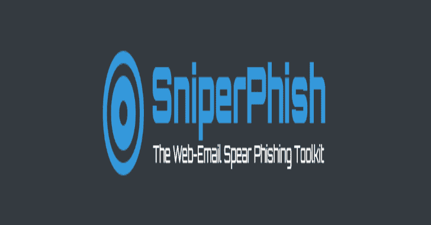
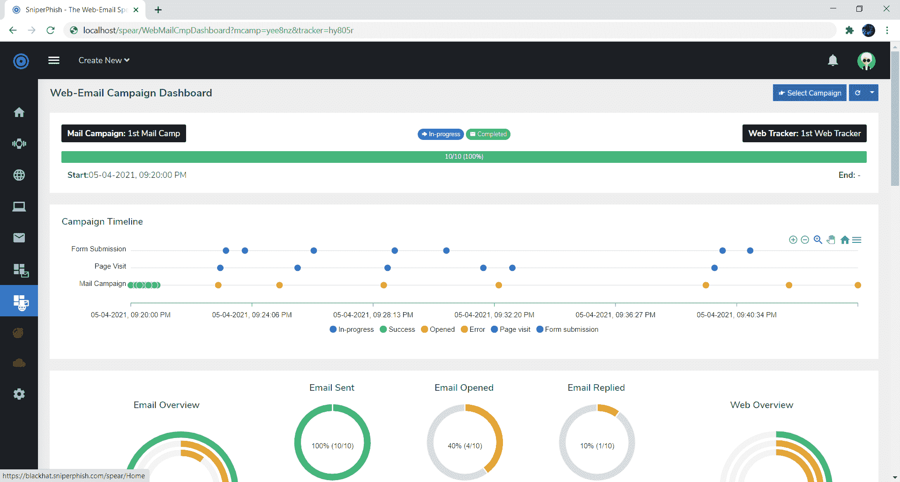
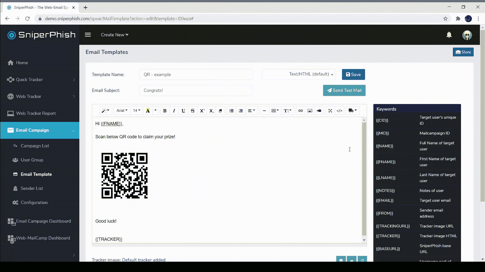
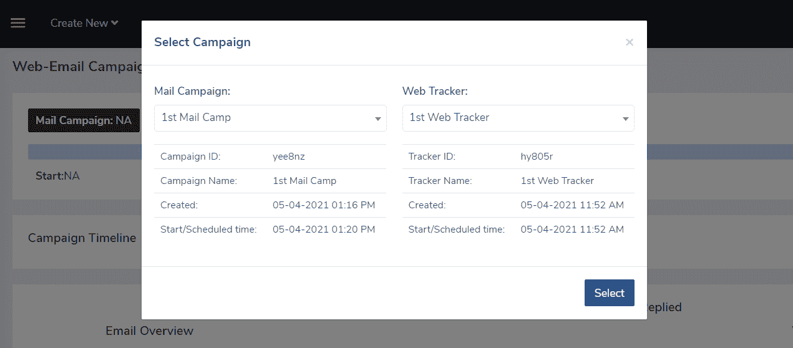

# SniperPhish:网络电子邮件鱼叉钓鱼工具包

> 原文：<https://kalilinuxtutorials.com/sniperphish/>

[SniperPhish](https://sniperphish.com/) 是一款针对 pentester 或安全专业人员的网络钓鱼工具包，通过模拟真实世界的网络钓鱼攻击来提高用户的防范意识。SniperPhish 有助于将您创建的网络钓鱼电子邮件和网络钓鱼网站结合起来，集中跟踪用户操作。该工具旨在执行专业的网络钓鱼练习，并会被提醒事先获得目标组织的许可，以避免法律影响。

**安装**

1.  克隆回购或下载最新版本
2.  将内容放入您的 web 根文件夹中
3.  在浏览器中打开安装页面 [http://localhost/install](http://localhost/install) ,然后按照步骤操作
4.  安装后，SniperPhish 会重定向到登录页面 [http://localhost/spear](http://localhost/spear)

默认登录—*用户名:`**admin**`密码:`**sniperphish**`*

**主要特点**

*   网络跟踪器代码生成–独立跟踪您的网站访问和表单提交
*   跟踪包含任意数量页面的网络钓鱼网站的数据
*   创建和计划网络钓鱼邮件活动
*   将网络钓鱼网站与电子邮件活动结合起来，进行集中跟踪
*   一个独立的“快速跟踪”模块，用于快速跟踪电子邮件或网页访问
*   高级报告生成–根据您需要的跟踪数据生成报告
*   支持 QR/条形码的邮件活动(本地和远程嵌入邮件)
*   跟踪网络钓鱼邮件回复
*   签名和加密邮件支持
*   高级邮件活动定制–阅读回执、收件人/抄送/密件抄送电子邮件等。
*   电子邮件防泛滥控制
*   对电子邮件和域的非 ASCII (Punycode 转录)支持

**截图**

**创建网络电子邮件活动–快速指南**

简而言之，我们创建网络追踪器->将网络追踪器添加到钓鱼网站->创建带有指向钓鱼网站的链接的邮件活动->启动邮件活动。

**创建网络跟踪器:**

1.  用你最喜欢的编程语言设计你的网站。确保您为 HTML 字段(如文本字段、复选框等)提供了唯一的“id”和“name”值。
2.  为你的钓鱼网站生成一个网络跟踪器代码`**Web Tracker -> New Tracker**`。“网页”选项卡列出了您想要跟踪的页面。
    *   要跟踪表单提交数据，请提供仿冒网站表单中 HTML 字段的“id”或“name”值。
    *   对需要跟踪的网络钓鱼站点中的每个页面重复上述操作。
3.  从最终输出中，复制生成的 JS 链接，并将其放在每个网站页面的和部分之间。这个 JS 脚本包含跟踪代码。
4.  最后，保存创建的跟踪器。现在追踪器被激活并在后台监听。打开您的钓鱼网站页面或表单提交都会被跟踪。

**创建电子邮件活动:**

1.  进入 **`Email Campaign ->`** **`User Group`** 添加目标用户
2.  转到`**Email Campaign -> Sender List**`并配置邮件服务器详细信息
3.  转到`**Email Campaign -> Email Template**`并创建邮件模板。在这里，您可以根据您创建的网络跟踪器来链接您的钓鱼网站。为此，点击电子邮件模板编辑器中的`**Insert**`菜单，选择`**Link to Web Tracker**`。从弹出窗口中选择您的网络跟踪器并将其插入。
4.  现在转到`**Email Campaign -> Campaign List -> New Mail Campaign**`，选择/填写字段以创建活动。
5.  开始邮件活动

***注意** : SniperPhish 只有在页面被追加`**cid**`参数(即`**?cid={{CID}}**`)结尾。例如打开`**http://yourphishingsite.com/login?cid=abcd**`会被跟踪，但`**http://yourphishingsite.com/login**`不会。默认情况下，上述第三步会这样做。*

**查看综合网络邮件结果**

转到 **`Web-MailCamp Dashboard -> Select Campaign`。**然后选择你创建的网络跟踪器和电子邮件活动。

[**Download**](https://github.com/GemGeorge/SniperPhish)