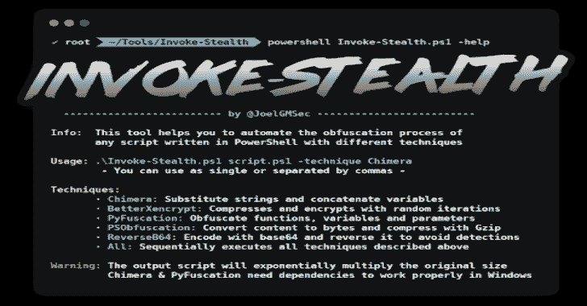

# Invoke-Stealth:简单而强大的 PowerShell 脚本混淆器

> 原文：<https://kalilinuxtutorials.com/invoke-stealth/>

**Invoke-Stealth** 是一个简单的&强大的 PowerShell 脚本混淆器。

这个工具可以帮助你用不同的技术自动化任何用 PowerShell 编写的脚本的混淆过程。您可以在 Windows 或 Linux 中单独使用它们中的任何一个，一起使用它们，或者轻松地按顺序使用它们。

**要求**

*   Powershell 4.0 或更高版本
*   狂欢*
*   Python 3*

*需要使用所有功能

**下载**

建议克隆完整的存储库或下载 zip 文件。您可以通过运行以下命令来实现这一点:

**git 克隆 https://github.com/JoelGMSec/Invoke-Stealth.git**

您也可以按如下方式下载限量版:

**powershell iwr-useb https://darkbyte.net/invoke-stealth.php-outfile Invoke-stealth . PS1**

**用途**

。**\ Invoke-stealth . PS1-help
Info:该工具帮助您自动化使用不同技术
在 PowerShell 中编写的
任何脚本的混淆过程。\ Invoke-stealth . PS1 script . PS1-technique Chimera
–您可以使用单个或用逗号分隔-
Techniques:
Chimera:替换字符串和连接变量
better xe crypt:用随机迭代压缩和加密
PyFuscation:混淆函数、变量和参数
PSObfuscation:将内容转换为字节并用 Gzip 编码
ReverseB64:用 base64 编码并反转它以避免检测
All:顺序执行上述所有技术【T12**

[**Download**](https://github.com/JoelGMSec/Invoke-Stealth)