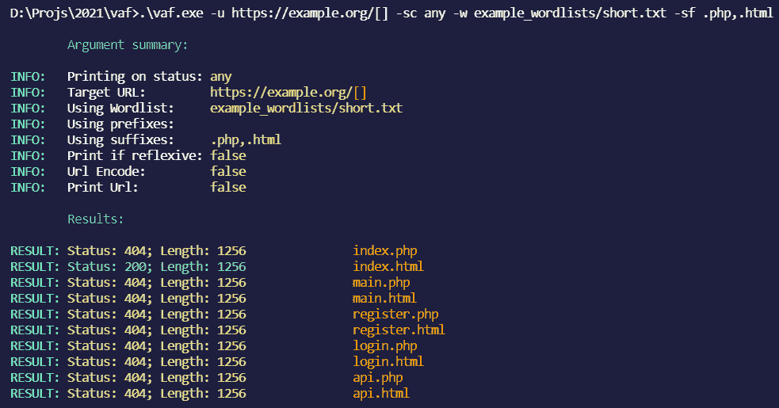
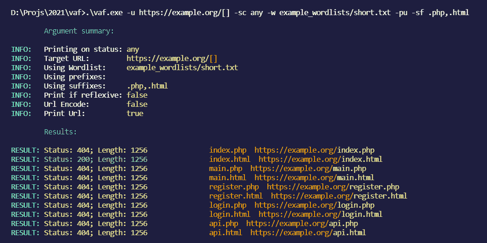
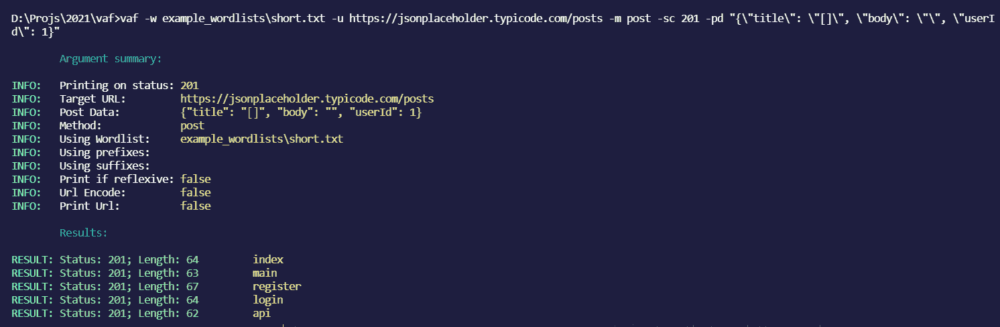

# VAF:非常先进的(网络)模糊器

> 原文：<https://kalilinuxtutorials.com/vaf/>

[ Fuzzer")](https://1.bp.blogspot.com/-fA1ieCrVKpM/YJfMmt3yiQI/AAAAAAAAJCI/pCP_IQLyo58vA41OzScSrV0zOFU3Ybo5QCLcBGAsYHQ/s728/Vaf%25281%2529.png)

在 **VAF** 中，我已经为 linux 用户编译了一个 vaf_linux_amd64 二进制文件，但是不会一直更新

*   **克隆并 cd 入回购**
*   安装 nim

**Linux:安装**

**nim 使用:`curl https://nim-lang.org/choosenim/init.sh -sSf | sh`并将 nim 添加到路径**

**Windows:下载**

来自[https://nim-lang.org/install_windows.html](https://nim-lang.org/install_windows.html)的 nim 运行`**finish.exe**`(你可能需要重新打开一个 cmd 窗口让 nim 加载)

*   奔跑

**敏捷构建**

将在您的目录中创建一个 vaf 二进制文件以供使用

**使用 VAF**

使用 vaf 很简单，下面是当前的帮助文本:

**用法:
vaf–非常高级的 fuzzer【选项】**

**选项:
-h，–help
-u，–url = URL 选择 URL，用[]
-w，–word list = word list 选择要使用的单词列表
-sc，–STATUS = STATUS 设置在哪个状态下打印，将此参数设置为' any '在任何状态下打印(默认值:200)
-pr，–PREFIX = PREFIX 前缀， 例如，如果您的 url 末尾没有/则设置为/用于内容发现(默认:)
-sf，–SUFFIX = SUFFIX，例如，如果您正在进行内容发现，请将此用于扩展(默认:)
-pd，–post data = post data 仅在设置了“-m post”时使用(默认:{})
-m，–METHOD = METHOD 后缀，例如，如果您正在进行内容发现(默认:get)
-pif，–printifr**

**截图**

*   **(打印每个状态码，后缀。php，。html 并且没有前缀)**

*   **(打印 url，打印每个状态码，后缀。php，。html 并且没有前缀)**

*   **(后期数据模糊)**

**例题**

*   模糊帖子数据:

**vaf.exe-w example _ word lists \ short . txt-u https://jsonplaceholder.typicode.com/posts-m post-sc 201-PD " { \ " title \ ":\ "[]\ " } "**

*   模糊获取 URL

**vaf.exe-w example _ word lists \ short . txt-u https://example . org/[]-SF。html**

**提示**

*   在后缀或前缀参数中添加一个尾随的`**,**`来尝试没有任何后缀/前缀的单词，如下所示: **`-pf .php,`或`-sf .php,`**
*   使用带有一堆 xss 有效负载的`**-pif**`作为单词列表来查找 XSS
*   如果你想推荐一个功能，就提出一个问题

[**Download**](https://github.com/d4rckh/vaf#screenshots)