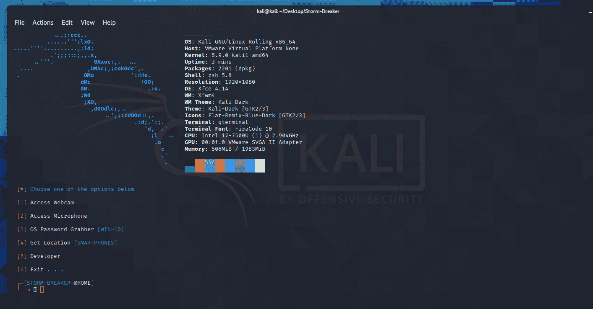
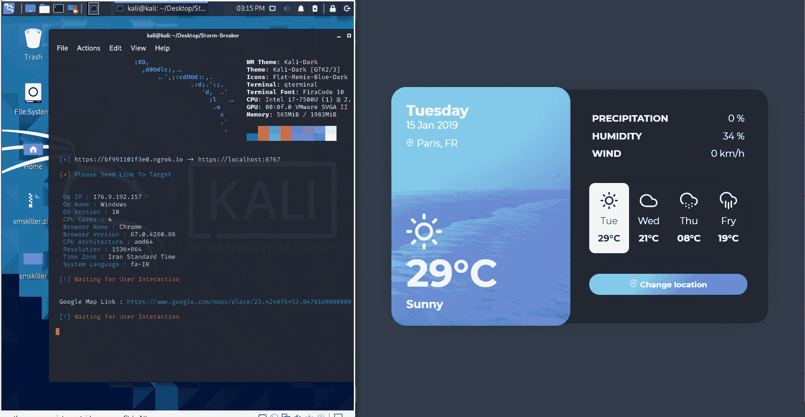

# Storm-Breaker:使用 Ngrok 的工具社交工程(访问网络摄像头、麦克风、操作系统密码抓取器和位置查找器)

> 原文：<https://kalilinuxtutorials.com/storm-breaker/>

[ With Ngrok")](https://1.bp.blogspot.com/-OGgsDTp1AMI/YJk8dAnBOKI/AAAAAAAAJCs/ZMdyLirpG6IAQCSFYDI1TFz2EN3Kiq48ACLcBGAsYHQ/s728/1%2B%25281%2529.png)

**特性**

*   在没有任何权限的情况下获取设备信息
*   访问位置[智能手机]
*   操作系统密码抓取器[WIN-10]
*   访问网络摄像头
*   接入麦克风

**测试的操作系统**

Kali Linux 2020

**在 Kali Linux 上安装**

**$ git 克隆 https://github.com/ultrasecurity/Storm-Breaker
$ CD Storm-Breaker
$ sudo bash Linux-installer . sh
$ python 3-m pip install-r requires . txt
$ sudo python 3 Storm-Breaker . py**

[**Download**](https://github.com/ultrasecurity/Storm-Breaker)