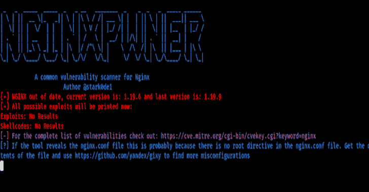

# Nginxpwner:查找常见 Nginx 错误配置和漏洞的工具

> 原文：<https://kalilinuxtutorials.com/nginxpwner/>

Nginxpwner 是一个简单的工具，用于查找常见的 Nginx 错误配置和漏洞。

**安装**

**cd /opt
git 克隆 https://github.com/stark0de/nginxpwner
CD nginxpowner
chmod+x install . sh
。/install.sh**

**用途**

**目标选项卡在 Burp 中，选择主机，点击右键，复制该主机中的所有 url，复制到一个文件
cat urllist |展开路径| cut-d "/"-F2-3 | sort-u>/tmp/pathlist
或者以其他方式获取你已经在应用中发现的路径列表。注意:路径不要以/
开头最后:
python 3 nginxpwner . py https://example.com/tmp/path list**

**注释**

它实际上会检查:

*   获取 Ngnix 版本，并使用 searchsploit 获取其可能的漏洞，并判断它是否过时
*   通过 gobuster 抛出一个特定于 Nginx 的单词列表
*   通过在重定向中使用$uri 的常见错误配置，检查它是否易受 CRLF 攻击
*   在提供的所有路径中检查 CRLF
*   检查是否可以从外部使用清除 HTTP 方法
*   检查可变泄漏错误配置
*   通过设置为 off 的 merge_slashes 检查路径遍历漏洞
*   测试使用逐跳标头时请求长度的差异(例如:X-Forwarded-Host)
*   使用 Kyubi 通过错误配置的别名测试路径遍历漏洞
*   使用 X 加速重定向测试 401/403 旁路
*   显示了用于检查原始后端读取响应错误配置的负载
*   检查网站是否使用 PHP，并为 PHP 网站建议一些 nginx 特定的测试
*   测试 Nginx 的范围过滤器模块中的常见整数溢出漏洞(CVE-2017-7529)

该工具使用响应中的服务器头进行一些测试。还有其他构建在 Nginx 上的 CMS 和 so，例如 Centminmod、OpenResty、Pantheon 或 Tengine，它们不返回头。在这种情况下，请使用 nginx-pwner-no-server-header . py，使用与其他脚本相同的参数

此外，为了让漏洞搜索正确运行，您应该不时地在 Kali 中使用:searchsploit -u

该工具不检查网页缓存中毒/欺骗漏洞，也不请求走私，你应该测试这些漏洞的具体工具。NginxPwner 主要关注开发人员可能在不知道的情况下在 nginx.conf 中引入的错误配置。

归功于 shibli2700 的令人敬畏的工具 Kyubi[https://github.com/shibli2700/Kyubi](https://github.com/shibli2700/Kyubi)和所有的贡献者。这也归功于 Detectify(它实际上发现了 NGINX 中的许多错误配置)

[**Download**](https://github.com/stark0de/nginxpwner)