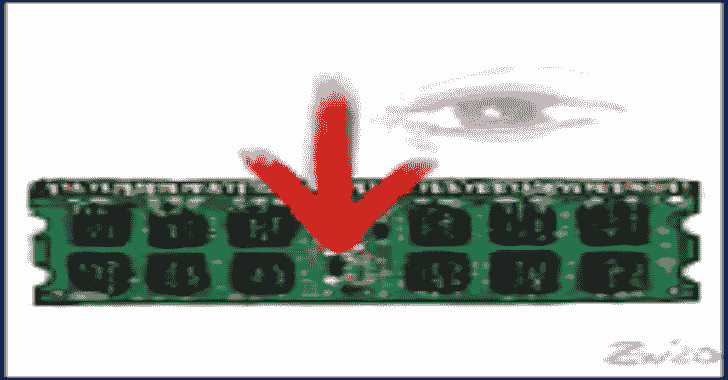

# WinPmem:多平台内存获取工具

> 原文：<https://kalilinuxtutorials.com/winpmem/>

长期以来，WinPmem 一直是 windows 的默认开源内存获取驱动程序。它曾经存在于 Rekall 项目中，但是最近被分离到它自己的存储库中。

**描述**

WinPmem 是一个物理内存获取工具，具有以下特性:

*   开放源码
*   支持 Win XP–Win 10、x86 + x64。WDK7600 可用于支持 WinXP。默认情况下，提供的 WinPmem 可执行文件将使用 WDK10 编译，支持 win 7–win 10，并具有更现代的代码。
*   创建内存转储的三种不同的独立方法。一种方法应该总是工作，即使面对内核模式的 rootkits。
*   原始内存转储映像支持。
*   使用读取设备接口，而不是像其他成像器一样从内核写入图像。这允许我们拥有复杂的用户空间成像仪(例如跨网络复制、哈希等)，以及在实时系统上运行分析(例如可以直接在设备上运行)。

此目录中的文件(包括 WinPmem 源代码和签名的二进制文件)可以在以下许可证下获得:Apache 许可证，版本 2.0。

**如何使用**

有两个 WinPmem 可执行文件:winpmem_mini_x86.exe 和 winpmem_mini_x64.exe。两个版本都包含两个驱动程序(32 位和 64 位版本)。

二进制名称中的 mini 指的是这种成像仪是一种简单的成像仪，它只能生成 RAW 格式的图像。过去，我们发布了一个基于 AFF4 的 WinPmem 成像仪，但该成像仪尚未更新到新的驱动程序。如果您需要基于 AFF4 的成像仪，请告知我们。

**Python 采集工具 winpmem.py**

python 程序目前正在构建中，但它是如何使用 Python 中的成像仪的演示。

**winpmem_mini_x64.exe(独立可执行文件)**

该程序最容易用于事件响应，因为除了可执行文件本身之外，它不需要其他依赖项。该程序将自动加载正确的驱动程序(32 位或 64 位),并且是独立的。

##### 示例:

**winpmm _ mini _ x64 . exe 物理学家。原始数据**

使用默认采集方法将原始图像写入 physmem.raw。

**winpmem_mini_x64.exe**

调用使用打印/简短手册。

要专门使用 MmMapIoSpace 方法获取原始图像:

**winpe mem . exe-1 my image . raw**

获取图像后会自动卸载驱动程序！

**实验性写支持**

WinPmem 源代码支持写入内存以及读取。这种能力是一个很好的学习工具，因为许多 rootkit 隐藏技术可以通过直接写入内存来模拟。

使用该功能时应格外小心！

注意:由于这是一个相当危险的功能，签名的二进制驱动程序禁用了写支持。如果您想使用这个特性，您可以重新构建驱动程序来生成测试签名的二进制文件。未签名的二进制文件(实际上是用测试证书自签名的)不能在常规系统上加载，因为它们是测试自签名的，但是您可以通过发出[https://docs . Microsoft . com/en-us/windows-hardware/drivers/install/the-test signing-boot-configuration-option](https://docs.microsoft.com/en-us/windows-hardware/drivers/install/the-testsigning-boot-configuration-option):

**Bcdedit.exe-设置测试签名于**

然后重启。您将在桌面上看到一个小的“测试模式”文本，提醒您这台机器是为测试签名驱动程序而配置的。

此外，还必须在加载时启用写支持:

winpmem.exe-w-l

这将加载驱动程序并打开写支持。

[**Download**](https://github.com/Velocidex/WinPmem#description)