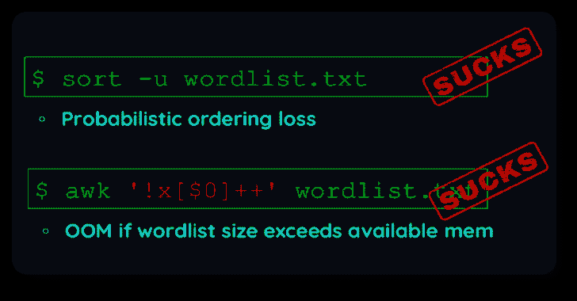
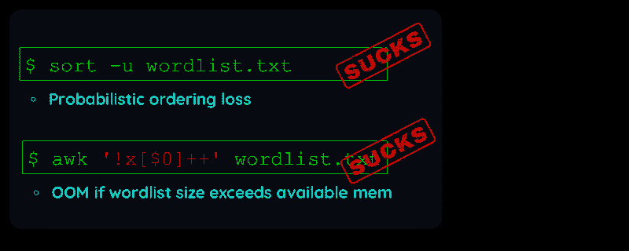
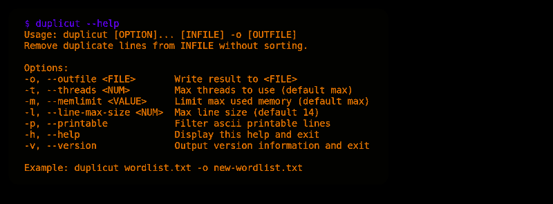
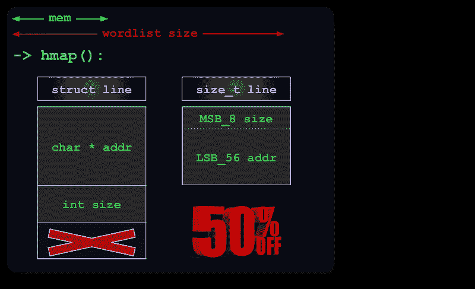
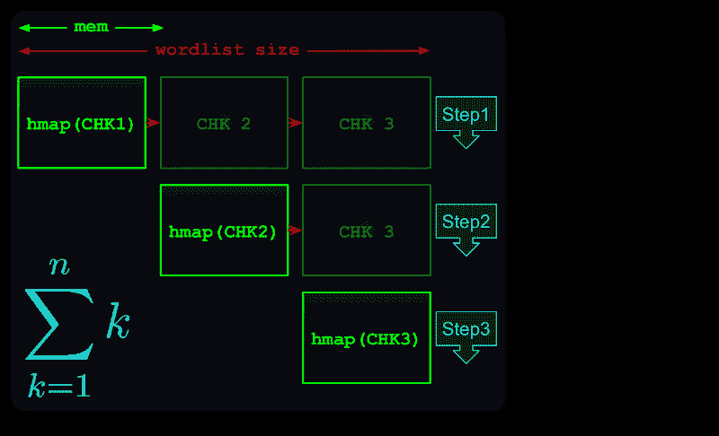

# 重复:从大量的单词列表中删除重复的单词，不进行排序

> 原文：<https://kalilinuxtutorials.com/duplicut/>

Duplicut 是一个现代密码单词表创建通常意味着连接多个数据源。

理想情况下，最有可能的密码应该位于单词列表的开头，这样最常见的密码可以立即被破解。

使用现有的*重复数据删除工具*，你不得不选择是选择*保留顺序**还是**处理大量单词列表*。

不幸的是，**单词表的创建同时需要**:

所以我用高度优化的 C 语言编写了 duplicut 来解决这个非常特殊的需求

**快速启动**

**git 克隆 https://github.com/nil0x42/duplicut
CD duplicut/&make
。/duplicut word list . txt-o clean-word list . txt**

**选项**

**特性**

*   处理大量的单词表，甚至那些大小超过可用内存的单词表
*   按最大长度过滤线条(`-l`选项)
*   可以删除包含不可打印 ASCII 字符的行(`-p`选项)
*   按任意键显示运行时的程序状态。

**实施**

*   用纯 C 代码编写，设计得很快
*   64 位平台上的压缩哈希表项目
*   多线程支持
*   **【TODO】:**使用巨大的内存页面来提高性能

**限制**

*   任何超过 255 个字符的行将被忽略
*   在 Linux x64 上进行了大量测试，大部分没有在其他平台上测试。

**技术细节**

**1-内存优化**

通过将`**size**`信息打包在指针的[额外位](https://en.wikipedia.org/wiki/Tagged_pointer)中，一个 **`uint64`** 足以索引散列表中的行:

**2-海量文件处理**

如果整个文件在内存中放不下，它会被分割成个虚拟块，然后每个虚拟块会被下一个虚拟块测试。

所以复杂度等于第个*三角形数*:

**throubleshooting**

如果您发现一个 bug，或者某些东西不能按预期工作，请在调试模式下编译 duplicut，并发布一个带有附加输出的[问题](https://github.com/nil0x42/duplicut/issues):

##### 调试级别可以从 1 到 4

##### **使调试级别=1
。/duplicut[选项]2>&1 | tee/tmp/duplicut-debug . log**

[**Download**](https://github.com/nil0x42/duplicut)