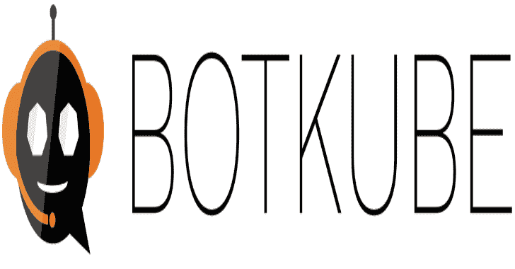
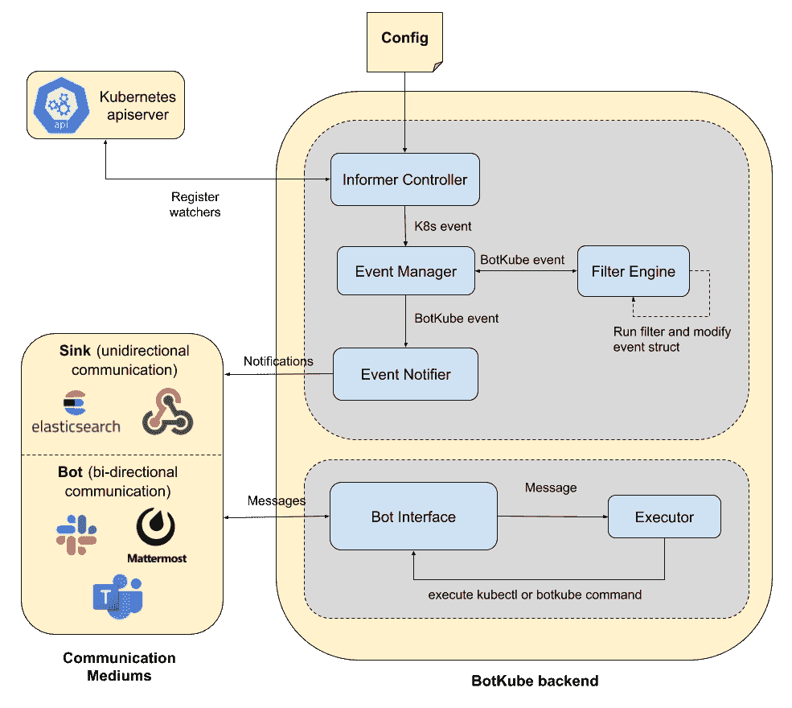

# Botkube:一个帮助你监控 Kubernetes 集群、调试关键部署并给出标准实践建议的应用程序

> 原文：<https://kalilinuxtutorials.com/botkube/>

BotKube 与 [Slack](https://slack.com/) 、 [Mattermost](https://mattermost.com/) 或[微软团队](https://www.microsoft.com/microsoft-365/microsoft-teams/group-chat-software)的集成有助于您监控您的 Kubernetes 集群，调试关键部署，并通过检查 Kubernetes 资源给出标准实践的建议。您还可以让 BotKube 在 k8s 集群上执行 kubectl 命令，这有助于调试应用程序或集群。

【2020 年啤酒节

BotKube 正在参加 Hacktoberfest 2020。我们将为我们的贡献者提供一些非常酷的礼品，请访问–[https://www . infra cloud . io/blogs/infra cloud-joins-hacktoberfest-2020/](https://www.infracloud.io/blogs/infracloud-joins-hacktoberfest-2020/)了解更多信息。

**入门**

请按照[此](https://www.botkube.io/installation/)获取完整的 BotKube 安装指南。

**架构**

*   **Informer Controller:** 向 kube-apiserver 注册 informers，以观察配置的 k8s 资源上的事件。它将传入的 k8s 事件转发给事件管理器。
*   **事件管理器:**从 k8s 事件对象中提取必需的字段，并创建一个新的 BotKube 事件结构。它将 BotKube 事件结构传递给过滤器引擎。
*   **过滤器引擎:**获取 k8s 对象和 BotKube 事件结构，并在其上运行过滤器。每个过滤器在 k8s 对象上运行一些验证，并在需要时修改 BotKube 事件结构中的消息。
*   **事件通知器:**最后，通知器通过配置的通信通道发送 BotKube 事件。
*   **Bot 接口:** Bot 接口负责认证和管理与 Slack、Mattermost、微软团队等通信媒介的连接，并向它们读取/发送消息。
*   **Executor:** 执行 BotKube 或 kubectl 命令，并将结果发送回 Bot 接口。

有关配置、使用和示例，请访问 [www.botkube.io](http://www.botkube.io/) 。

[**Download**](https://github.com/infracloudio/botkube)