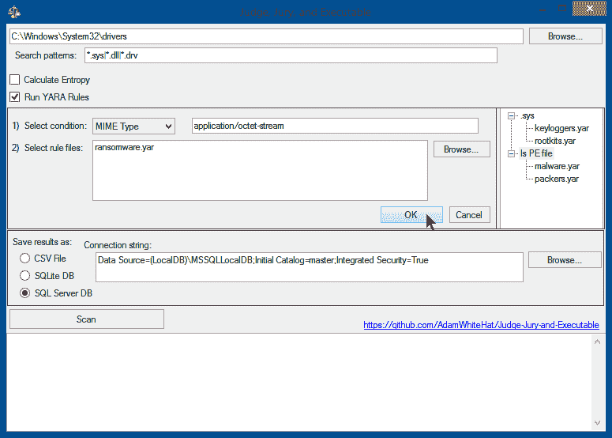

# Judge Jury And Executable:一个文件系统取证分析扫描器和威胁搜索工具

> 原文：<https://kalilinuxtutorials.com/judge-jury-and-executable/>

**Judge Jury And Executable** 是一款文件系统取证分析扫描器和威胁搜索工具

**特性**

*   立即扫描挂载的文件系统中的威胁
*   或者在事件发生前收集系统基线，以获得额外的威胁搜寻能力
*   可以在事故发生之前、期间或之后使用
*   一对多工作站
*   扫描 MFT，绕过文件权限、文件锁或操作系统文件保护/隐藏/隐藏
*   为每个文件收集多达 51 种不同的属性
*   扫描结果保存在 SQL 表中，供以后搜索、汇总多次扫描和/或多台计算机的结果，以及进行历史或回顾性分析
*   利用 SQL 的强大功能来搜索文件系统、查询文件属性、回答复杂或高级问题，以及寻找威胁或危害迹象。

**要求**

*   。NET 框架 4.8 版
*   具有读/写/创建权限的本地或远程 SQL 数据库。
*   Visual studio(如果您希望编译 C#代码)
*   访问互联网(否则你怎么得到这个代码？？？也适用于 nuget 包…)
*   sql 的基础知识

**通过在 SQL 中编写查询，使用搜索(多个)文件系统上的病毒、恶意软件和 apt。**

您从可能被恶意软件、病毒、APT(高级持久威胁)等污染的磁盘或磁盘映像开始，然后使用此工具扫描它们。(或者，假设您有足够的智慧和远见来这样做，您可能希望先用这个工具扫描一个已知良好的基准磁盘映像(或者稍后——无所谓)。这当然不是必要的，但只能帮助你。)该工具的取证级扫描部分收集关于文件系统中每个文件(或一个文件的映像)的一组*属性，并将这些属性放在 SQL 关系数据库表中。秘方来自于能够通过使用 SQL 语言对创建的数据库进行查询来对数据进行威胁搜索、调查或提问。这里的一个关键特征是*而不是*发明了一种专有的查询语言。如果你知道 SQL，以及如何点击按钮，那么你已经知道如何像老板一样使用这个工具。即使你不知道，这个概念也足够强大，固定查询(见下文)会让你受益匪浅。*

**取证级扫描**

首先，该工具在数据库中为在 MFT 中找到的每个记录创建一个条目(主文件表 NTFS 就是这样保存记录的)。这绕过了文件安全许可、文件隐藏、隐藏或混淆技术、文件删除或时间戳篡改。这些技术不会阻止文件被扫描和编目。从 MFT 读取文件的字节，并在尝试使用更高级的 OS API 调用访问任何数据点之前，从从 MFT 读取的文件的字节中获取尽可能多的数据点。

**丰富的高级数据分析**

保护 MFT 和取证级别的数据后，将收集每个文件的操作系统级别的属性、数据和元数据，并扩充从 MFT 条目创建的每个条目。因此，即使由于文件权限(ACL)、文件锁定(正在使用)、磁盘损坏、零字节长度文件或任何其他原因而无法从操作系统 API 或点网络框架访问文件或其属性，文件的存在仍将被记录、录入和跟踪。但是，该条目将不包含操作系统无法访问的相关信息。每个文件最多可收集 51 个不同的数据点。

**对于每个文件，收集的信息包括**

*   SHA256 哈希
*   MD5 哈希
*   导入表哈希(如果存在)
*   MFT 编号和序列号
*   MFT 创建/修改/访问日期
*   操作系统报告的创建/修改/访问日期
*   所有“标准”操作系统文件属性:位置、大小、日期戳、属性、元数据
*   是 PE 还是 DLL 还是驱动？
*   Authenticode 签名了吗？
*   X.509 证书链是否验证？
*   自定义 YARA 规则(列出匹配的规则名称)
*   文件熵
*   文件熵
*   总共多达 51 个不同的数据点

**示例数据行**

| 制造商编号 | 序列号 | SHA256 | FullPath | 长度 | 文件所有者 | 属性 | 国际电睡眠与电麻醉学会 | IsDll | 伊里弗 | 二元类型 | 分配 | issignaturevealid | IsValidCertChain | 被信任 | ImpHash | 讯息摘要 5 | SHA1 | 编译日期 | MimeType | 内部名称 | 产品名称 | 原始文件名 | 文件版本 | 文件描述 | 版权 | 公司 | 语言 | 商标 | 项目 | 应用程序名称 | 评论 | 标题 | 环 | ProviderItemID | 计算机名称 | 驱动器号 | 目录定位 | 文件名 | 延长 | 证书主题 | 证书颁发者 | CertSerialNumber | CertThumbprint | CertNotBefore | CertNotAfter | 预测计数 | 熵 | YaraRulesMatched | 约会 | MftTimeAccessed | mfttime 创作 | mfttimemodefied | mfttimemftmodefied | 创造时间 | 最后访问时间 | LastWriteTime |
| --- | --- | --- | --- | --- | --- | --- | --- | --- | --- | --- | --- | --- | --- | --- | --- | --- | --- | --- | --- | --- | --- | --- | --- | --- | --- | --- | --- | --- | --- | --- | --- | --- | --- | --- | --- | --- | --- | --- | --- | --- | --- | --- | --- | --- | --- | --- | --- | --- | --- | --- | --- | --- | --- | --- | --- | --- |
| Eighteen thousand and ten | Zero | c 67 be 7d 3 f 54d 44 AC 264 a 18 e 33909482 f1 F8 ca 7 b 7 FBA af 5659 ef 71 ed 9 f 8092 c 34 | c:\ Windows \ WinSxS \ amd64 _ Windows-defender-service-cloud clean _ 31bf 3856 ad 364 e 35 _ 6 . 3 . 9600 . 18603 _ none _ 73d 12 e 8145 b 3841 b \ sym SRV . dll | One hundred and forty-nine thousand two hundred and sixty-four | 可信安装者 | A | one | one | Zero | Sixteen | one | one | Zero | one | 5d 54 f 5d 721 e 301667338323 AC 07578 e 3 | 65fb 3391 EB 26 F5 AC 647 fc 40501 D8 e 21d | 4b 46 db 2 a 99 a 47 ff 6a 6e 376 f 4d 79 f 5298 BFF 28 a 2 | 2010-02-01 20:15:48.0000000 | 应用程序/x-msdownload | symsrv.dll | Windows 调试工具(R) | symsrv.dll | 6.12.2.633 | 符号服务器 | 微软公司。保留所有权利。 | 微软公司 | 英语(美国) |  |  |  |  |  |  |  | L | C | c:\ Windows \ WinSxS \ amd64 _ Windows-defender-service-cloud clean _ 31bf 3856 ad 364 e 35 _ 6 . 3 . 9600 . 18603 _ none _ 73d 12 e 8145 b 3841 b | SymSrv.dll | 。动态链接库 | CN =微软公司，OU=MOPR，O =微软公司，L =雷蒙德，S =华盛顿州，C =美国 | CN =微软代码签名 PCA，O =微软公司，L =雷蒙德，S =华盛顿，C =美国 | 6105F71E000000000032 | d 468 faeb 5190 BF 9 decd 9827 af 470 f 799 c 41 a 769 c | 2009 年 7 月 13 日下午 5 时 18 分 | 2010 年 10 月 13 日下午 5 时 10 分 18 秒 | one | Zero | 空 | 2020-10-25 06:17:12.0133333 | 2013-06-18 14:43:52.6497911 | 2013-08-22 06:56:50.9086288 | 2013-08-22 06:56:50.9086288 | 2019-01-15 19:13:49.1704756 | 2013-08-22 06:56:50.9086288 | 2013-08-22 06:56:50.9086288 | 2013-06-18 14:43:52.6497911 |

**预约查询**

**/*想法:目录 C:\Windows\System32\中的所有文件都应该由 TrustedInstaller 拥有’。
如果 System32 目录中的文件由不同的用户拥有，这表示异常，
并且该用户可能是创建该文件的用户。
恶意软件喜欢伪装成有效的 Windows 系统文件。
放置在 System32 目录中的可执行文件不仅看起来更正式，因为它是
系统文件的公共路径，而且不需要提供该可执行文件的显式路径来从
命令行、开始菜单的 windows“运行”对话框或 win32 API 调用 ShellExecute 执行它。
*/SELECT
TOP 1000 *
FROM[file properties]
其中
【file owner】<>【trusted installer】
【directory location】= ':\ Windows \ System32’
AND is signed = 0
ORDER BY【prevalence count】desc**

想法:MFT 创建时间戳和操作系统创建时间戳应该匹配。
如果 MFT 创建时间戳出现在操作系统元数据报告的创建时间之后，
这表明出现异常。
Timestomp 是 Metasploit 框架的一部分，它允许用户将文件
回溯到他们选择的任意时间。做这个
(让我知道你是否能想到一个)真的没有一个好的合法理由，并且被认为是一种反取证技术。
*/从【文件属性】
中选择
TOP 1000 *
其中
(【mfttime accessed】<>【lastaccestime】)或
(【mfttime creation】<>【creation time】)或
(【MftTimeMftModified】<>【LastWriteTime】)
按【DateSeen】排序

想法:任何可执行文件或 dll 的“CompileDate”属性应该总是在文件的创建时间戳之前。
类似的逻辑适用于在创建时间戳之后出现的 MFT 创建时间戳。一个程序怎么可能在保存它的文件被创建之后被编译
？这种异常表明发生了回溯或时间戳。
*/从【文件属性】
中选择
前 1000 名*
其中
(【创建】<【编译日期】)或
(【创建时间】<【编译日期】)
排序依据【日期见】DESC

[**Download**](https://github.com/AdamWhiteHat/Judge-Jury-and-Executable)