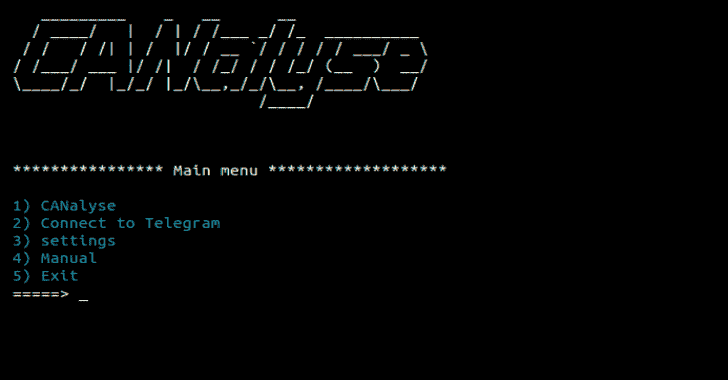
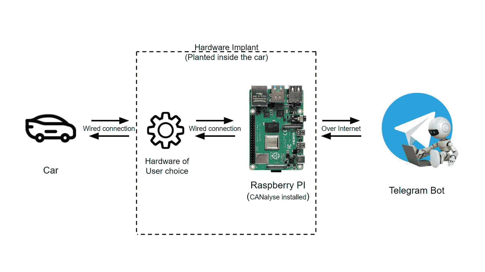

# CANalyse:一个车载网络分析和攻击工具

> 原文：<https://kalilinuxtutorials.com/canalyse/>

CANalyse 是一个工具，用于分析日志文件，以自动找出唯一的数据集，并能够连接到简单的用户界面，如 Telegram。基本上，在使用该工具时，攻击者可以提供一个 bot-ID，并通过 telegram-bot 在互联网上使用该工具。CANalyse 被放置在 raspberry-PI 中，能够通过电报机器人记录和分析网络流量/数据日志来利用车辆，就像在汽车中植入的硬件后门一样。

使用该工具的先决条件是硬件植入物已经安装在汽车中，并且能够与车内的网络/通信通道通信。

**此处解释**

*   [媒体博客](https://kartheeklade.medium.com/what-is-canalyse-and-how-do-i-control-hack-cars-through-telegram-part-1-de358640becf)
*   [Youtube](https://youtu.be/s5WGn3rwzKk)

**刀具布局**

**要求**

*   [蟒蛇 3](https://www.python.org/)
*   pip3
*   库要求列在 requirements.txt 文件中。

**管道安装**

**git 克隆 https://github.com/KartheekLade/CANalyse.git
CD can alyse
pip 3 install-r requirements . txt**

**用途**

**CD can alyse/
python 3 can alyse _ tool . py**

**故障排除**

*   如果工具转储“没有这样的设备”错误或你不能查看任何流量，检查是否接口和通信通道在设置。
*   如果所需库的自动安装不起作用，请尝试使用 sudo 运行一次，或者手动安装。
*   如果您不能正确执行命令，请检查“菜单”。

**下一次更新(进行中)**

*   一个二级精炼过程，以获得更集中的有效载荷，这将是用户的选择。
*   在 CLI 和 Bot 中进行通用设置。
*   能够记录和下载多个文件。

**注**

*   代码不断更新，以修复错误，错误处理和流畅的体验。如果您面临任何问题，请发送 DM 或提出问题，我们(我和贡献者)将乐意尽我们所能提供帮助。
*   **感谢(❤️)开发人员创建了 python-can 和本工具中使用的其他库。**

**警告**

*   这个工具纯粹是为了学习和教育的目的。我和捐助者对任何有害行为不负任何责任。
*   不要使用/共享您的公共 bot 名称/ID，建议使用随机名称。

[**Download**](https://github.com/KartheekLade/CANalyse)