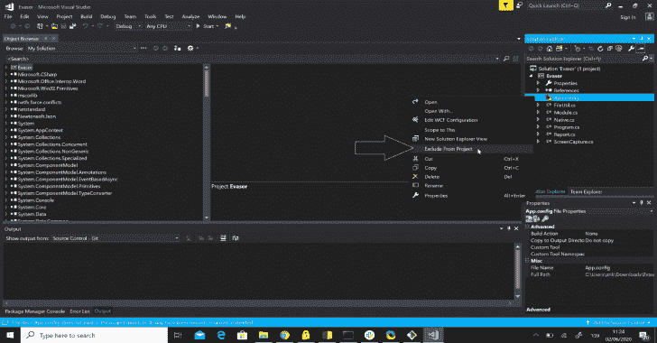
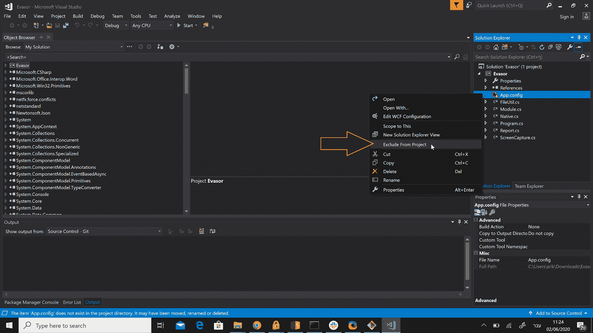
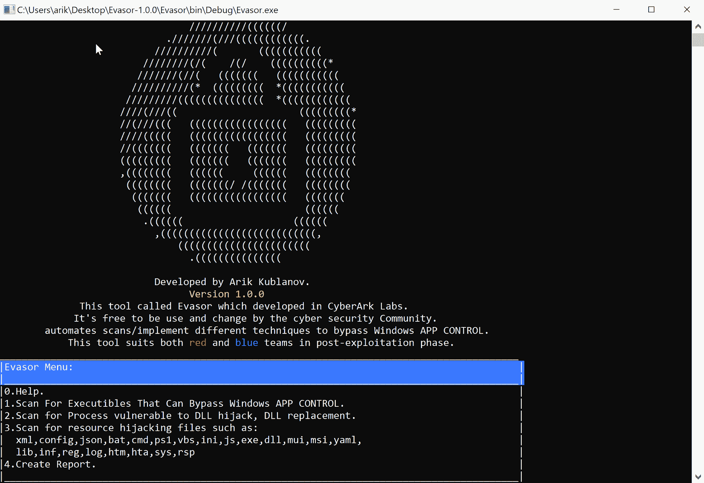

# Evasor:一个用于 Blue 后期开发阶段的工具

> 原文：<https://kalilinuxtutorials.com/evasor/>

Evasor 是一个自动化的安全评估工具，它可以定位 Windows 操作系统上的现有可执行文件，这些文件可用于绕过任何应用程序控制规则。它非常易于使用，快速，节省时间，完全自动化，为您生成一份报告，其中包括描述，截图和缓解建议，为蓝队和红队在开发后阶段的评估套件。

**要求**

*   Windows 操作系统。
*   已安装 Visual studio 2017。

**使用说明**

下载 Evasor 项目并编译它。验证从项目中排除引用树中的 App.config 文件。

从 bin 文件夹运行 Evasor.exe。从以下选项中选择您的数字选项:

1.  定位可用于绕过应用程序控制的可执行文件！

*   检索所有正在运行的进程的相对路径
*   通过以下方式检查每个进程(可执行文件)是否容易受到 DLL 注入:
    1.  使用默认参数从路径 C:\ Windows \ System32 \ MAV inject . exe 运行“MAV inject”Microsoft 组件。
    2.  检查 MavInject 执行的退出代码，如果该进程正常退出，则意味着该进程容易受到 DLL 注入的攻击，并可用于绕过应用程序控制。

2.  定位容易受到 DLL 劫持的进程！

*   检索所有正在运行的进程
*   对于每个正在运行的进程:
    1.  检索加载的流程模块
    2.  通过创建一个与加载的模块(DLL)同名的空文件或覆盖工作进程目录上的现有模块文件，检查是否有权限将数据写入工作进程的目录。
    3.  如果写操作成功，这个过程似乎很容易被 DLL 劫持。

3.  查找潜在的可劫持资源文件

*   通过扩展名搜索计算机上的特定文件。
*   试图将该文件替换到另一个位置，以便验证该文件可以被替换，最后，可能容易受到资源劫持的攻击。
*   扩展:xml，config，json，bat，cmd，ps1，vbs，ini，js，exe，dll，msi，yaml，lib，inf，reg，log，htm，hta，sys，rsp

4.  生成自动评估报告 word 文档包括测试描述和截图。

**注释**

*   CyberArk 实验室开发和使用的原始代码:版权所有 2020 CyberArk 软件有限公司。保留所有权利。在内部，实现了信息结果的完全自动化和利用。
*   原始代码包含部分激活和利用，但我们从这里删除了它。
*   dll 文件夹下的文件内容是空的，也不包含任何利用代码，它供网络安全社区红蓝团队根据自己的需求使用和实施，可以作为他们评估目标的起点。

[**Download**](https://github.com/cyberark/Evasor)