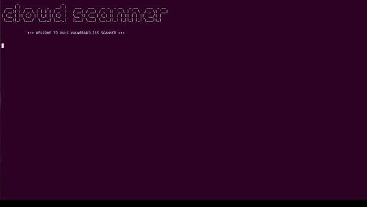

# Red-Detector:使用 Vuls.io 扫描您的 EC2 实例以查找其漏洞

> 原文：<https://kalilinuxtutorials.com/red-detector-scan-your-ec2-instance-to-find-its-vulnerabilities-using-vuls-io/>

**Red-Detector** 是一个使用 Vuls(【https://vuls.io/en/】)扫描 EC2 实例以发现其漏洞的工具。

使用 Lynis([https://cisofy.com/solutions/#lynis](https://cisofy.com/solutions/#lynis))审计您的 EC2 实例以发现安全错误配置。

使用 Chkrootkit([http://www.chkrootkit.org/](http://www.chkrootkit.org/))扫描 EC2 实例，寻找 rootkit 的迹象。

**要求**

*   使用下面提到的 EC2 操作配置 AWS 帐户。包含这些要求的策略可以在 red-detector-policy.json 中找到。

操作详细信息:

| 必需的操作权限 | 为什么需要它 |
| --- | --- |
| "附件卷" | 允许将已拍摄快照的卷附加到用于漏洞扫描的 EC2 实例。 |
| " AuthorizeSecurityGroupIngress " | 允许将安全组附加到 EC2 实例。包含 ssh 端口的 IP 前缀和为扫描 UI 访问生成的随机端口。 |
| "描述实例" | 允许访问客户端 EC2 实例的详细信息。 |
| "创建密钥对" | 允许创建用作 EC2 实例的密钥的密钥对。 |
| "创建标签" | 允许在卷和快照上创建标记。 |
| "描述区域" | 允许访问客户端的活动区域，使用户能够选择相关区域进行扫描。 |
| "运行实例" | 允许在用户客户端下创建 EC2 实例。 |
| "报告实例状态" | 允许获取创建的 EC2 实例的当前状态，以确保它正在运行。 |
| "描述快照" | 允许获取拍摄的快照的当前状态，以确保其可用。 |
| "描述图像" | 支持查询 AMI 以获取最新的 Ubuntu AMI。 |
| "描述卷状态" | 启用获取正在创建的卷的当前状态。 |
| "描述卷" | 允许获取卷的详细信息。 |
| "创建卷" | 允许创建卷，以便将其附加到拍摄的快照，并将其附加到用于漏洞扫描的 EC2 实例。 |
| "描述可用性区域" | 允许访问客户端的活动可用性分区，以便为连接到 EC2 实例的已创建卷选择一个分区。 |
| "描述电脑" | 启用获取客户端默认 vpc。用于 EC2s 安全组生成。 |
| "创建安全组" | 允许创建附加到 EC2 实例的安全组。 |
| "创建快照" | 允许拍摄快照。用于拍摄所选 EC2 实例的快照。 |
| "删除快照" | 允许删除在此过程中创建的过时快照 |

*   运行 EC2 实例–确保您知道要扫描的 EC2 实例的区域和实例 id。支持的版本:
    *   乌班图:14，16，18，19，20
    *   Debian: 6，8，9
    *   红帽:7，8
    *   苏珊:12 岁
    *   亚马逊:2
    *   甲骨文:8

**安装**

sudo git 克隆 https://github.com/lightspin-tech/red-detector.git
pip 3 install-r requirements . txt

**用途**

**互动**

**python3 main.py**

**命令参数**

**用法:main . py[-h][–REGION REGION][–INSTANCE-ID INSTANCE _ ID][–key pair key pair][–日志级 LOG_LEVEL]
可选参数:
-h，–help 显示此帮助消息并退出
–REGION REGION 区域名称
–INSTANCE-ID INSTANCE _ ID EC2 实例 ID
–key pair key pair 现有密钥对名称
–日志级 LOG_LEVEL 日志级**

**流量**

*   运行 main.py。
*   区域选择:使用默认区域(美国东部-1)或选择一个区域。请注意，如果所选区域不包含任何 EC2 实例，您将被要求选择另一个区域。
*   EC2 inatance-id 选择:您将获得所选区域下所有 EC2 实例 id 的列表，并要求您选择想要扫描的 inatance。请确保选择有效的答案(所需 id 左边的数字)。
*   跟踪流程进度…大约需要 30 分钟。
*   获取报告的链接！

**故障排除**

**动词日志**

**python 3 main . py–日志级调试**

**扫描仪数据库更新过程**

*   连接到 EC2 实例创建的 **`ssh ubuntu@PUBLICIP -i KEYPAIR.pem`**
*   观看进度 **`tail /var/log/user-data.log`**

[**Download**](https://github.com/lightspin-tech/red-detector)