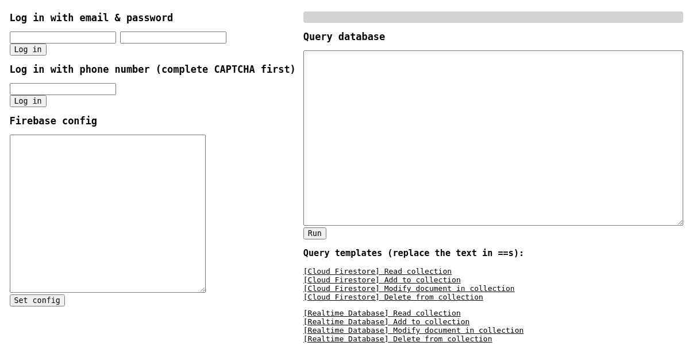

# Baserunner:一个探索 Firebase 数据存储的工具

> 原文：<https://kalilinuxtutorials.com/baserunner/>

Baserunner 是一个用于探索和利用 Firebase 数据存储的工具。请看我们博客上的这篇文章，了解 Firebase 的工作原理以及我们开发这个工具的原因。

**设置**

**git 克隆 https://github.com/iosiro/baserunner.git
CD base runner
NPM 安装
npm 运行构建
npm 开始
在你的浏览器中转到 http://localhost:3000**。

**用途**

Baserunner 接口如下所示:

首先，使用配置文本框从您想要测试的应用程序加载 Firebase 配置 JSON 结构。看起来是这样的:

**{
"apiKey": "API_KEY "、
" authDomain ":" PROJECT _ ID . firebase APP . com "、
" database URL ":" https://PROJECT _ ID . firebase io . com "、
"projectId": "PROJECT_ID "、
" storage bucket ":" PROJECT _ ID . APP spot . com "、
" messaging senderid ":" SENDER _ ID "、
"appId": "APP_ID**

然后以普通用户身份登录，要么用邮箱和密码，要么用手机号。使用手机号码登录时，请先填写验证码，然后再提交您的号码。然后，系统会从您的短信中提示您输入动态口令。不需要输入验证码就可以完成登录。请注意，您可以跳过这一步来测试没有身份验证的查询。

最后，您可以使用查询接口向应用程序的云 Firestore 提交查询。Baserunner 为常见操作提供了许多模板查询。单击其中一个将其加载到文本框中，并用集合、id、字段等的有效名称替换看起来像 **`==LIKE THIS==`** 的值。

因为使用 Firebase JavaScript SDK 无法获得可用集合的列表，所以您需要猜测这些集合，或者从应用程序的前端 JavaScript 中获取它们的名称。

[**Download**](https://github.com/iosiro/baserunner)