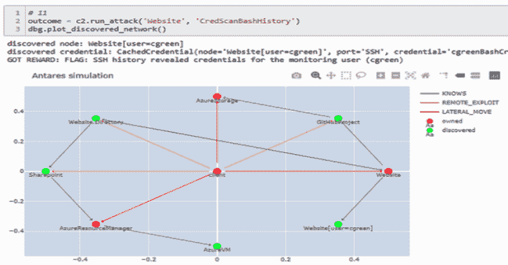

# 网络战:一个实验和研究平台

> 原文：<https://kalilinuxtutorials.com/cyberbattlesim/>

CyberBattleSim 是一个实验研究平台，用于研究在模拟的抽象企业网络环境中运行的自动代理的交互作用。该模拟提供了计算机网络和网络安全概念的高级抽象。其基于 Python 的开放式人工智能健身房接口允许使用强化学习算法训练自动化代理。

模拟环境由一个固定的网络拓扑和一组代理可以用来在网络中横向移动的漏洞来参数化。攻击者的目标是通过利用植入计算机节点的漏洞来控制网络的一部分。当攻击者试图在整个网络中传播时，防御代理会监视网络活动，并尝试检测任何正在发生的攻击，并通过驱逐攻击者来减轻对系统的影响。我们提供了一个基本的随机防御程序，可以根据预定义的成功概率检测和缓解正在进行的攻击。我们通过重新映像受感染的节点来实现缓解，这是一个抽象地建模为跨越多个模拟步骤的操作的过程。

为了比较代理的表现，我们看两个指标:为达到他们的目标所采取的模拟步骤的数量和跨训练时期的模拟步骤的累积奖励。

**项目目标**

我们将这个项目视为一个实验平台，在抽象的模拟网络环境中对自动代理的交互进行研究。通过开源，我们希望鼓励研究界研究网络代理如何在这样的网络环境中互动和进化。

我们提供的模拟确实过于简单，但这也有好处。其高度抽象的性质禁止直接应用于现实世界的系统，从而提供了一种安全措施，防止用它训练的自动化代理的潜在恶意使用。同时，它的简单性允许我们专注于我们旨在研究的特定安全方面，并快速试验最近的机器学习和人工智能算法。

例如，当前的实现集中于横向移动网络攻击技术，希望了解网络拓扑和配置如何影响它们。考虑到这个目标，我们认为没有必要对实际的网络流量进行建模。这只是我们系统中的一个重要限制的例子，未来的贡献可能想要解决这个问题。

在算法方面，我们提供了一些基本的代理作为起点，但我们很想知道最新的强化学习算法与它们相比如何。我们发现，与视频游戏或机器人控制等其他应用相比，任何计算机系统固有的大动作空间对于强化学习来说都是一个特殊的挑战。当在代理通常不具有内部存储器的情况下应用 RL 技术时，训练可以存储和检索凭证的代理是面临的另一个挑战。这些是模拟可以用于基准测试的其他研究领域。

其他感兴趣的领域包括自主网络安全系统的负责任和合乎道德的使用:如何设计一个企业网络，使防御代理具有内在优势？如何进行旨在保护企业免受自主网络攻击的安全研究，同时防止此类技术被恶意使用？

**设置开发环境**

强烈建议在 Linux 环境下工作，无论是直接还是通过 Windows 上的 WSL。直接在 Windows 上运行 Python 应该可以，但是不再受支持。

从签出存储库开始:

**git 克隆 https://github.com/microsoft/CyberBattleSim.git**

**在 Linux 或 WSL 上**

这些指令在 Linux Ubuntu 发行版上进行了测试(本地和通过 WSL)。运行以下命令来设置您的开发环境并安装所有必需的依赖项(apt 和 pip 包):

**。/init.sh**

如果 python3.8 不存在，脚本会安装它。如果你运行的 Ubuntu 版本早于 20，它会自动添加一个额外的 apt 库来安装 python3.8

该脚本将在`**venv**`子目录下创建一个[虚拟 Python 环境](https://docs.python.org/3/library/venv.html)，然后可以用 **`venv/bin/python`** 运行 Python。

**注意**:如果您更喜欢来自全局安装而不是虚拟环境的 Python，那么您可以通过用`./init.sh -n`运行脚本来跳过虚拟环境的创建。这将在 Python 3.8 的全系统安装中安装所有 Python 包。

**用于 Linux 的 Windows 子系统**

Windows 上支持的开发环境是通过 WSL 实现的。您首先需要在您的 Windows 机器上安装一个 Ubuntu WSL 发行版，然后按照 Linux 说明进行操作(下一节)。

**来自 WSL 的 Git 认证**

要使用 Git 进行身份验证，您可以使用基于 SSH 的身份验证，或者使用 credential-helper 技巧来自动生成 PAT 令牌。后者可以通过在 WSL 下运行以下命令来完成([更多信息，请点击](https://docs.microsoft.com/en-us/windows/wsl/tutorials/wsl-git)):

**Git config–global credential . helper "/mnt/c/Program \ Files/Git/mingw 64/lib exec/Git-core/Git-credential-manager . exe "**

wsl 上的坞站

要在 docker 容器中运行您的环境，我们建议使用以下指令通过 Linux (WSL)上的 Windows 子系统运行`**docker**`:[在 WSL](https://docs.docker.com/docker-for-windows/wsl-tech-preview/) 下的 Windows 上安装 Docker。

**Windows(不支持)**

这个方法不再被维护，请选择在 WSL 子系统 Linux 环境下运行。但是如果你坚持要从安装 [Python 3.8](https://www.python.org/downloads/windows/) 开始，那么在 Powershell 提示符下运行`**./init.ps1**`脚本。

**使用 Docker 快速入门**

启动和运行的最快方法是通过 Docker 容器。

注意:出于许可的原因，我们不会公开再分发任何构建工件。特别是下面命令中提到的 docker 注册表 **`spinshot.azurecr.io`** 只对项目维护人员保密。

作为一种变通方法，您可以使用提供的`**Dockerfile**`自己重新创建 docker 映像，将生成的映像发布到您自己的 docker 注册表中，并替换下面命令中的注册表名称。

**提交= 7c 1 F8 c80 BC 53353937 e 3c 69 B0 f799 eb2b 03 ee
对接员登录 spino shot . Azur rec . io
对接员拉 spino shot . Azur rec . io/cyber battlefield:$提交
对接员运行-it spino shot . Azur rec . io/cyber battlefield:$ cyber battlefield/agents/baseline/run . py″**

**检查您的环境**

运行以下命令，使用基线 RL 代理运行模拟:

**python cyber battle/agents/baseline/run . py–training _ episode _ count 1–eval _ episode _ count 1–iteration _ count 10–reward plot _ with 80–chain _ size = 20–ownership _ goal 1.0**

如果一切设置正确，您应该得到如下所示的输出:

**torch cuda available = true
# # # # # dql
学习用:episode_count=1,iteration_count=10,ϵ=0.9,ϵ_min=0.1，ϵ_expdecay=5000,γ=0.015，lr=0.01，replaymemory=10000，
batch=512，target _ update = 10
# #插曲:1/1 'DQL' ϵ=0.9000，γ=0.015，lr=0.01，replaymemory=10000，
batch=512，target_update=10
第 1 集 random = green
194.00┼╭──╴
174.60┤│
155.20┤╭─────╯
135.80┤│╭──╴
116.40┤││
97.00┤│╭╯
77.60┤││
58.20┤╯╭──╯
38.80┤│
19.40┤│【t20**

**Jupyter 笔记本**

为了快速熟悉这个项目，你可以打开一个附带的 Juptyer 笔记本，与健身房环境互动。只需用`j**upyter notebook**`或 **`venv/bin/jupyter`** `notebook`启动 jupyter，如果你使用的是虚拟环境设置。

*   “捕捉旗帜”玩具环境笔记本:
    *   [随机代理](https://github.com/microsoft/CyberBattleSim/blob/main/notebooks/toyctf-random.ipynb)
    *   [人类玩家的互动会话](https://github.com/microsoft/CyberBattleSim/blob/main/notebooks/toyctf-blank.ipynb)
    *   [互动环节——完全解决](https://github.com/microsoft/CyberBattleSim/blob/main/notebooks/toyctf-solved.ipynb)
*   连锁环境笔记本电脑:
    *   [随机代理](https://github.com/microsoft/CyberBattleSim/blob/main/notebooks/chainnetwork-random.ipynb)
*   其他环境:
    *   [与随机生成环境的互动会话](https://github.com/microsoft/CyberBattleSim/blob/main/notebooks/randomnetwork.ipynb)
    *   [随机生成网络上的随机代理](https://github.com/microsoft/CyberBattleSim/blob/main/notebooks/c2_interactive_interface.ipynb)

以下 **`.py`** 笔记本最好在 VSCode 或带有 [Jupytext 扩展名](https://jupytext.readthedocs.io/en/latest/install.html)的 Jupyter 中查看，如果需要，可以轻松转换为`**.ipynb**`格式:

*   连锁环境基准:
    *   [所有基准代理的基准](https://github.com/microsoft/CyberBattleSim/blob/main/cyberbattle/agents/baseline/notebooks/notebook_all_agents_benchmark.py)
    *   [所有底线队员对抗一名基础防守队员](https://github.com/microsoft/CyberBattleSim/blob/main/cyberbattle/agents/baseline/notebooks/notebook_withdefender.py)
    *   [DeepQL](https://github.com/microsoft/CyberBattleSim/blob/main/cyberbattle/agents/baseline/notebooks/notebook_dql.py)
    *   [ε贪婪](https://github.com/microsoft/CyberBattleSim/blob/main/cyberbattle/agents/baseline/notebooks/notebook_randlookups.py)
    *   [表格 Q 学习](https://github.com/microsoft/CyberBattleSim/blob/main/cyberbattle/agents/baseline/notebooks/notebook_tabularq.py)
*   捕获标志基准:
    *   [DeepQL](https://github.com/microsoft/CyberBattleSim/blob/main/cyberbattle/agents/baseline/notebooks/notebook_ctf_dql.py)

如何实例化健身房环境？

下面的代码显示了如何创建 OpenAI Gym 环境`**CyberBattleChain-v0**`的实例，这是一个基于[链状网络结构](https://github.com/microsoft/CyberBattleSim/blob/main/cyberbattle/samples/chainpattern/chainpattern.py)的环境，具有 10 个节点 **( `size=10` )** ，其中代理的目标是要么获得网络的完全所有权 **( `own_atleast_percent=1.0` )** 要么破坏 80%的网络可用性 SLA **( `maintain_sla=0.80` )** ，同时网络由基本的概率模型防御者**进行监控和保护**

**导入赛博战。_ env . cyber battle _ env
cyber battle chain _ defender =
gym . make(' cyber battle chain-v 0 '，
size=10，
attacker goal = attacker goal(
own _ anyahy = 0，
own _ anyahy _ percent = 1.0
)，
defender _ constraint = defender constraint(
maintain _ SLA = 0.80
)，
defender _ agent = scanandreimagecompromissed machines(【T11**

要尝试其他网络拓扑，以 [chainpattern.py](https://github.com/microsoft/CyberBattleSim/blob/main/cyberbattle/samples/chainpattern/chainpattern.py) 为例定义您自己的一组机器和漏洞，然后在[模块初始化器](https://github.com/microsoft/CyberBattleSim/blob/main/cyberbattle/__init__.py)中添加一个条目来声明和注册健身房环境。

**投稿**

这个项目欢迎投稿和建议。大多数贡献都要求您同意贡献者许可协议(CLA ),声明您有权并确实授予我们使用您的贡献的权利。详情请访问[https://cla.opensource.microsoft.com](https://cla.opensource.microsoft.com/)。

当您提交拉取请求时，CLA 机器人将自动确定您是否需要提供 CLA 并适当地修饰 PR(例如，状态检查、注释)。只需按照机器人提供的指示。您只需使用我们的 CLA 在所有回购中执行一次即可。

该项目采用了[微软开源行为准则](https://opensource.microsoft.com/codeofconduct/)。欲了解更多信息，请参见[行为准则常见问题解答](https://opensource.microsoft.com/codeofconduct/faq/)或联系[opencode@microsoft.com](mailto:opencode@microsoft.com)了解更多问题或意见。

**引用本项目**

**@misc{msft:cyberbattlesim，
作者= {微软防御者研究团队。}
注= {由克里斯蒂安·塞弗特、迈克尔·贝瑟、威廉·布鲁姆、詹姆斯·博诺、凯特·法瑞斯、艾米丽·戈伦、贾斯汀·格拉纳、克里斯蒂安·霍尔斯海默、布兰登·马肯、约书亚·尼尔、妮可·尼科尔斯、朱加尔·帕里克、蔚昊然。}、
Publisher = {GitHub}、
how published = { \ URL { https://GitHub . com/Microsoft/CyberBattleSim } }、
Title = {CyberBattleSim}、
Year = {2021}
}**

[**Download**](https://github.com/microsoft/CyberBattleSim)