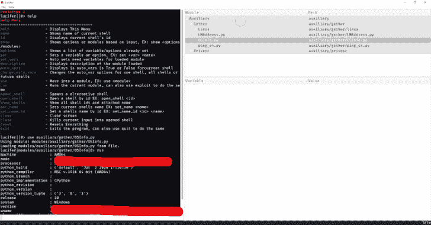
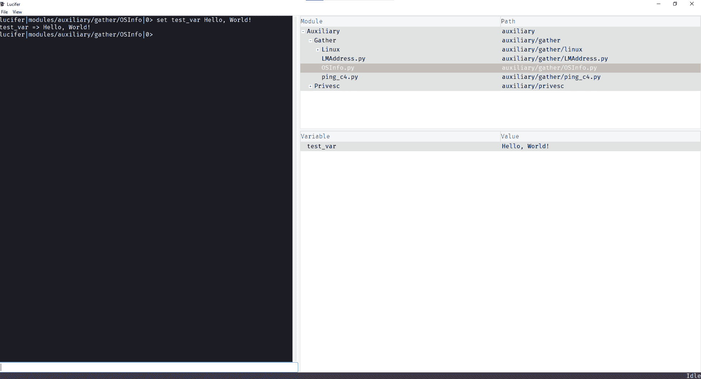
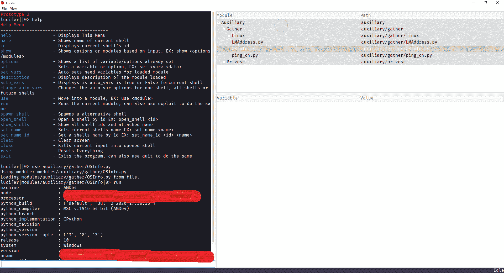
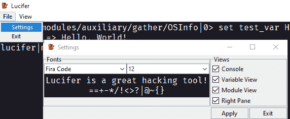

# Lucifer:一个强大的自动渗透工具

> 原文：<https://kalilinuxtutorials.com/lucifer/>

Lucifer 是一款强大的渗透工具，用于自动执行渗透任务，如本地权限提升、枚举、渗透等…使用或构建自动化模块来加速您的网络安全生活

**git 克隆 https://github.com/Skiller9090/Lucifer.git
CD 路西法
pip install-r requirements . txt
python main . py–help**

如果你想改变切割边缘，将`**-b dev**`添加到`**git clone https://github.com/Skiller9090/Lucifer.git**`的末端

**命令**

| 命令 | 描述 |
| --- | --- |
| 帮助 | 显示此菜单 |
| 名字 | 显示当前外壳的名称 |
| 身份证明（identification） | 显示当前外壳的 id |
| 显示 | 根据输入显示选项或模块，例如:显示 |
| 选择 | 显示已经设置的变量/选项列表 |
| 设置 | 设置变量或选项，例如:set |
| set _ who 的值 | 自动设置需要加载模块的变量 |
| 描述 | 显示加载的模块的描述 |
| 自动 _ vars | 显示当前 shell 的 auto_vars 是真还是假 |
| 改变自动变量 | 更改一个壳、所有壳或未来壳的 auto_var 选项 |
| 莱因德克斯 | 重新索引所有模块，允许动态添加模块 |
| 使用 | 移动到一个模块，例如:使用 |
| 奔跑 | 运行当前模块，也可以使用 exploit 来做同样的事情 |
| 产卵 _ 外壳 | 产生另一个壳 |
| opensell | 通过 id 打开一个 shell，例如:open_shell |
| 显示 _ 外壳 | 显示所有外壳 id 和附加名称 |
| 集合名称 | 设置当前壳的名称，例如:set_name |
| 集合名称标识 | 按 id 设置外壳名称，例如:set_name_id |
| 清楚的 | 清除屏幕 |
| 关闭 | 切断输入到打开的外壳的电流 |
| 重置 | 重置一切 |
| 出口 | 退出程序，也可以用 quit 来做同样的事情 |

**命令使用**

*   无参数命令
    *   `**help**`–显示帮助菜单
    *   `**name**`–显示当前外壳的名称
    *   `**id**`–显示当前外壳 id
    *   `**options**`–显示设置选项/变量的表格
    *   `**set_vars**`–自动设置加载模块所需的变量(默认在模块中定义)
    *   `**description**`–显示当前加载模块的描述
    *   `**auto_vars**`–显示 auto_vars 的当前设置(如果为真，auto_vars 将在模块加载时自动运行 set_vars)
    *   **`run`**–用当前选项运行模块，`exploit`也一样
    *   `**spawn_shell**`–生成一个新的 Shell 实例
    *   `**show_shells**`–显示所有打开的外壳 id 和名称
    *   `**clear**`–清除终端/控制台屏幕
    *   **`close`**–终止当前 shell 的输入
    *   `**reset**`–重置一切(未实施)
    *   **`exit`**–退出程序
*   Arg 命令
    *   `**show <options/modules>**`–根据参数显示集合选项或模块的列表。
    *   `**set <var_name> <value>**`–设置变量/选项
    *   `**change_auto_vars <to_set> <args>**`:
        *   `**<to_set>**`–可以是真或假(t 或 f) (-t 或-f)
        *   `**<args>**`:
            *   `**-g**` =全局–为生成的所有 shells 设置
            *   `**-n**`= new–为将来的壳生成设置该选项
            *   `**-i**`= inclusive–无论如何，将当前 shell 设置为<以 _set >
    *   `**use <module> <args>**`:
        *   `**<module>**`–模块路径
        *   `**<args>**`:
            *   `**-R**`–覆盖缓存(动态重新加载)
    *   `**open_shell <id>**`–通过外壳 id 打开外壳
    *   `**set_name <name>**`–设置当前外壳的名称
    *   `**set_name_id <id> <name>**`–设置由指定的外壳名称

**使用 Java**

通过使用 LMI.Java 扩展，Lucifer 允许 Python 和 Java 代码并肩工作。为此你需要安装 jpype1，在你的 python 环境中运行下面的命令:
`**pip install jpype1**`
从这里你可以自由地与 LMI 交互。Java .编译器和 LMI。java.luciferJVM 允许你调用 Java 函数，并通过 python 实例化 Java 类，更多的文档将在后面的 lucifer wiki 上创建。

**例题**

**设置变量**

**运行模块**

**设置**

**版本控制**

该项目的版本标准是:

少校。次要.补丁.阶段.构建

*   **专业:**
    *   当从主版本开始有大量的新特性时，或者如果有一个很大的变化会导致兼容性问题时(如果非常不稳定，主版本为 0 ),增加
    *   可能会导致不兼容问题
*   **次要:**
    *   当新功能或功能集添加到项目中时递增
    *   不应仅由于添加而导致不兼容错误
*   **补丁:**
    *   修正错误时增加，或者如果功能很小，值得增加次要的
    *   不兼容错误的风险非常低
*   **阶段:**
    *   当前专业的阶段。次要版本。补丁版本，alpha，beta，发布候选版本或发布版本
    *   表示新专业的开发进度。未成年人。补丁是
    *   阶段编号到名称的翻译:
        *   0 => beta (b)
        *   1 = >α(a)
        *   2 = >发布候选(rc)
        *   3 = >释放(r)
*   构建:
    *   这应该随着代码的每一次改变而增加，即使是一个字符的改变
*   这个版本结构可以用几种方式存储和显示:

*   在代码中存储数据的最佳方式是通过元组，例如:
    *   (主要版本、次要版本、补丁、阶段、内部版本)
        *   例如:(1，4，1，2，331)
*   最长的显示将是:
    *   `**{stage} {major}.{minor}.{patch} Build {build}**`
        *   例如:Alpha 1.4.1 Build 331
*   简短的显示如下:
    *   `**{major}.{minor}.{patch}{stage}{build}**`
        *   例如:1.4.1a331

[**Download**](https://github.com/Skiller9090/Lucifer)