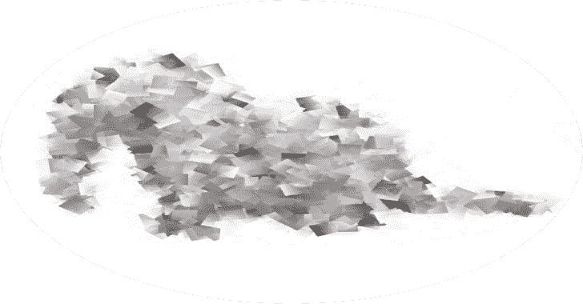

# snuffleupagus:PHP 7 和 Php8 的安全模块——杀死 bug 类并虚拟修补其余部分

> 原文：<https://kalilinuxtutorials.com/snuffleupagus/>

Snuffleupagus 是一个 [PHP 7+和 8+](https://secure.php.net/) 模块，旨在通过杀死整个 bug 类来大幅提高攻击网站的成本。它还提供了一个强大的虚拟补丁系统，允许管理员修复特定的漏洞和审计可疑的行为，而不必接触 PHP 代码。

**主要特征**

*   没有[明显的性能影响](https://dustri.org/b/snuffleupagus-030-dentalium-elephantinum.html)
*   编写虚拟修补规则既强大又简单
*   消除几类漏洞
    *   [基于非序列化的](https://www.owasp.org/images/9/9e/Utilizing-Code-Reuse-Or-Return-Oriented-Programming-In-PHP-Application-Exploits.pdf)代码执行
    *   基于[`mail`](https://blog.ripstech.com/2016/roundcube-command-execution-via-email/)的代码执行
    *   偷饼干 [XSS](https://en.wikipedia.org/wiki/Cross-site_scripting)
    *   基于文件上传的代码执行
    *   虚弱的 PRNG
    *   [二十](https://en.wikipedia.org/wiki/XML_external_entity_attack)
*   几个硬化特征
    *   cookies 的自动`secure`和`samesite`标志
    *   检测压缩后行为的捆绑规则集
    *   全局[严格模式](https://secure.php.net/manual/en/migration70.new-features.php#migration70.new-features.scalar-type-declarations)和防止类型篡改
    *   [流包装器的白名单](https://secure.php.net/manual/en/intro.stream.php)
    *   阻止可写文件执行
    *   `eval`的白名单/黑名单
    *   使用 [curl](https://secure.php.net/manual/en/book.curl.php) 时强制 TLS 证书验证
    *   请求卸载能力
*   相对合理的代码库:
    *   接近 100%覆盖率的[综合](https://coveralls.io/github/jvoisin/snuffleupagus?branch=master)测试套件
    *   每个提交都在[几个发行版](https://gitlab.com/jvoisin/snuffleupagus/pipelines)上进行测试
    *   强制代码风格
    *   A [综合文档](https://snuffleupagus.rtfd.io/)
    *   [covery](https://scan.coverity.com/projects/jvoisin-snuffleupagus)的用法

**下载**

我们有一个[下载页面](https://snuffleupagus.readthedocs.io/download.html)，在那里你可以找到你的发行包，但是你当然可以只`git clone`这个回购，或者在 [github](https://github.com/jvoisin/snuffleupagus/releases) 上查看发布。

**例题**

我们提供了[各种示例规则](https://github.com/jvoisin/snuffleupagus/tree/master/config)，如下所示:

# **加固`chmod`函数
sp . disable _ function . function(" chmod ")。param("模式")。value_r("^[0-9]{2}[67]$").drop()；
#缓解命令注入`system`
sp . disable _ function . function("系统")。param("command ")。value _ r("[$ |；& `\n]"。drop()；**

违反规则时，您应该会在日志中看到类似这样的行:

**[snuffleupagus][0 . 0 . 0 . 0][disabled _ function][drop]在/var/www/index.php:2 中执行已中止，因为函数' strpos '的返回值(0)与某个规则匹配。**

[**Download**](https://github.com/jvoisin/snuffleupagus)