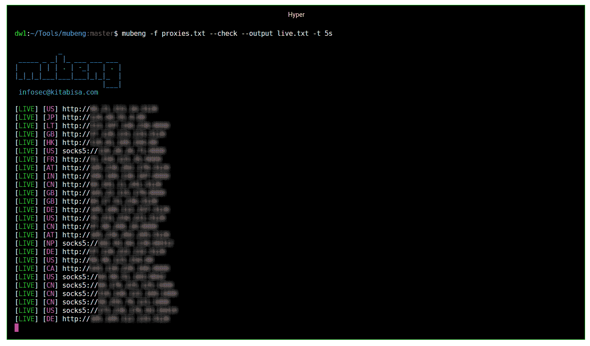
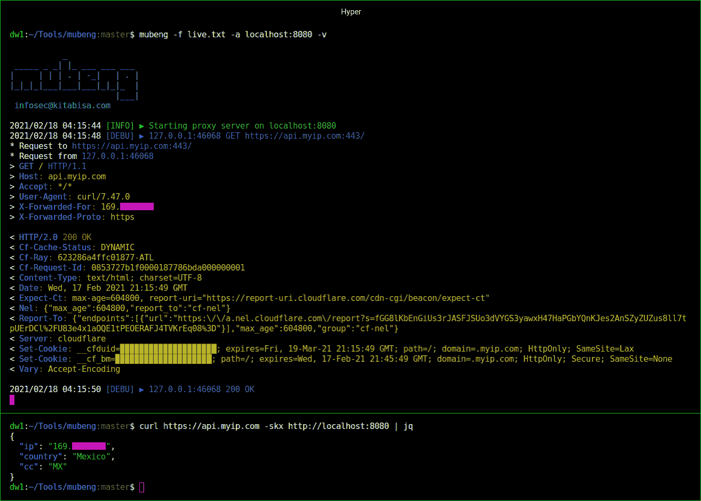
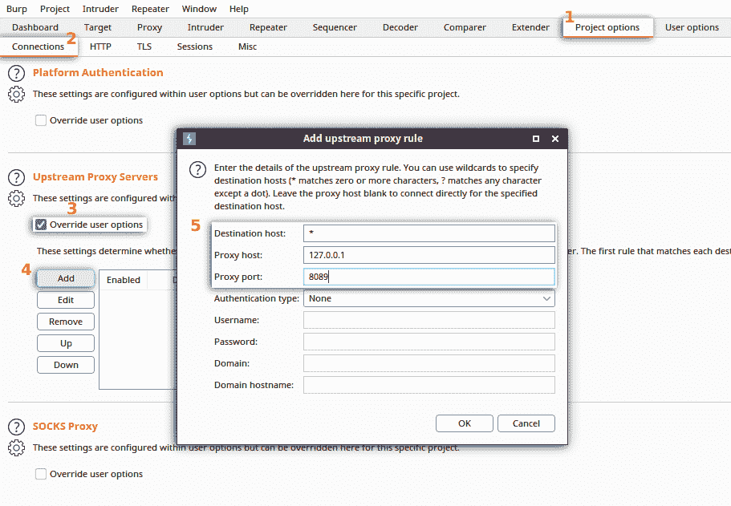
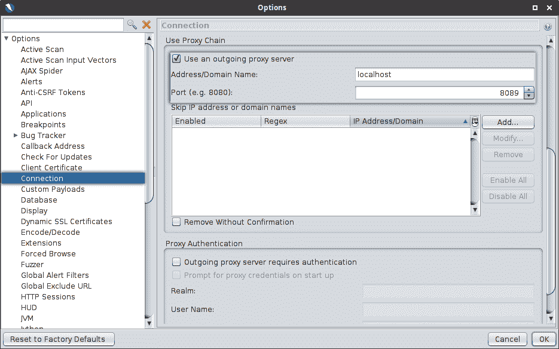

# Mubeng:一个难以置信的快速代理检查器和 IP 旋转器

> 原文：<https://kalilinuxtutorials.com/mubeng/>

Mubeng 是一个令人难以置信的快速代理检查器& IP 旋转器。

**特性**

*   **代理 IP 旋转器**:为每个特定的请求旋转你的 IP 地址。
*   **代理检查器**:检查你的代理 IP 是否仍然有效。
*   **支持所有 HTTP/S 方法**。
*   HTTP & SOCKSv5 代理协议适用。
*   **所有参数& URIs 通过**。
*   **易于使用**:你可以只运行它对你的代理文件，并选择你想要的行动！
*   **跨平台**:无论你是 Windows、Linux、Mac，甚至是树莓派，都可以很好的运行。

**为什么是 Mubeng？**

这相当简单，不需要额外的配置。

`**mubeng**`有两个核心功能:

### 1.将代理服务器作为代理 IP 轮换运行

这有助于避免不同类型的 IP 禁令，即暴力保护、API 速率限制或基于 IP 的 WAF 阻止。我们还让用户完全决定从任何地方使用代理池资源。

### 2。执行代理检查

所以，如果你想检查你的代理池，你不需要任何额外的代理检查工具。

**安装**

**二进制**

简单地说，从[发布页面](https://github.com/kitabisa/mubeng/releases)下载一个预构建的二进制文件并运行！

**码头工人**

运行以下命令提取 [Docker](https://docs.docker.com/get-docker/) 图像:

**码头工拉北碧莎/木本**

**来源**

使用 [Go *(v1.15+)*](https://golang.org/doc/install) 编译器:

**go 111 module = on go get-u ktbs.dev/mubeng/cmd/mubeng**

**注意:**上面同样的命令也适用于更新。

##### —或者

从源代码手动构建可执行文件:

**git 克隆 https://github.com/kitabisa/mubeng
CD mu beng
make build
(sudo)mv。/bin/mu beng/usr/local/bin
make clean**

**用途**

对于使用，它总是需要提供您的代理列表，无论它是用于检查还是作为代理 IP 轮换的代理池。

**基础**

**mu beng[-c |-a:8080]-f file . txt[选项…]**

**选项**

以下是它支持的所有选项。

**mubeng -h**

| **【标志】t1㎡** | **描述** |
| --- | --- |
| -f，–文件`<FILE>` | 代理文件。 |
| -a，–地址`<ADDR>:<PORT>` | 运行代理服务器。 |
| -d，–守护程序 | 代理服务器代理化。 |
| -c，–检查 | 执行代理实时检查。 |
| -t，–超时 | 最大值代理服务器/检查允许的时间(默认值:30 秒)。 |
| -r，–旋转`<AFTER>` | 为每个`AFTER`请求轮换代理 IP(默认值:1)。 |
| -v，–详细 | 转储 HTTP 请求/响应或检查时显示失效的代理。 |
| -o，–输出 | 记录代理服务器或实时检查的输出。 |
| -u，–更新 | 将 mubeng 更新至最新稳定版本。 |
| -V，-版本 | 显示当前 mubeng 版本。 |

##### 注意事项:

*   即使请求失败，也会对所有请求进行循环计数。
    *   轮换意味着随机，**而不是**从代理池中选择代理之后/增量。如果使用了代理，我们不设置条件。所以，如果你的请求达到了 *N* 值 **`(-r/--rotate)`** 你的 IP 代理就不能保证会轮换。
*   守护模式`**(-d/--daemon)**`会在(Linux/OSX)系统~~/设置回调(Windows)~~ 上安装 mubeng 作为服务。
    *   因此，您可以使用 **`journalctl`、`service`或`net`** (对于 Windows)命令来启动/停止代理服务器，从而控制服务。
    *   每当您激活守护模式，它的工作方式是强制停止和卸载现有的 mubeng 服务，然后在守护进程中重新安装和启动它。
*   详细模式 **`(-v/--verbose)`** 和超时 **`(-t/--timeout)`** 适用于代理检查和代理 IP 轮换操作。
*   启用详细模式`**(-v/--verbose)**`时，显示 HTTP 流量请求和响应，但是
    *   我们**没有**明确显示请求/响应主体，并且
    *   标题中的所有 cookie 值都将被自动编辑。
*   如果使用输出选项 **`(-o/--output)`** 运行代理 IP 旋转器，请求/响应头**而不是**被写入日志文件。
*   超时选项`**(-t/--timeout)**`值是一个可能有符号的十进制数序列，每个十进制数都有一个可选的分数和一个单位后缀，如“5s”、“300ms”、“1.5h”或“2h45m”。
    *   有效的时间单位是“ns”、“us”(或“s”)、“ms”、“s”、“m”和“h”。

**例题**

例如，您已经将代理池 **`(proxies.txt)`** 设为:

**http://127 . 0 . 0 . 1:8080
https://127 . 0 . 0 . 1:3128
socks 5://127 . 0 . 0 . 1:2121
……
……**
因为我们使用自动切换传输，所以 mubeng 可以一次接受多个代理协议方案。
请参考该软件包的文档。

**代理检查器**

通过命令中的 **`--check`** 标志来执行代理检查:

**mu beng-f proxies . txt–check–output live . txt**

上面的例子还使用了`--output`标志将一个活动代理从检查结果保存到文件`(live.txt)`中。

**代理 IP 旋转器**

此外，如果您希望根据检查 **`(live.txt)`** *(或者如果您有自己的列表)*的结果，从先前仍然存在的代理中进行代理 IP 轮换，您必须使用`**-a**`*(–address)*标志来运行代理服务器:

**mu beng-a localhost:8089-f live . txt-r 10**

`**-r**`*(–rotate)*标志用于为您提供的每个 *N* 请求值 **`(10)`旋转您的 IP。**

**[打嗝组曲](https://portswigger.net/burp/documentation/desktop/getting-started/installing-burp)上游代理**

如果您想使用`mubeng` *(代理 IP 旋转器)*作为 Burp Suite 中的上游代理，在 Burp Suite 和 mubeng 之间代理互联网，那么您不需要在 Burp Suite 中为此进行任何额外的扩展。为了证明这一点:

在您的 Burp Suite 实例中，选择**项目选项**菜单，并点击**连接**选项卡。在**上游代理服务器**部分，选中**覆盖用户选项**，然后按**添加**按钮添加您的上游代理规则。之后，在必填栏*(目的主机、代理主机&代理端口)*中填入正确的详细信息。点击**确定**保存设置。

**[OWASP ZAP](https://www.zaproxy.org/download/) 代理链**

当您使用上游代理时，它的行为是相同的。OWASP ZAP 允许您在 OWASP ZAP 会话中连接到另一个用于传出连接的代理。要用 mubeng 代理服务器链接它:

在 ZAP 会话窗口的菜单栏中选择**工具**，然后选择**选项** *(快捷键:Ctrl+Alt+O)* 子菜单，进入**连接**部分。在窗口中，滚动到**使用代理链**部分，然后选中**使用外发代理服务器**。之后，在必填栏*(地址/域名&端口)*中填入正确的详细信息。点击**确定**保存设置。

**限制**

目前 IP 轮转只将代理服务器作为 HTTP 协议运行，而不是 SOCKSv5 协议，即使您拥有的资源是 SOCKSv5。换句话说，您提供的 SOCKSv5 资源得到了正确的使用，因为它在客户机上使用自动切换传输，但是这个代理服务器**不会**切换到 HTTP 协议之外的任何协议。

[**Download**](https://github.com/kitabisa/mubeng)