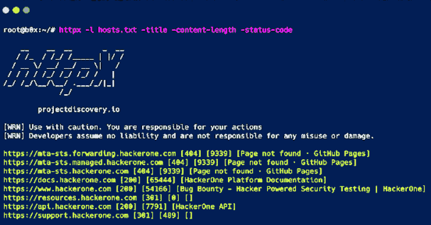
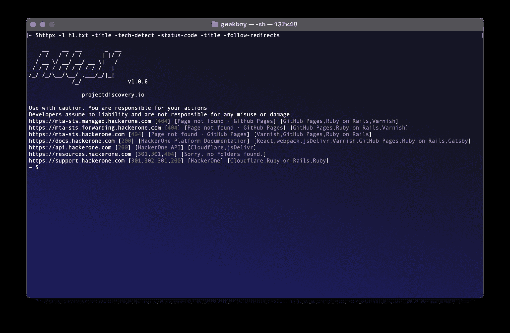

# HTTPX:一个快速多用途的 HTTP 工具包

> 原文：<https://kalilinuxtutorials.com/httpx/>

**HTTPX** 是一个快速多用途的 HTTP 工具包，允许使用 [retryablehttp](https://github.com/projectdiscovery/retryablehttp-go) 库运行多个探测器，它旨在通过增加线程来保持结果的可靠性。

**特性**

*   简单和模块化的代码基础使其易于贡献。
*   快速和完全可配置的标志探测多个元素。
*   支持多个基于 HTTP 的探测。
*   默认情况下，智能自动从 https 回退到 http。
*   支持主机，网址和 CIDR 作为输入。
*   处理边缘情况，为处理 WAFs 进行重试、回退等。

**支持的探头**

| 探针 | 默认检查 | 探针 | 默认检查 |
| --- | --- | --- | --- |
| 统一资源定位器 | 真实的 | 互联网协议(Internet Protocol) | 真实的 |
| 标题 | 真实的 | CNAME | 真实的 |
| 状态代码 | 真实的 | Raw HTTP | 错误的 |
| 内容长度 | 真实的 | HTTP2 | 错误的 |
| TLS 证书 | 真实的 | HTTP 1.1 管道 | 错误的 |
| CSP 标题 | 真实的 | 虚拟主机 | 错误的 |
| 位置标题 | 真实的 | 加拿大 | 错误的 |
| 网络服务器 | 真实的 | 小路 | 错误的 |
| Web 套接字 | 真实的 | 港口 | 错误的 |
| 响应时间 | 真实的 | 请求方法 | 错误的 |

**安装说明**

httpx 需要 **go1.14+** 才能成功安装。运行以下命令获取报告–

**go 111 module = on go get-v github.com/projectdiscovery/httpx/cmd/httpx**

**用途**

**【http x-h】**

这将显示该工具的帮助。这里是它支持的所有开关。

**httpx 帮助菜单**

**运行 httpX**

**使用标准输入运行 httpx】**

这将针对`**hosts.txt**`中的所有主机和子域运行该工具，并返回运行 HTTP webserver 的 URL。

**cat hosts . txt | httpx
*_ _**_**_//*//*//*|//
/*_ \//_*|/
///////*/////*//*//_*/_ _/。/*/|*| v 1.0
/_/
project discovery . io
【WRN】慎用。你对你的行为负责
【WRN】开发者不承担任何责任，也不对任何误用或损坏负责。
https://mta-sts.managed.hackerone.com
https://mta-sts.hackerone.com
https://mta-sts.forwarding.hackerone.com
https://docs.hackerone.com
https://www.hackerone.com
https://resources.hackerone.com
https://api.hackerone.com
https://support.hackerone.com**

**使用文件输入运行 httpx】**

这将针对 **`hosts.txt`** 中的所有主机和子域运行该工具，并返回运行 HTTP webserver 的 URL。

**httpx-l hosts . txt-silent
https://docs.hackerone.com
https://mta-sts.hackerone.com
https://mta-sts.managed.hackerone.com
https://mta-sts.forwarding.hackerone.com
https://www.hackerone.com
https://resources.hackerone.com
https://api.hackerone.com
https://support.hackerone.com**

**使用 CIDR 输入运行 httpx】**

**echo 173 . 0 . 84 . 0/24 | https-silent
https://173.0.84.29
https://173.0.84.43
https://173.0.84.31
https://173.0.84.44
https://173.0.84.12
https://173.0.84.4
https://173.0.84.36
https://173.0.84.45
https://173 . 0 . 84 . 14
https://173 . 0 . 84 . 25
https://173 . 0 . 84 . 46
https://173.0**

**使用子查找器运行 httpx】**

sub finder-d hackerone.com | httpx-title-tech-detect-status-code-title-follow-redirects
*_ _*_ _*_*_/////*///**/*_*| |//
/*_ \/**/**/_*|/
//////*////*//*//****/*/|*|
/_/v 1 . 0 . 6
project discovery . io
慎用。您对自己的行为负责
开发者不承担任何责任，也不对任何误用或损坏负责。
https://mta-sts.managed.hackerone.com[404][Page not found GitHub Pages][Varnish，GitHub Pages，Ruby on Rails]
https://mta-sts.hackerone.com[404][Page not found GitHub Pages][Varnish，GitHub Pages，Ruby on Rails]
https://mta-sts.forwarding.hackerone.com[404][Page not found GitHub Pages][GitHub Pages，Ruby on Rails，Varnish]
https://docs.hackerone.com[200][hacker one 平台文档] [Ruby on Rails，jsDelivr，Gatsby，React，webpack，Varnish，GitHub Pages]【]

[**Download**](https://github.com/projectdiscovery/httpx)