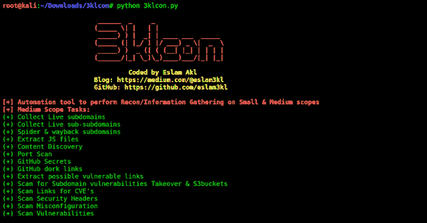
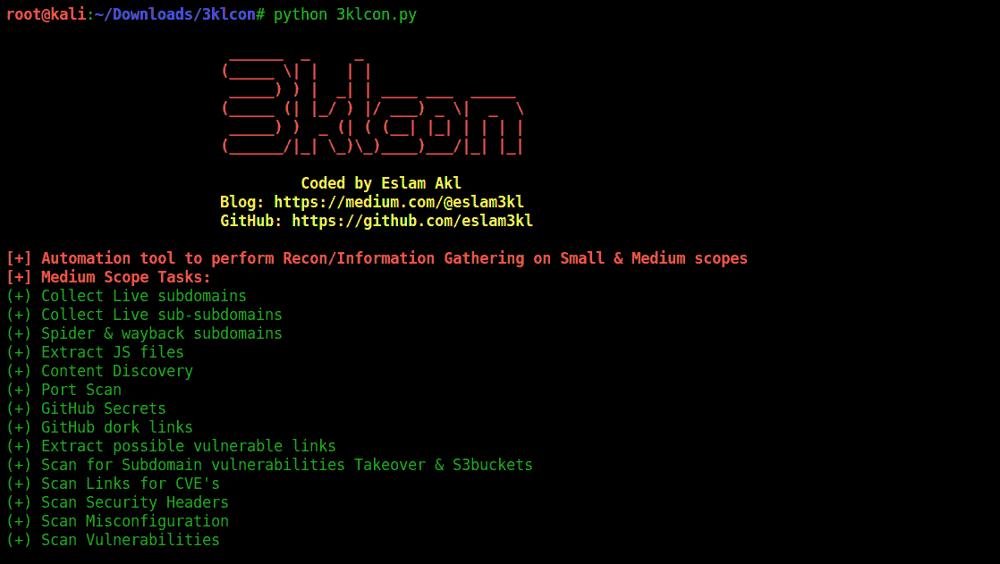

# 3KLCON:适用于大中型范围的自动化侦察工具

> 原文：<https://kalilinuxtutorials.com/3klcon/>

3KLCON 是一款全自动侦察工具，适用于中小型范围。ّIt's 建议在 VPS 上使用它，它会发现秘密和寻找漏洞。**那么，欢迎并让我们深入了解一下< 3**

**更新**

**1.1 版本，有什么新功能？(非常推荐)**

*   使用旧工具解决多个问题。
*   升级到 python3
*   编辑工具的方法，你可以在那里检查🙂
*   编辑选定的工具，更改一些并使用更多的工具
*   编辑一些进程作为用户选项，如目录强制和端口扫描

**安装说明**

1.在任何安装说明之前:您必须是*根用户*

**$苏—**

因为一些工具和依赖项需要 root 权限

2.安装所需的工具(即使安装了用过的工具，也必须运行它)

**chmod +x install_tools.sh
。/install_tools.sh**

3.运行工具(最好使用 python2 而不是 python3)

**python 3 klcon . py-t target.com**

4.检查您是否已经安装了 GO 的最新版本，因为有些工具需要更新！

**注释**

[+]如果您在安装过程中遇到任何问题，请检查:

**你以根用户而不是普通用户的身份登录
检查你是否安装了 GO 语言，并且该路径是 exist /root/go/bin**

[+]如果你的目标是中型的话，差不多要跑 5 ~ 6 个小时。所以，耐心点，或者使用 VPS，边跑边睡🙂

[+]它会将所有的结果收集到一个带有你的目标名称的目录中

[+]有些工具可能需要你的反应，比如输入你的 GitHub 的 2FA 或者用户名，密码等等。

**使用的工具**

*   子 finder
*   资产查找器
*   替代域名系统
*   目录搜索
*   Httpx
*   Waybackurls
*   高斯
*   Git-hound
*   Gitdorks.sh
*   纳阿布
*   重力
*   Gf 模板
*   核心
*   原子核模板
*   Subjack
*   Port_scan.sh

[**Download**](https://github.com/eslam3kl/3klCon)