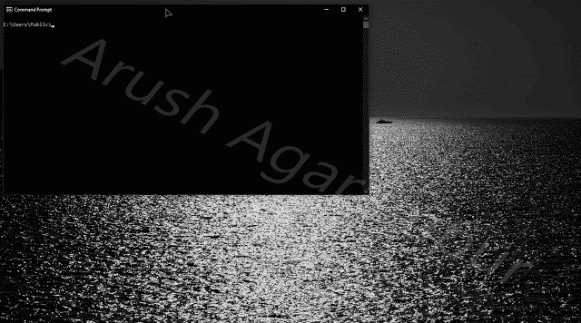
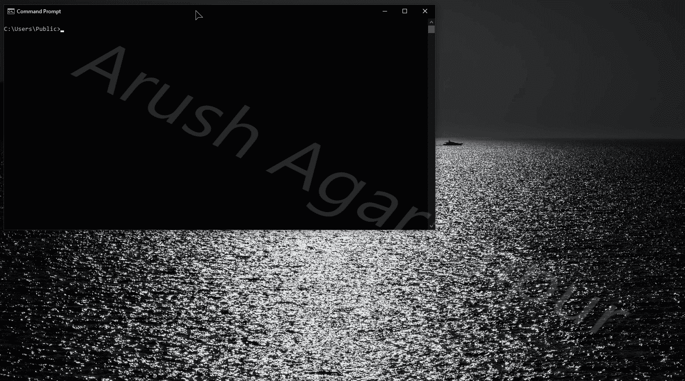

# ByeIntegrity UAC:通过劫持位于本机映像缓存中的 DLL 来绕过 UAC

> 原文：<https://kalilinuxtutorials.com/byeintegrity-uac/>

**ByeIntegrity UAC** 是一个工具，用于绕过用户帐户控制(UAC)来获得提升的(管理员)权限，以高完整性级别运行任何程序。

**要求**

*   管理员帐户
*   UAC 通知级别设置为默认或更低

**工作原理**

ByeIntegrity 劫持位于本机映像缓存(NIC)中的 DLL。网卡由使用。NET 框架来存储优化的。NET 程序集，这些程序集是从 Ngen。NET Framework 本机映像生成器。由于 Ngen 通常在当前用户下运行，该用户通过任务计划程序具有管理权限，因此 NIC 授予管理员组成员修改权限。

Microsoft 管理控制台(MMC) Windows 防火墙管理单元使用。NET Framework，在初始化它时，NIC 中的模块被加载到 MMC 进程中。MMC 可执行文件使用 AutoElevate，这是 Windows 使用的一种机制，可以在没有 UAC 提示的情况下自动提升进程的令牌。

ByeIntegrity 劫持位于名为 **`Accessibility.ni.dll`的网卡中的特定 DLL。**它将一些外壳代码写入位于 DLL 的`**.text**`部分的适当大小的填充区域。然后，DLL 的入口点被更新为指向外壳代码。加载 DLL 时，入口点(实际上是外壳代码)被执行。shellcode 计算出 **`kernel32!CreateProcessW`** 的地址，创建一个以管理员身份运行的 **`cmd.exe`** 的新实例，然后简单地返回 **`TRUE`** 。这只是因为`**DLL_PROCESS_ATTACH**`的原因；其他所有原因会立即返回 **`TRUE`。**

**UACMe**

这种攻击在 UACMe 中被实现为方法#63。如果你想尝试这种攻击，请先使用 UACMe。攻击是相同的，但是，UACMe 使用不同的方法来修改 NIC。ByeIntegrity 使用 **`IFileOperation`** 而 UACMe 使用`**ISecurityEditor**`。

此外，UACMe 为您的系统选择正确的 **`Accessibility.ni.dll`** ，并在必要时执行系统维护任务(以生成 NIC 组件)。ByeIntegrity 只是选择存在的第一个 NIC 条目(可能是/可能不是 MMC 正在使用的正确条目),并且不运行系统维护任务。

ByeIntegrity 包含的代码比 UACMe 多得多，因此阅读 UACMe 实现比阅读 ByeIntegrity 代码更容易理解。最后，ByeIntegrity 在攻击过程中会启动一个子进程，而 UACMe 不会。

**TL；dr: UACMe 比 ByeIntegrity 更简单有效，所以先用 UACMe。**

**使用代码**

如果你正在读这篇文章，那么你可能知道如何编译源代码。请注意，这根本没有经过 x86 的测试或设计，无论如何，它可能无法在 x86 上工作。

就像 UACMe，**我永远不会把编译好的二进制文件上传到这个 repo。**总有人想让这个世界崩溃，我不会为他们提供一条简单的路线，让他们在别人的电脑上运行这个程序，并故意造成破坏。我也不希望脚本小子在不了解它的作用和可能造成的损害的情况下使用这种攻击。

[**Download**](https://github.com/AzAgarampur/byeintegrity-uac)