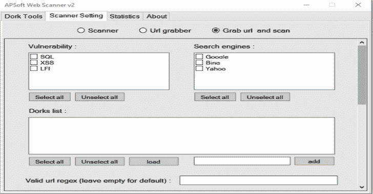
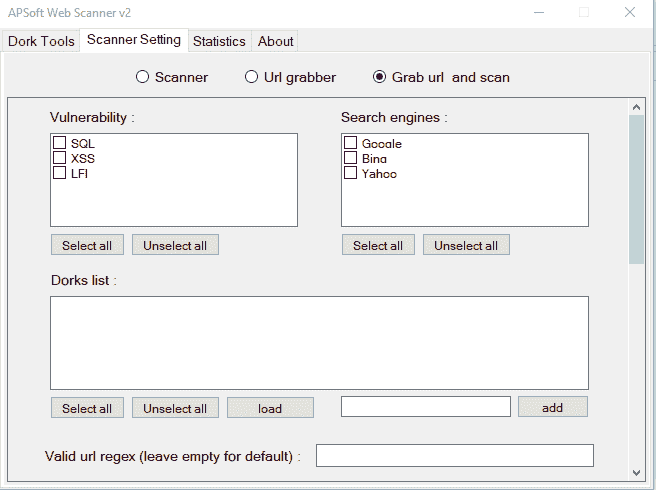
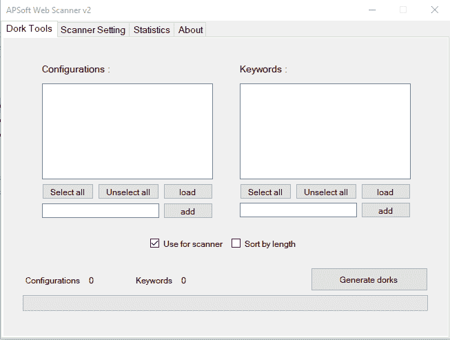
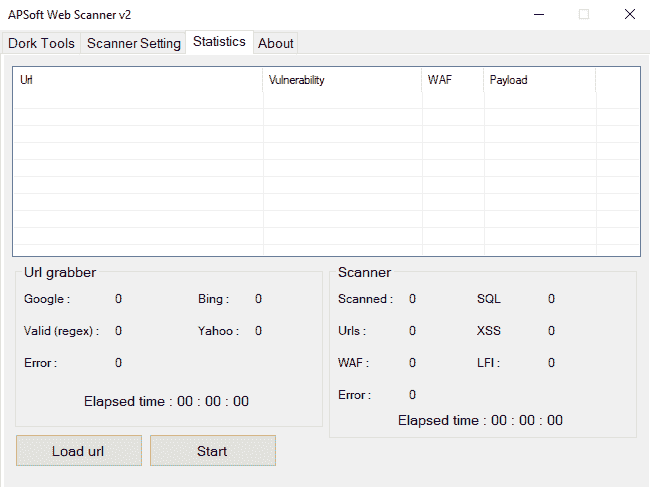

# APSoft Web Scanner V2:用于 Windows 平台的强大的傻瓜搜索器和漏洞扫描器

> 原文：<https://kalilinuxtutorials.com/apsoft-web-scanner-v2/>

**APSoft Web Scanner V2** 是一款用于 Windows 平台的强大的傻瓜搜索和漏洞扫描工具。

**软件图片**

我能用这个做什么？

有了这个软件，你将能够在**支持的搜索引擎**中搜索你的呆瓜，并扫描抓取的 URL 以找到它们的漏洞。此外，你可以随时生成呆瓜，扫描网址和搜索呆瓜

**支持的搜索引擎**

*   谷歌
*   美国 Yahoo 公司(提供互联网的信息检索服务)
*   堆

**支持的漏洞**

*   SQL 注入
*   XSS
*   LFI

第 2 版有什么新功能(最重要的更新)？

**添加自定义有效载荷**

你可以编辑 **payloads.json** 文件，该文件将在你打开和关闭一次软件时创建，并根据你的需要添加有效载荷，比喝水还容易

**添加自定义错误检查**

一旦有效载荷被注入 url，软件将在新的网站源中寻找错误，你也可以自定义这些错误。你要做的就是轻松编辑 **payloadserror.json** 文件，这个文件会在你打开和关闭一次软件时创建。你也可以使用正则表达式作为错误，在这里用**REIT |你的正则表达式**格式

**多重漏洞检查**

在旧版本中，您不能选择 1 个以上的漏洞进行检查，但在 v2 中，您可以轻松做到这一点。

**多重搜索引擎抓取器**

在旧版本中，您不能选择一个以上的搜索引擎来搜索，但在 v2 中，您可以很容易地做到这一点。

**内存管理**

我们增加了内存管理，以避免您的系统内存不足

**呆瓜发电机**

您可以生成呆子，并保存他们非常快与您的自定义配置和关键字。有效的配置格式应该包含 **{DORK}** ，在生成 DORK 的过程中，这些关键字将被替换

**更新列表(全部)**

*   基于 microsoft task 的新线程系统
*   使用 linq 技术
*   多克发电机部件
*   能够添加正则表达式作为有效负载错误
*   使用率低
*   从 WPF 转移到 Windows 窗体(只是因为我的设计不好，如果你能做得更好，请联系我)
*   能够单独和同时使用扫描仪
*   还有…

[**Download**](https://github.com/ph09nix/APSoft-Web-Scanner-v2#what-can-i-do-with-this-)