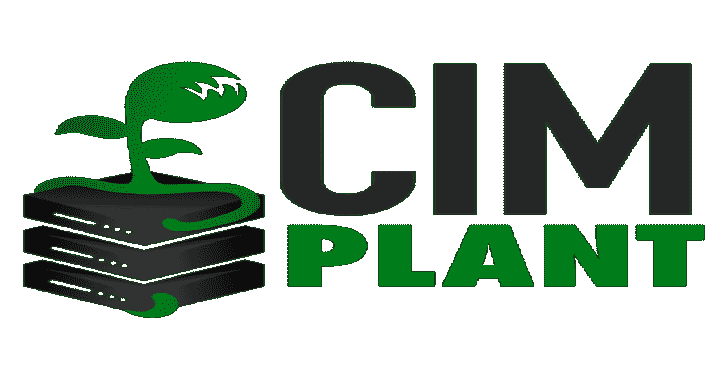
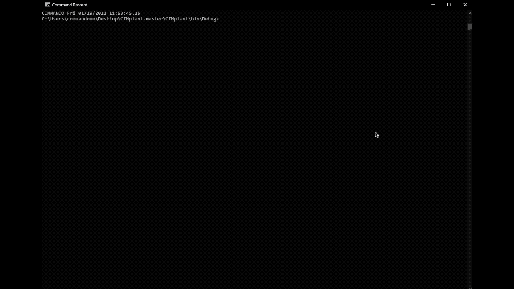

# CIM plant:WM implant 的 C#端口，它使用 CIM 或 WMI 来查询远程系统

> 原文：<https://kalilinuxtutorials.com/cimplant/>

WMImplant 的 C#端口，它使用 CIM 或 WMI 来查询远程系统。它可以使用提供的凭据或当前用户的会话。

**注意:**一些命令将结合使用 PowerShell 和 WMI，在`--show-commands`命令中用**表示。

**简介**

CIMplant 是在 [@christruncer](https://twitter.com/christruncer) 的 [WMImplant](https://github.com/FortyNorthSecurity/WMImplant) 上的 C#重写和扩展。它允许您收集有关远程系统的数据、执行命令、导出数据等等。该工具允许使用 Windows 管理规范、 [WMI](https://docs.microsoft.com/en-us/windows/win32/wmisdk/about-wmi) 或通用接口模型、 [CIM](https://www.dmtf.org/standards/cim) 进行连接；更准确地说是 Windows 管理基础设施。CIMplant 需要目标系统上的本地管理员权限。

##### **设置**

在 Releases 下使用构建版本可能是最简单的，只需注意它是在调试模式下编译的。如果您想自己构建解决方案，请遵循以下步骤。

1.  将 CIMplant.sln 加载到 Visual Studio
2.  转到顶部的构建，然后构建解决方案(如果不需要修改)

**用途**

**CIMplant.exe–帮助
CIMplant.exe–show-commands
CIMplant.exe–show-examples
CIMplant.exe-s[远程 IP 地址]-c cat-f c:\ users \ user \ desktop \ file . txt
CIMplant.exe-s[远程 IP 地址]-u[用户名]-d[域]-p[密码]-c cat-f c:\ users \ test \ desktop \ file . txt
CIMplant.exe-s[远程 IP 地址]-u[用户名]-d[域]-p[密码]-c command _ exec–执行" dir c:\" 【T6**

**一些有用的命令**

**一些使用命令的例子**

**钴击执行组件**

我想以一种允许通过 execute-assembly 使用的方式对 CIMplant 进行编码，这样所有的东西都被打包到一个可执行文件中，并以反射方式加载。您应该能够通过 beacon 毫无问题地运行所有命令。尽情享受吧！

**重要文件**

1.  程序. cs

> 这是操作的大脑，程序的驱动程序。

2.  Connector.cs

> 这是进行初始 CIM/WMI 连接并传递给应用程序其余部分的地方

2.  ExecuteWMI.cs

> WMI 命令的所有功能代码

3.  ExecuteCIM.cs(执行 CIM.cs)

> CIM (MI)命令的所有功能代码

**检测**

当然，我们想知道的第一件事是最初的 WMI 或 CIM 连接。一般来说，WMI 使用 DCOM 作为通信协议，而 CIM 使用 WSMan(或 WinRM)。这可以为 CIM 修改，并且在 CIMplant 中，但是现在让我们检查一下缺省值。对于 DCOM，我们可以做的第一件事是寻找通过**端口 135** 的初始 TCP 连接。然后，连接和接收系统将决定使用一个新的、非常高的端口，因此会有很大变化。对于 WSMan，最初的 TCP 连接是通过**端口 5985** 进行的。

接下来，您需要在事件查看器中查看 Microsoft-Windows-WMI-活动/跟踪事件日志。搜索**事件 ID 11** ，如果可能，过滤 IsLocal 属性。您还可以在 Microsoft-Windows-WinRM/Analytic 日志中查找**事件 ID 1295** 。

最后，您将希望使用**Win32 _ OSRecoveryConfiguration**类查找对 **DebugFilePath** 属性的任何修改。关于检测的更多详细信息可以在我们博客系列的第 1 部分找到: [CIMplant 第 1 部分:检测 WMImplant 的 C#实现](https://fortynorthsecurity.com/blog/cimplant-part-1-detections/)