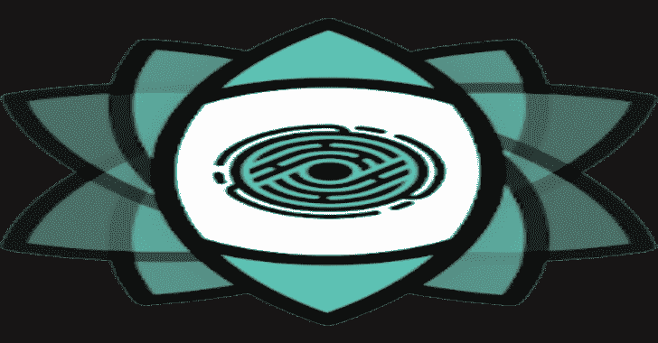
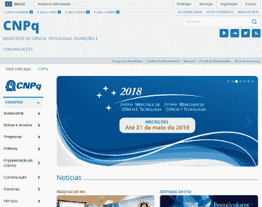
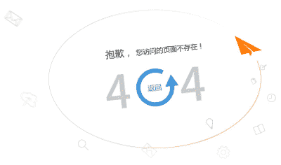
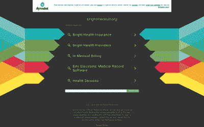

# Eyeballer:用于分析 Pentest 截图的卷积神经网络

> 原文：<https://kalilinuxtutorials.com/eyeballer/>

Eyeballer 适用于大范围的网络渗透测试，在这种测试中，您需要从大量基于 web 的主机中找到“感兴趣的”目标。继续使用您最喜欢的截屏工具，如 normal(witness 或 GoWitness ),然后通过 Eyeballer 运行它们，告诉您哪些可能包含漏洞，哪些不包含。

**示例标签**

**古色古香的遗址**

**登录页面**

**Webapp**

**自定义 404 的**

**停放的域名**

**标签的含义**

看起来陈旧的网站，块状的框架，破损的 CSS，看起来像是 21 世纪初设计的网站，你一看就知道。旧网站不仅仅丑陋，它们也非常容易受到攻击。当你想黑进一些东西时，这些网站是一座金矿。

**登录页面**登录页面对于 pen 测试来说是很有价值的，它们表明还有你目前无法访问的额外功能。这也意味着凭据枚举攻击有一个简单的后续过程。您可能认为可以设置一个简单的启发式方法来查找登录页面，但实际上这真的很难。现代网站不仅仅使用一个简单的输入标签。

这告诉你这里有更多的页面和功能可以作为攻击的表面。这与没有其他功能的简单登录页面形成对比。或者没有其他功能的默认 IIS 登录页面。这个标签应该向您表明这里有一个 web 应用程序要攻击。

现代网站喜欢可爱的定制 404 页面，上面有坏掉的机器人或悲伤的狗的图片。不幸的是，他们也喜欢在这样做的同时返回 HTTP 200 响应代码。更常见的是，“404”页面甚至不包含文本“404”。这些页面通常是无趣的，尽管有很多视觉上的东西，Eyeballer 可以帮你筛选出来。

**停泊域**停泊域是看起来真实的网站，但不是有效的攻击面。它们是独立的页面，通常缺乏任何真正的功能，几乎完全由广告组成，并且通常不是由我们的实际目标运行的。这是当指定的域名错误或失效时你得到的结果。随着时间的推移，找到这些页面并将其从范围中移除是非常有价值的。

**设置**

在 pip 上下载所需的软件包:

**sudo pip3 安装要求. txt**

或者，如果您需要 GPU 支持:

**sudo pip3 install -r 需求-gpu.txt**

**注意**:设置 GPU 以与 TensorFlow 一起使用超出了本自述文件的范围。有硬件兼容性要考虑，有驱动程序要安装…有很多。因此，如果你想要一个 GPU，你就必须自己解决这个问题。但是至少从 Python 包的角度来看，上面的需求文件已经涵盖了您的需求。

**预训练重量**

对于最新的预训练重量，请查看 GitHub 上的发布。

**培训数据**您可以在这里找到我们的培训数据:

[https://www . Dropbox . com/s/rpylhi v2 g 0 kokts/eye baller-3.0 . zip？dl=1](https://www.dropbox.com/s/rpylhiv2g0kokts/eyeballer-3.0.zip?dl=1)

从训练数据中你需要两件事:

*   **`images/`** 文件夹，包含所有截图(缩小到 224×224)
*   那有所有的标签
*   `**bishop-fox-pretrained-v3.h5**`一个经过预先训练的重量文件，无需训练即可直接使用。

将这三个都复制到 Eyeballer 代码树的根中。

**预测标签**

**注意**:为了获得最佳效果，请确保您的网站截图采用原生的 1.6 倍宽高比。即:1440×900。Eyeballer 会自动将图像缩小到合适的大小，但如果纵横比不对，它会挤压图像，从而影响预测性能。

要查看一些截图，只需运行“预测”模式:

**eye baller . py–weights YOUR _ weights . H5 预测 YOUR_FILE.png**

或者对于整个文件目录:

**eye baller . py–weights YOUR _ weights . H5 predict PATH _ TO/YOUR _ FILES/**

Eyeballer 会以人类可读的格式(一个`**results.html**`文件，这样你可以很容易地浏览)和机器可读的格式(一个`**results.csv**`文件)将结果返回给你。

**性能**

Eyeballer 的性能是根据一个评估数据集来衡量的，该数据集是随机选择的总截图的 20%。由于这些截图从未在培训中使用过，因此它们可以作为一种有效的方式来查看模型的执行情况。以下是最新结果:

| 整体二进制精度 | 93.52% |
| --- | --- |
| **全有或全无的精确度** | **76.09%** |

**整体二进制精度**大概就是你所认为的模型的“精度”。给定任何一个标签，它都有可能是正确的。

**全有或全无的准确性**更加严格。为此，我们考虑图像的所有标签，如果任何标签是错误的，就认为它是失败的。这个准确度等级是模型正确预测任何给定图像的所有标签的机会。

| 标签 | 精确 | 回忆 |
| --- | --- | --- |
| 定制 404 | 80.20% | 91.01% |
| 登录页面 | 86.41% | 88.47% |
| Webapp | 95.32% | 96.83% |
| 看上去很老 | 91.70% | 62.20% |
| 寄存域 | 70.99% | 66.43% |

关于[精度与召回的详细解释，请查看维基百科](https://en.wikipedia.org/wiki/Precision_and_recall)。

**训练**

若要训练新模型，请运行:

**eyeballer.py train**

您将需要一台具有良好 GPU 的机器来在合理的时间内运行。但是，设置这一点超出了本自述文件的范围。

这将输出一个新的模型文件(默认为 weights.h5)。

**评估**

你刚刚训练了一个新模型，酷！让我们看看它对一些从未见过的图像在各种指标上的表现如何:

**eye baller . py–weights YOUR _ weights . H5 evaluate**

输出将描述模型对于每个程序标签的召回率和精确度的准确性。(包括“以上都不是”作为伪标签)

[**Download**](https://github.com/BishopFox/eyeballer)