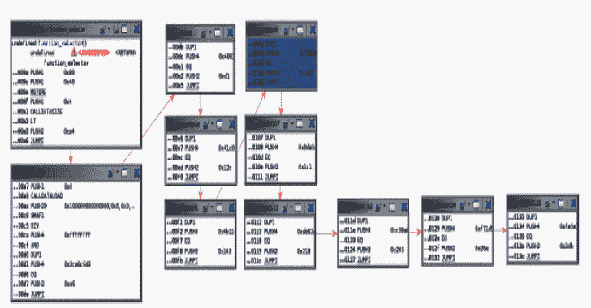
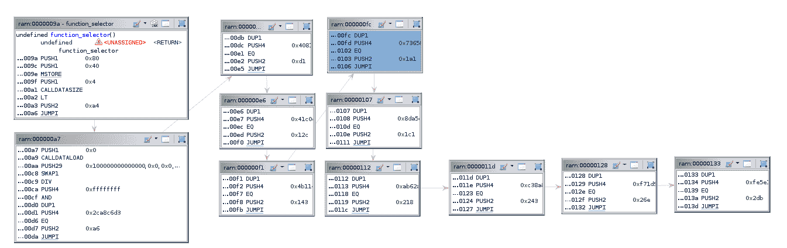

# Ghidra-Evm:智能合约逆向工程模块

> 原文：<https://kalilinuxtutorials.com/ghidra-evm/>

**Ghidra-Evm** 在过去几年中，由于编程错误，对以太坊区块链中部署的智能合约的攻击导致大量资金被盗。由于智能合约一旦被编译和部署，修改和更新起来就很复杂，不同的从业者建议在区块链中检查其安全性的重要性，在那里只有以太坊虚拟机(EVM)字节码可用。在这方面，通过反汇编和反编译的逆向工程可能是有效的。

EVM 是一个用于逆向工程智能合同的模块。它可用于从以太坊区块链下载以太坊虚拟机(EVM)字节码，并反汇编和反编译智能合约。此外，它可以分析创建代码，找到契约方法和定位不安全的指令。

它包括处理器模块、定制加载器和插件，这些插件反汇编以太坊 VM (EVM)字节码并生成智能合约的控制流图(CFG)。

最后一个版本使用的是 Ghidra 9.1.2 API。它依靠 crytic evm_cfg_builder 库([https://github.com/crytic/evm_cfg_builder](https://github.com/crytic/evm_cfg_builder))在 cfg 生成过程中帮助 Ghidra。

Ghidra-evm 包括:

*   读取字节和十六进制代码的加载程序。evm 和。evm_h 文件(见[例题](https://github.com/adelapie/ghidra-evm/blob/main/examples))。
*   EVM 指令集的 SLEIGH 定义考虑了 Ghidra 核心限制(见注释)。
*   一个助手脚本，使用 evm_cfg_builder 和 ghidra_bridge 来帮助 ghidra 生成 cfg 并探索智能合约的功能属性。
*   有助于对智能合约的不同方面进行反向工程的脚本集合:

| 脚本 | 描述 |
| --- | --- |
| [search_codecopy.py](https://github.com/adelapie/ghidra-evm/blob/main/scripts/search_codecopy.py) | 当分析智能合约中的创建代码时，我们只能看到 _dispatcher 函数，它使用 CODECOPY 将运行时代码写入内存。这个脚本寻找有用的 CODECOPY 指令，并找到隐藏在契约运行时部分的智能契约方法。 |
| [search _ dangerous _ instructions . py](https://github.com/adelapie/ghidra-evm/blob/main/scripts/search_dangerous_instructions.py) | 指令，如调用，调用代码，自毁和委托调用有时会被滥用，以转移资金到另一个合同。这个脚本找到它们，并为每个事件创建一个标签。 |
| [load _ external _ contract . py](https://github.com/adelapie/ghidra-evm/blob/main/scripts/load_external_contract.py) | 将智能合约字节代码从区块链下载到一个. evm_h 文件中，该文件可以加载到 ghidra-evm 中 |

**安装说明**

*   按照[https://github.com/justfoxing/ghidra_bridge](https://github.com/justfoxing/ghidra_bridge)的说明安装 ghidra_bridge
*   按照[https://github.com/crytic/evm_cfg_builder](https://github.com/crytic/evm_cfg_builder)的说明安装 crytic evm_cfg_builder 库
*   在 ghidra_evm/dist/安装最新的 ghidra-evm 发行版文件:
    *   Open ghidra
    *   文件->安装扩展
    *   点击“+”并选择压缩文件，例如 GHI DRA _ 9 . 1 . 2 _ PUBLIC _ 2020 1 1 0 2 _ GHI DRA _ EVM . zip
    *   单击确定
    *   重启 Ghidra

**编译指令**

ghidra-evm 目录的内容可用于在 Eclipse 中用处理器和加载程序创建 ghidra 模块，以便扩展或调试 [ghidra_evm](https://github.com/adelapie/ghidra-evm/blob/main/ghidra_evm) 。

**教程**

| 辅导的 | 描述 |
| --- | --- |
| [利用率](https://github.com/adelapie/ghidra-evm/blob/main/tutorials/00_utilization.md) | test.evm 的简单使用说明 |
| [分析创建字节码](https://github.com/adelapie/ghidra-evm/blob/main/tutorials/01_codecopy.md) | 使用 search_codecopy.py 分析创建代码并查找隐藏方法 |
| [寻找危险指令](https://github.com/adelapie/ghidra-evm/blob/main/tutorials/02_dangerous.md) | 用 search _ dangerous _ instructions . py 分析自毁事故 |
| [将智能合约字节码从区块链下载到 Ghidra](https://github.com/adelapie/ghidra-evm/blob/main/tutorials/03_external.md) | 使用 load_external_contract.py 将 EVM 字节码从区块链下载到. evm_h 文件中 |

**与外部符号执行工具的集成**

| 脚本 | 描述 |
| --- | --- |
| [咬牙器](https://github.com/adelapie/ghidra-evm/blob/main/scripts/teether_integration.py) | 它在生成漏洞之前标记了 Ghidra 中的关键路径。需要[牙胶](https://github.com/nescio007/teether)。 |

**注释**

*   CFG 是根据 evm_cfg_builder 创建的:使用了 JUMP 和 JUMPI 指令。
*   相应地生成 32×32 的跳转表(evm_jump_table ),以便在反汇编和控制流窗口中检测和显示分支。
*   Ghidra 不是为处理大于 64 位的体系结构和内存而设计的。这意味着像 PUSH32 这样的指令不能正确地显示在反编译窗口中。

[**Download**](https://github.com/adelapie/ghidra-evm)