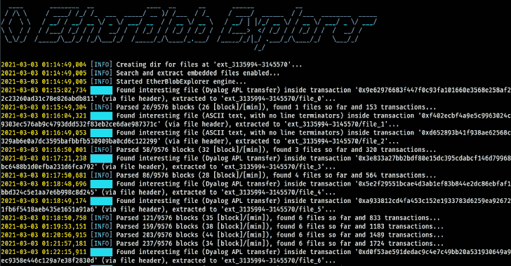

# 以太 blob 浏览器:在以太坊区块链网络上搜索并提取 Blob 文件

> 原文：<https://kalilinuxtutorials.com/etherblob-explorer/>

EtherBlob Explorer 是一款工具，面向研究人员、分析师、CTF 玩家或任何好奇的人，他们想在以太坊区块链网络上搜索不同类型的文件或任何有意义的人类提供的数据。它在 5 个可用网络中的任何一个上搜索用户提供的块 id 或 UNIX 时间戳范围:MainNet、gli、Kovan、Rinkeby 和 Ropsten。

对于现实生活中的案例，你可以阅读 2017 年做的这个实验。区块链的不变性确实是一把双刃剑。

**安装**

运行以下命令:

**pip 安装 git+https://github . com/litneet 64/etherblob explorer . git**

现在它已经可以从您的 CLI 中使用了，您可以在下面找到一些常见的用法示例！

**特性**

**网络**

搜索五个以太坊网络中的任何一个:

*   **主页**
*   **见**
*   **硬的**
*   **林克比**
*   **石柱**

**搜索位置**

该工具可以在以下位置进行搜索，可以单独搜索，也可以在同一次运行中组合搜索:

*   **交易输入数据**:在交易输入数据内搜索(默认位置)。
*   **块输入数据**:搜索块内的输入数据。
*   **契约存储**:在一个契约的存储数组中搜索第一个 *N 个* 32 字节大小的位置，将其作为一个大数据串。
*   **收件人地址**:搜索追加“收件人”地址作为可能的输入 **[*]** (首先检查文件头，并在使用 binwalk 获取所有数据时重新检查)。

**[*]** 在以太坊网络上可以将数据存储在“收件人”地址上，因为如果发送到一个没有关联帐户密钥的地址，则没有验证。这意味着您可以对任意地址进行事务处理，以便在几个 20 字节大小的事务上构建有效负载(这非常罕见，但也是一些 CTF 挑战)。
**搜索和提取方法**

所有这些方法既可以单独使用，也可以任意组合使用:

*   **嵌入文件**:使用 **`binwalk`搜索数据中嵌入的文件。**
*   **文件头/幻字节**:通过 Linux util `**file**`(默认方式)使用文件头+幻字节进行搜索。
*   **ASCII 字符串转储**:搜索数据中的 ASCII 字符串。
*   **基于熵的搜索**:使用香农熵作为测量工具，搜索自然语言文本(例如 UTF-8 Unicode)、加密/压缩文件或任何用户提供的熵限制内用户认为可行的内容。

**重要提示**:此处显示的顺序用于*幕后*放弃其他方法的搜索(例如，如果通过 **`embedded files`** 找到文件，则不会尝试使用 **`file headers`、`ascii string dump`或`entropy`** 进行搜索)，因为如果之前的方法已经成功，则不可能找到任何有意义的内容。
**杂项**

*   接受 UNIX 时间戳(而不是块 id ),这些时间戳被解析为在这些时间提交的最接近的块 id。
*   将已访问交易的所有数据保存到文件中，供以后查看。
*   将 CLI 显示的日志存储到文件中，供以后提取文件分析使用。
*   忽略用户提供的文件格式(不区分大小写)进行提取，并接受完整文件格式的子字符串以列入黑名单。
*   每分钟打印一般进度指标(例如，已经分析了多少块/事务，还剩下多少块),并在当前运行结束时显示一些有趣的指标。
*   更多有用的功能请参见手册 **( `-h` )** ！

**用途**

**常见用例**

MainNet 上的标准搜索(通过文件头搜索内部交易)，API 关键字位于默认位置(`.api-key`)和这两个块 id 之间(包括):

**$ etherblob 4081599 4081600**

在 goerli 网络上使用任意文件内的密钥进行更多“深入”搜索(搜索嵌入文件+常规搜索方法):

**$ ether blob-K API . key 3134050 3145570-M-H-网络歌莉**

同时搜索块标题和事务，并将提取的文件保存到“extracted”:

**$ ether blob 4081599 4081600–区块–交易-提取 d/**

仅搜索在 **`Jan 25 2021 19:00:00`** 和`**Jan 26 2021**` **`19:00:00` :** 之间提交的块范围内的“至”地址

**$ ether blob-t 1611601200 1611687600–地址**

仅在合同的存储上搜索字符串，并搜索前 4 个存储数组位置(128 字节的数据):

**$ ether blob 3911697 3912697-S–合同-C 4**

仅在事务内部搜索加密/压缩数据(忽略任何其他文件格式):

**$ ether blob 4081599 4081600–加密**

将事务保存到文件中时，在事务内部搜索自定义熵文件:

**$ ether blob 3911697 3912697-E 4.0 5.0-s**

仅转储在平安夜(24 日和 25 日之间)进行的块和交易的 ASCII 字符串:

**$ ether blob-t 1608836400 1608922800–块–交易–字符串**

全面搜索(缓慢，预计会有许多误报):

**$ ether blob 4081599 4081600-美国-M-H-区块-交易-地址-合同**

**高级用例**

在 [wiki](https://github.com/litneet64/etherblob-explorer/wiki) 上有更多关于高级用例的解释和相关内容！

**手动**

**用法:ether blob[-H][–transactions][–blocks][–addresses][–contracts]
[–Network { main，goerli，kovan，rinkeby，rops ten }][-H][-M][-U][-E CUSTOM _ ENTROPY CUSTOM _ ENTROPY]
[–encrypted][-S][-C CONTRACT _ POSITION][-t][-K API _ KEY _ PATH][-K API _ KEY][-D OUTPUT _ DIR]
[-o OUT _ o
位置参数:
start_block 块 id 范围的开始。
end_block 块 id 范围的结束。
可选参数:
-h，–帮助显示此帮助消息并退出
–事务在事务输入中搜索 blob 文件。默认搜索模式。
–阻止在块输入中搜索 blob 文件。如果启用，则交易输入检查被禁用，除非
明确启用。
–addresses 在“to”交易地址上搜索 blob 文件，因为在以太坊上，任何人都可以对任意地址进行交易
，即使它没有相关的所有者(仍然不是很常见)。如果启用，则
事务的输入检查被禁用，除非明确启用。
–合同在合同存储上搜索 blob 文件。如果启用，则交易输入检查被禁用
，除非明确启用。
–网络{main，goerli，kovan，rinkeby，ropsten}，-N {main，goerli，kovan，rinkeby，ropsten}
选择区块链网络进行搜索。可供选择的有 Main、Goerli(格利)、Kovan、Rinkeby
和 Ropsten。MainNet 是默认网络。不区分大小写。
-H，–文件头如果启用，通过数据(来自块，
事务或地址)的幻字节/文件头搜索文件格式。默认情况下启用，除非也启用了另一种方法。
-M，–嵌入式如果启用，通过
binwalk 搜索数据(来自块、事务或地址)上的嵌入式文件。默认情况下禁用，因为解析现在需要更长时间。
-U，–unicode 如果启用，尝试使用香农熵(介于 3.5 和 5.0 之间)从采集的数据(块、
事务、地址)中搜索并转储包含 UTF-8 文本的文件，如果在该数据上没有首先找到其他可识别的
文件。会产生许多误报。
-E CUSTOM _ ENTROPY CUSTOM _ ENTROPY，–CUSTOM-ENTROPY CUSTOM _ ENTROPY CUSTOM _ ENTROPY
定义您自己的熵限制(最小值和最大值)以在采集的数据上搜索文件/数据。
–加密如果启用，尝试使用香农熵(介于 7.0 和 8.0 之间)搜索并转储通过不同搜索
方法(块、事务、地址)找到的加密/压缩数据，如果在该数据上没有首先找到
其他可识别的文件。
-S，–strings 如果启用，如果在采集的数据
(块、事务、地址)中没有找到其他可识别的文件，则尝试搜索 ASCII 字符串并将其转储到该数据中。
-C CONTRACT_POSITION，–CONTRACT-POSITION CONTRACT _ POSITION
在合约数据内部搜索，直到到达其存储数组上的第(N-1)个位置。位置
包含 32 字节的数据。如果没有给定自定义位置，计数从 0 开始，默认位置是第 15 个位置(总共 16 个索引
)。
-t，–时间戳如果启用，则开始和结束块 id 被解释为 UNIX 时间戳，然后被解析为
这些特定时间的最近提交块。
-K API_KEY_PATH，–API-KEY-PATH API _ KEY _ PATH
带有用于查询的 Etherscan API 密钥的文件路径。默认搜索位置是。api-key。
-k API_KEY，–API-KEY API _ KEY
ethers can API KEY 作为参数。如果给定，则忽略'–API-key-path '。
-D 输出目录，–输出目录输出目录
提取文件的输出目录。默认值为“ext_{start block}-{end block}”。
-o 输出日志，–输出日志输出日志
输出日志文件。默认值为“etherblob _ {开始块}-{结束块}。日志。
-s，–save-transactions
如果启用，所有事务及其信息都存储在文件‘transactions _ { start-block }-{ end-
block }中。txt '
-I[IGNORED _ FMT[IGNORED _ FMT…]]，–IGNORED-fmt[IGNORED _ FMT[IGNORED _ FMT…]]
忽略提取的文件格式。默认忽略/通用文件格式为“ISO-8859 文本”和
“非 ISO 扩展 ASCII 文本”。“数据”文件格式总是被忽略。接受文件格式
子字符串并进行不区分大小写的匹配。* '是一个通配符，用于忽略所有文件格式。
–版本显示程序的版本号并退出
官方 GitHub repo ' https://GitHub . com/litneet 64/ether blob-explorer '**

[**Download**](https://github.com/litneet64/etherblob-explorer)