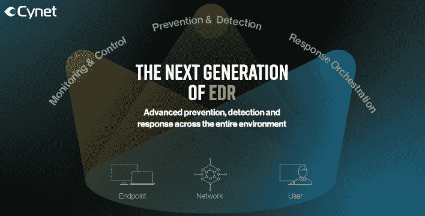

# 端点检测和响应:你必须知道的 6 个最佳实践

> 原文：<https://kalilinuxtutorials.com/endpoint-detection-and-response-6-best-practices-you-must-know-about/>

什么是端点检测和响应？

[端点检测和响应(EDR)解决方案](https://www.cynet.com/endpoint-protection-and-edr/top-6-edr-tools-compared/)是一组工具和流程，用于检测和分析端点设备上的潜在攻击及其踪迹。端点包括台式机、笔记本电脑、移动设备和连接到公司网络的其他设备。

EDR 解决方案旨在对网络威胁和攻击提供持续监控和响应。安全团队使用 EDR 工具来了解终端上发生的活动。这种级别的终端威胁可见性对于确保团队能够快速调查威胁、响应威胁并防止未来出现类似威胁至关重要。

据 Gartner 称，EDR 解决方案应该能够执行多项任务，包括数据探测、威胁搜寻、异常活动检测、事件数据搜索和调查、警报分类、验证可疑活动以及阻止攻击。

## **端点检测&响应(EDR)软件有哪些共同特点？**

大多数 EDR 解决方案提供以下功能。

**检测**

检测是持续监控的结果，用于收集有关系统正常行为的信息。然后，正常行为成为检测异常行为的基准。一旦检测到异常行为，IT 和安全团队就会收到警报，并在审查和解决过程中得到指导。

**安全壳**

如果在一个端点检测到威胁，您需要限制它访问网络和其他端点。这些功能(也称为隔离功能)有助于在检测到威胁后立即保护您的网络。

**补救**

一旦发现威胁，就必须予以解决。EDR 软件使团队能够追踪事件的源头，并识别恶意软件或可疑行为者。

**调查**

事件发生后，EDR 软件会收集大量与终端设备相关的数据，并提供活动的历史记录。您可以使用这些信息快速确定事故原因，并防止将来发生类似事件。

**行为分析**

行为分析为管理员提供了与最终用户行为相关的宝贵见解。这些数据有助于监控流程检测和比较异常情况。

**威胁数据文档**

EDR 系统通过自动收集和管理事故数据来记录事件。安全团队可以利用这些信息更好地了解终端设备的性能和运行状况。

**数据探索**

数据浏览功能使安全团队能够查看与安全事件相关的数据。安全团队可以交叉引用和分析这些数据点，以深入了解如何在未来更好地保护您的终端。

## **端点检测和响应最佳实践**

### **1。从网络分段开始**

EDR 工具通常通过隔离端点来响应事件，这种类型的响应可确保快速阻止威胁参与者。但是，首先从分段网络开始可以提供更好的保护。网络分段允许您限制对某些服务和数据存储的访问。这可以降低数据丢失的风险，并限制攻击成功时的破坏范围。

您可以使用以太网交换路径(ESP)技术，通过隐藏网络结构来进一步保护您的网络。这使得攻击者更难从一个网段横向移动到另一个网段。

### **2。关注 BYOD**

在当今的组织中，实施自带设备(BYOD)策略以使员工能够使用个人电脑、笔记本电脑和移动设备非常普遍。此外，现代网络包括许多互联设备，如打印机和其他办公设备、智能建筑设备、工业传感器和可穿戴设备。

具有活跃网络连接的安全性差的设备经常成为攻击者的目标。您的终端保护策略应该考虑这些新设备。个人拥有的设备引入了许多传统工具没有涵盖的风险。为了保护企业网络，安全团队应该考虑 [BYOD 安全技术](https://www.hysolate.com/learn/byod/byod-security-threats-security-measures-and-best-practices/)，如网络分段和零信任认证。

### **3。监控和观察流程执行情况**

安全团队需要了解终端上所有活动的细节。例如，正在运行什么进程、进程在哪里运行、正在访问哪些文件以及打开了哪些套接字。Shell 命令、进程哈希和进程祖先对于识别未授权或潜在的恶意活动都非常重要。

### **4。教育员工**

[网络犯罪分子经常利用社会工程](https://www.exabeam.com/information-security/social-engineering/)诱骗员工采取有害行动并泄露敏感信息。防止这种情况发生的唯一方法是教所有员工正确的安全措施。比如定期更换密码，确保员工不在时电脑上锁。教他们如何识别电子邮件和电话钓鱼诈骗也很重要。

### **5。强制最低特权访问**

最低权限方法将授予终端和用户的访问权限限制在所需的最小资源量。如果用户试图访问违反策略的内容，管理员会立即收到该行为的通知。如果用户需要更高级别的权限，则必须使用多因素身份认证对其进行验证。

### **6。请注意，EDR 解决方案需要人才**

在大型组织中，EDR 安全解决方案每天会生成数千个警报。这些警告中的大多数可能是误报。要实现 EDR 的真正优势，组织必须投资于能够理解计算机生成数据的安全分析师。然而，雇用内部有经验的安全分析师可能是一项昂贵的投资。较小的组织可以考虑托管检测和响应(MDR)，这是一种第三方服务，提供 EDR 和由人工分析师执行的手动分析。

## **结论**

在本文中，我介绍了可以帮助您改进端点检测和响应的 6 个关键最佳实践:

*   **使用网络分段**–这是对终端安全的重要补充，因为它可以防止攻击者在终端受损时造成损害
*   **注意 BYOD**–工作中使用的个人设备会带来额外的安全风险，使用传统方法可能难以保护。
*   **监控进程执行**–当攻击者危害主机时，这通常表现为恶意进程，这使得进程监控变得至关重要。
*   **教育员工**–员工通常是安全链中最薄弱的环节，应该接受识别和避免社会工程攻击的教育。
*   **实施最低权限访问**–使用零信任方法，确保每个用户和设备仅拥有其任务所需的最低权限。
*   **提供人力资源**–需要训练有素的安全人员来运营 EDR 解决方案，确保您拥有这种人才是至关重要的。

我希望这将有助于您的组织更好地利用 EDR 工具，并将终端安全性提升到一个新的水平。