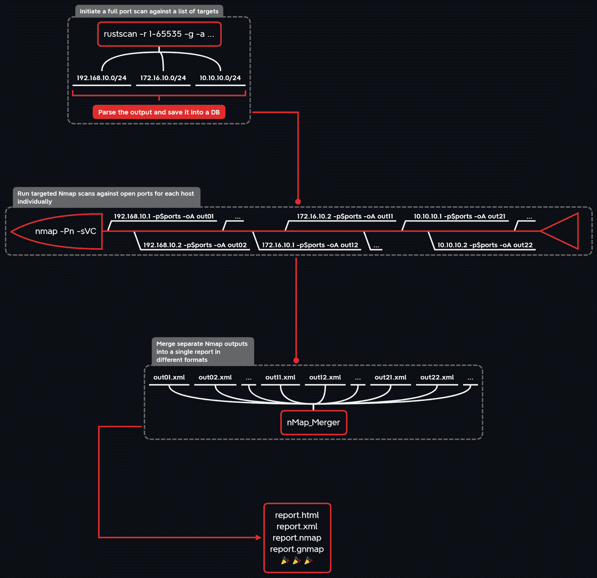

# 分割扫描:分割全端口扫描结果，并将其用于目标 Nmap 运行

> 原文：<https://kalilinuxtutorials.com/divideandscan-divide-full-port-scan-results-and-use-it-for-targeted-nmap-runs/>

**D**I vide**A**D**S**can 用于通过将端口扫描程序分为 3 个阶段来有效地自动化端口扫描程序:

1.  发现一堆目标的开放端口。
2.  使用版本抓取和 NSE 操作为每个目标单独运行 Nmap。
3.  将结果合并到单个 Nmap 报告中(提供不同的格式)。

第一阶段计划使用一个*快速*端口扫描仪([mass can](https://github.com/robertdavidgraham/masscan)/[RustScan](https://github.com/RustScan/RustScan)/[Naabu](https://github.com/projectdiscovery/naabu))，其输出被解析并存储在一个文件数据库( [TinyDB](https://github.com/msiemens/tinydb) )中。接下来，在第二阶段，根据数据库数据，针对每个目标及其一组开放端口(支持多处理)启动单独的 Nmap 扫描。最后，在第三阶段，使用[Nmap _ merge](https://github.com/CBHue/nMap_Merger)将单独的 Nmap 输出合并成不同格式(XML / HTML /简单文本/ grepable)的单一报告。

潜在使用案例:

*   Pentest 项目/ red 团队，范围很广，可以列举。
*   网络安全军事演习/训练 CTF 实验室。
*   OSCP 认证考试。

**工作原理**

**如何安装**

**先决条件**

为了成功地*分割和扫描*，我们需要一些好的端口扫描工具。

**注意:**如果你不想在你的主机操作系统上搞乱依赖关系，跳到 [Docker](https://github.com/snovvcrash/DivideAndScan#using-from-docker) 部分。

Nmap

**sudo 安装 nmap sudo xsltproc-y
sudo nmap–script-updatedb**

Masscan

**cd /tmp
git 克隆 https://github.com/robertdavidgraham/masscan.git
CD mass can
make
sudo make install
CD&RM-RF/tmp/mass can**

鲁斯蒂卡斯

**CD/tmp
wget-qo-https://API . github . com/repos/rust scan/rust scan/releases/latest \
| grep " browser _ download _ URL。* amd64 . deb " \ T3 } | cut-d:-F2，3 \
| tr-d \ | t5 | wget-qo rust scan . deb-I-
sudo dpkg-I rust scan . deb
CD&【RM/tmp/rust scan . deb
sudo wget https://GIS**

纳阿布

**sudo mkdir/opt/project discovery
【CD/opt/project discovery】
【wget-qo-https://API . github . com/repos/project discovery/naabu/releases/latest \
| grep】browser _ download _ URL。* Linux-amd64 . tar . gz " \ T4 } | cut-d:-F2，3 \
| tr-d \
| sudo wget-qo naabu . tar . gz-
sudo-xvzf naabu . tar . gz
sudo mv naabu-Linux-amd64 naabu
sudo RM naabu . tar . gz readme . MD**

**安装**

DivideAndScan 在 PyPI 上以`divideandscan`的名字提供，不过我建议从 GitHub 用 [pipx](https://github.com/pipxproject/pipx) 安装它，以便总是有最前沿的版本:

**~ $ pix install-f " git+https://github . com/snovvcrash/dividends can . git "
~ $ das**

为了调试的目的，你可以用[诗歌](https://github.com/python-poetry/poetry)建立一个开发环境:

**~$ git 克隆 https://github.com/snovvcrash/DivideAndScan
~ $ CD 分割扫描
~$诗歌安装
~$诗歌运行 das**

**注意:** DivideAndScan 使用 sudo 来运行所有的端口扫描器，因此在调用扫描命令时，它会要求输入密码。

**使用来自 Docker**

您可以在 Docker 容器中运行 DivideAndScan，如下所示:

**~ $ docker run-it–RM–das-v 名称`pwd`:/snovvcrash/dividends can**

因为该工具需要一些输入数据并产生一些输出数据，所以您应该将您当前的工作目录指定为容器内`/app`处的挂载点。您可能希望设置一个别名来缩短基本命令:

**~ $ alias das = ' docker run-it–RM–name das-v`pwd`:/app snovcrash/divideandscan '
~ $ das**

**如何使用**

**准备工作**

创建一个新目录来启动 DivideAndScan。该工具将在 CWD 创建子目录来存储输出，因此我建议从一个干净的目录启动它以保持有序:

**~ $ mkdir dividend scan
~ $ CD dividend scan**

**填充数据库**

向`add`模块提供一个命令，让快速端口扫描器在所需范围内发现开放端口。

#**mass can
~ $ das add mass can '–rate 1000-iL hosts . txt-P1-65535–open '
# RustScan
~ $ das add RustScan '-b 1000-t 2000-u 5000-a hosts . txt-r 1-65535-g–no-config '
# na Abu
~ $ das add na Abu '-rate 1000-iL hosts . txt-p--silent
~ $ das add nmap '-v-n-Pn–最小速率 1000-T4-iL hosts . txt-P1-65535–open '**

当模块完成其工作时，在 CWD 创建一个包含数据库文件和原始扫描结果的隐藏目录`.db`。

**目标扫描**

使用`**scan**`模块启动目标 Nmap 扫描。您可以使用 **`-hosts`或** `**-ports**`选项调整扫描面:

# **按主机扫描
~$ das 扫描-主机所有-oA 报告 1
~$ das 扫描-主机 192.168.1.0/24，10.10.13.37 -oA 报告 1
~$ das 扫描-主机. txt -oA 报告 1
#按端口扫描
~$ das 扫描-端口所有-oA 报告 2
~$ das 扫描-端口 22，80，443，445 -oA 报告 2 【T7**

要在多个进程中同时启动 Nmap，请指定`**-parallel**`开关，并使用 **`-proc`** 选项设置工作进程数(如果未提供值，将默认为机器上的处理器数):

**~$ das 扫描-主机所有-oA 报告-并行[-proc 4]**

使用`**-oX**`、`**-oN**`、`**-oG**`和`**-oA**`选项分别选择 XML+HTML 格式、简单文本格式、grepable 格式和所有格式的输出格式。当该模块完成其工作时，在 CWD 创建一个隐藏目录`**.nmap**`，其中包含 Nmap 原始扫描报告。

此外，在实际启动扫描之前，您可以使用`**-show**`选项检查数据库的内容:

**~$ das 扫描-主机全部-显示**

**合并报表**

为了独立于 **`scan`** 模块生成报告，您应该使用`**report**`模块。它将在 **`.nmap`** 目录中搜索 Nmap 原始扫描报告，并根据`**-hosts**`或`**-ports**`选项处理和合并它们:

# **按主机合并输出
~$ das 报告-主机所有-oA 报告 1
~$ das 报告-主机 192.168.1.0/24，10.10.13.37 -oA 报告 1
~$ das 报告-hosts . txt-oA 报告 1
#按端口合并输出
~$ das 报告-端口所有-oA 报告 2
~$ das 报告-端口 22，80，443，445 -oA 报告 2**

**注意:**记住`**report**`模块在处理 **`-hosts`或** `**-ports**`选项时**不是**搜索 DB，而是直接在`**.nmap**`目录中查找 Nmap 原始报告；意味着只有`**.nmap/127-0-0-1.***`文件存在时`**-hosts 127.0.0.1**`参数值才会解析成功，只有`**.nmap/port80.***`文件存在时`**-ports 80**`参数值才会解析成功。

[**Download**](https://github.com/snovvcrash/DivideAndScan)