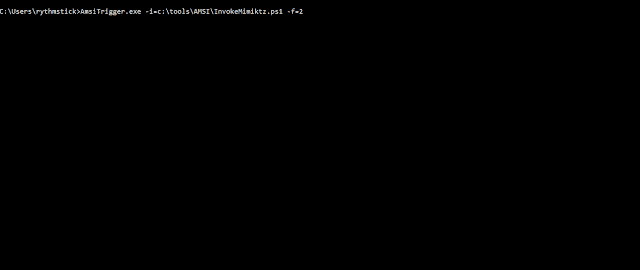

# AMSITrigger:恶意字符串的狩猎

> 原文：<https://kalilinuxtutorials.com/amsitrigger/>

AMSITrigger 将通过反复使用 AMSIScanBuffer 调用 AMSI 来识别 powershell 文件中的所有恶意字符串。

**寻找恶意字符串**

**用途**

**-i，–input file = VALUE Powershell 文件名
-u，–URL = VALUE URL 例如:https://10 . 1 . 1 . 1/Invoke-ninjopy . PS1
-f，–Format = VALUE 输出格式:
1–仅显示触发器
2–显示带有行号的触发器
3–显示内嵌代码的触发器
4–显示 AMSI 调用(圣诞树模式)
-d，–Debug 显示调试信息
-m，–maxsiglength，–帮助显示帮助**

[**Download**](https://github.com/RythmStick/AMSITrigge)