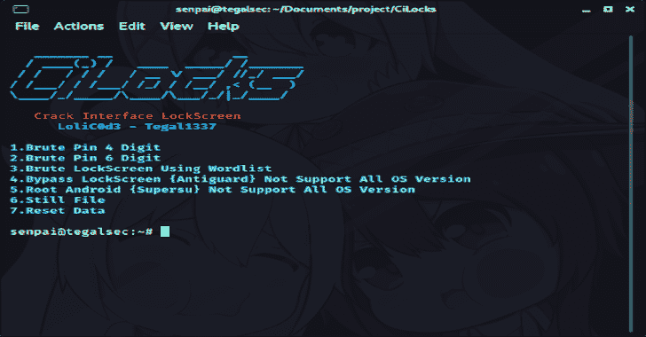
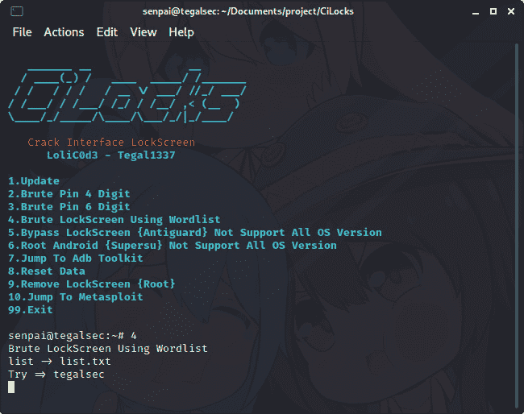
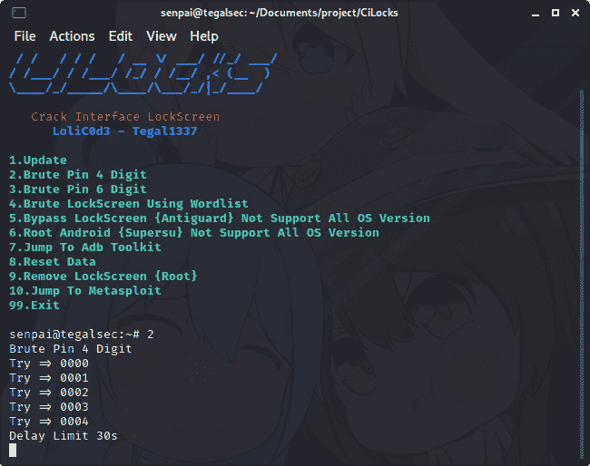
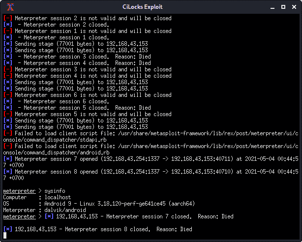
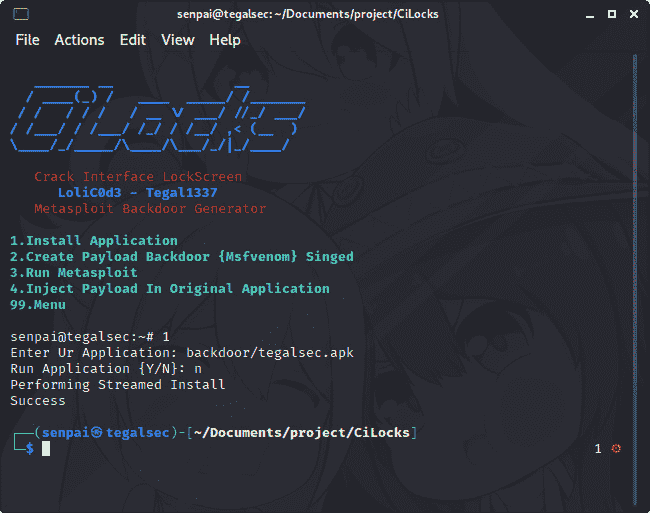
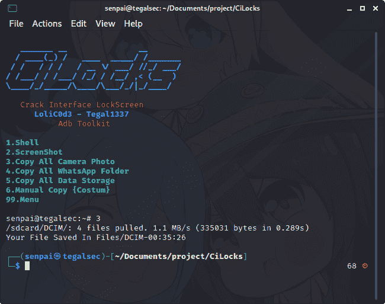

# CiLocks : Android 锁屏旁路

> 原文：<https://kalilinuxtutorials.com/cilocks/>

**CiLocks(破解界面锁屏)**，Metasploit 还有更多安卓黑客。

**更新可用版本 1.1.0**

*   添加了新工具
    *   Root Android {Supersu}不支持所有操作系统版本
    *   跳转至亚行工具包
    *   移除锁屏{Root}
    *   跳转到 Metasploit
    *   恢复所有删除的介质(Coomingsoon)
*   蛮针 4 位数
*   蛮针 6 位数
*   使用单词列表的强力锁屏
*   不支持所有操作系统版本
*   重置数据

**截图**

**必需的**

**ADB {Android SDk}
USB 线
Android 模拟器{Nethunter/Termux} Root
或电脑**

【Linux 安装

**git 克隆 https://github.com/tegal1337/CiLocks
CD 西洛克斯
chmod +x 西洛克斯
sudo bash 西洛克斯**

完成所有步骤后，只需输入终端 **root@tegalsec:~** **。/cilocks**

**用于 Android 模拟器**

**安装 Busybox
Root 权限**

如果 brute 不起作用，那么就取消这段代码的注释

# **亚行外壳输入键事件 26
如果 5 次输错密码将自动延时 30 秒**

[**Download**](https://github.com/tegal1337/CiLocks)