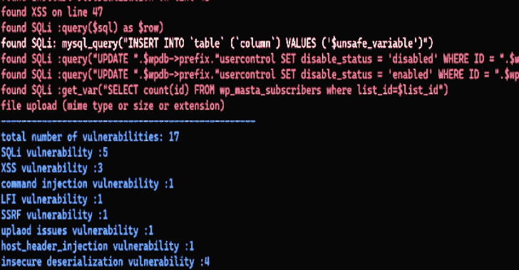
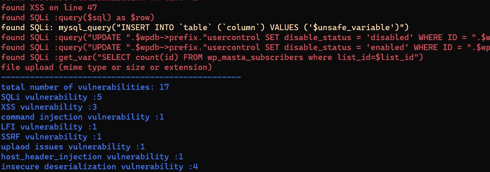

# Php_Code_Analysis:扫描 Php 代码中的漏洞

> 原文：<https://kalilinuxtutorials.com/php_code_analysis/>

Php_Code_Analysis 是一个扫描 Php 代码漏洞的工具

脚本可以找到

*   检查 _ 文件 _ 上传问题
*   主机 _ 标题 _ 注入
*   SQl 注入
*   不安全的反序列化
*   打开 _ 重定向
*   SSRF
*   XSS
*   LFI
*   命令 _ 注入

**特性**

*   快的
*   简单报告

**用途**

**python code.py > > >这将扫描一个文件
python code.py > > >这将扫描整个文件夹(。)
python code.py > > >扫描全文件夹** r

**输出**

[**Download**](https://github.com/kira2040k/php_code_analysis)