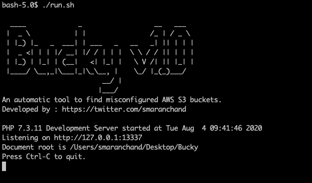
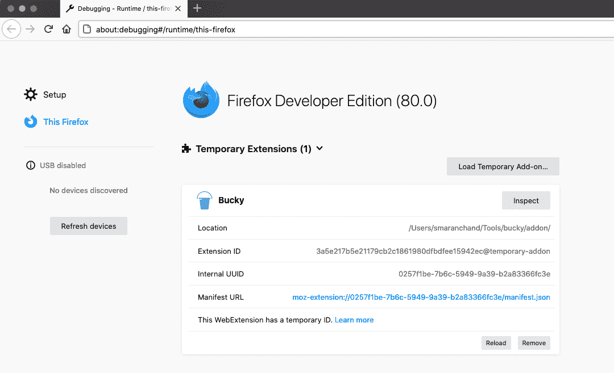
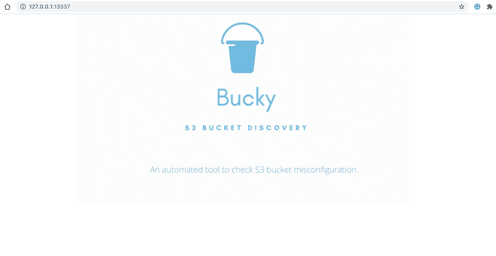
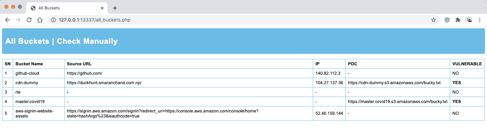
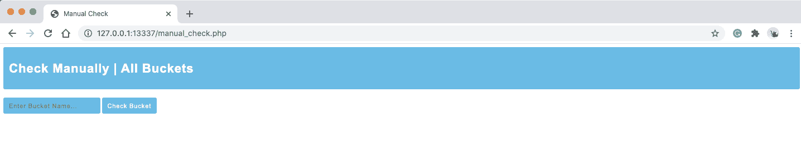
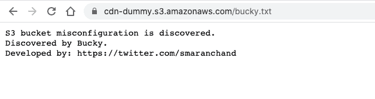

# Bucky:一个自动 S3 桶发现工具

> 原文：<https://kalilinuxtutorials.com/bucky/>

布基是一个自动工具，旨在发现 S3 桶错误配置，布基包括两个模块布基火狐插件和布基后端引擎。Bucky addon 读取网页的源代码，并使用正则表达式(Regex)来匹配用作内容交付网络(CDN)的 S3 桶，并将其发送到 Bucky 后端引擎。后端引擎从插件接收数据，并检查 S3 桶是否是公开可写的。如果存储桶易受攻击，Bucky 会自动上传一个文本文件作为概念证明(PoC)。

**工作**

Bucky addon 将从用户访问的网页中发现的 s3 存储桶名称的细节发送到后端引擎。它使用 [AWS PHP SDK](https://docs.aws.amazon.com/sdk-for-php/v3/developer-guide/getting-started_installation.html) 来发现错误配置。用户还可以手动检查 S3 存储桶的错误配置。自动和手动检查的所有结果都被填充到仪表板中。

**安装**

**git 克隆 https://github.com/smaranchand/bucky.git
CD 巴基**

要求:AWS 访问密钥和 PHP 安装

获取 AWS 访问密钥:[https://console.aws.amazon.com/iam/home?#/security_credentials](https://console.aws.amazon.com/iam/home?#/security_credentials)

PHP 安装:根据你的操作系统安装，apt 安装 php7.3 / brew 安装 php7.3

目前，Bucky addon 没有在 Firefox addon 商店中发布；一旦插件发布，就会提供插件链接。

目前，用户可以手动将插件加载到浏览器中

1.  打开 Firefox 浏览器并访问关于:调试
2.  点击“This Firefox”>加载临时插件
3.  选择位于 bucky/addon/bucky.js 的插件

添加 AWS 访问键:

**CD bucky/
nano config.inc.php
添加您的 AWS 访问密钥 ID 和秘密访问密钥。(在线 57 和 61)**

**用途**

要使用 Bucky，将 Bucky 插件加载到浏览器并启动后端引擎。

**CD bucky/
chmod+x run . sh
。/run.sh
后端引擎运行在 http://127.0.0.1:13337
浏览网站，Bucky 会自动发现 S3 桶，并会反映在仪表盘中。
访问上述地址，访问巴奇仪表板。**

**截图**

奔跑的巴基

**加载插件**

**用户界面**

**所有桶**

**手动检查**

**巴基的概念验证**

[**Download**](https://github.com/smaranchand/bucky)