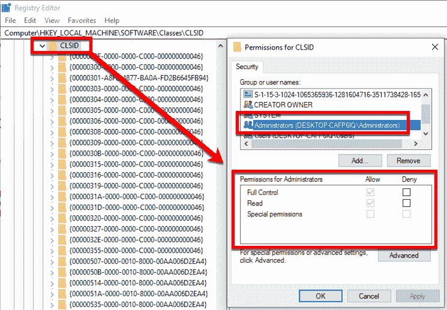
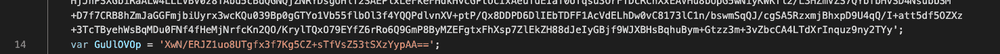

# Dent:利用微软 WDAPT 传感器中的漏洞创建基于 COM 的旁路的框架

> 原文：<https://kalilinuxtutorials.com/dent/>

Dent 是一个框架，它生成代码来利用 Microsoft Defender Advanced Threat Protection 的攻击面减少(ASR)规则中的漏洞，在不被检测到或阻止的情况下执行外壳代码。ASR 被设计为第一道防线，根据违反一组规则的行为来检测事件。这些规则侧重于端点上的特定行为指标，这些指标通常与攻击者的战术、技术或程序(TTP)相关联。这些规则重点关注 Microsoft Office 套件，因为这是在终端上建立远程立足点的常见攻击媒介。许多基于规则的控制侧重于基于网络或基于流程的行为指标，这些指标在正常业务运营中非常突出。这些规则侧重于系统的初始危害或可能严重影响组织的技术(例如，凭据泄露或勒索软件)。它们涵盖了大量常见的攻击面，并侧重于阻碍用于危害资产的已知技术。

Dent 利用几个漏洞绕过这些限制性控制，在端点上执行有效负载，而不会被 Microsoft Defender Advanced Threat Protection 传感器阻止或有效检测到。上面的文章概述了即使在披露之后，Microsoft Defender Advanced Threat Protection 中仍然存在的漏洞。

**安装**

一如既往，第一步是克隆回购协议，然后构建它

去造登特吧

**帮助**

**。/Dent-h

_ _ _ _ _ _ \*_*/| _
| | _/\/\ \ | | \*/| | \ |/_/_ _*>_ |/|
\/\/
(@ Tyl0us)
“叫一个人英雄够久了，他们就会相信。他们会成为它。他们别无选择。让他们叫你怪物，你就成了怪物。”的用法。/Dent:
-C string
COM 对象的名称。
-N 字符串
写入磁盘时 XLL 播放负载的名称。
-O 字符串
输出文件的名称。(默认为“output . txt”)
-P string
你的 COM 对象的 DLL 的路径。(使用\或"绕过路径)
-U string
托管 base64 编码的 XLL 有效负载的 URL。
-show
显示终端中的脚本。**

**武器化**

该框架旨在利用 Microsoft Defender Advanced Threat Protection 中的漏洞和缺陷，因为它实际上不会生成任何有效载荷/植入。为了生成这些，你可以使用大量公开可用的工具，然而所有的研究、开发和测试都是使用稻草人来完成的。Microsoft Defender 高级威胁防护并不依赖于用户区挂钩来进行遥测，而是利用了各种其他机制，如内核回调。从测试来看，这个框架在绕过 Microsoft Defender Advanced Threat Protection 来执行外壳代码方面工作得非常好。

**技巧**

在发布时，目前有两种技术。我会定期不断地添加不同的漏洞，以不同的方式利用这些漏洞，所以请继续关注。

**假 COM 对象模式**

COM 对象通常是在应用程序安装到系统上时创建的。一旦创建，任何应用程序或脚本都可以调用它们，但是这不是创建它们的唯一方法。通过在 Windows 注册表的`HKEY_CLASSES_ROOT`部分修改/创建注册表项，我们可以创建一个 COM 对象，指向系统上的外壳代码。这意味着任何可以利用 COM 的应用程序或脚本都可以调用它，执行外壳代码。

这是因为 CoCreatInstance API 的工作方式。CoCreateInstance 用于根据 CLSID(用于标识特定 COM 类对象的全局唯一标识符)创建和初始化 COM 对象。该函数使用存储在注册表项中的值提取执行调用的信息。这些 CLSID 值可以在注册表的`HKEY_CLASSES_ROOT\CLSID\`路径中找到。但是，在进程调用 CLSID 之前，它必须知道 CLSID 的值。这是通过首先执行一个注册表查询来查找`HKEY_CLASSES_ROOT\<COM object name>`中的 COM 对象来完成的，如果它存在，将执行第二个注册表查询来获取存储在子文件夹中的 CLSID 值。

对注册表子文件夹的进一步检查显示，CLSID 值的权限不一致。这里存储的大多数 COM 对象只允许可信安装程序具有“完全控制”权限。受信任的安装程序是一个服务帐户，拥有保护它们的资源，即使是来自管理员。这是为了确保即使攻击者获得了管理特权，也不能恶意操纵资源。不幸的是，许多 COM 对象允许 Administrators 组中的任何人拥有“完全控制”权限。此外，根密钥 CLSID 允许 Administrators 组“完全控制”权限，而不是 NT AUTHORITY\System 或 Trusted Installer。因此，在提升的上下文中，我们可以创建甚至修改特定的 COM 对象值。

**重要**

只有在提升的上下文中运行时，这些注册表项的创建才有效。通过 GUI 双击它不会执行。VBS 文件，即使您是管理员。建议您从管理外壳或命令提示符运行它。但是，一旦创建了密钥，任何应用程序都可以在任何上下文中调用这个 COM 对象。

**稻草人武器化**

要将稻草人有效负载用于这种类型的旁路，您可以运行以下命令:

**。/稻草人-我<路径到你的原始无级外壳代码>-域<域名>-加载器 dll**

**用途**

一旦你有了你的有效载荷，当它被写到磁盘时，使用`**-N**`标志作为有效载荷的名称，使用`**-C**`标志作为 COM 对象的名称，使用`**-I**`标志作为写入的位置，最后使用`**-O**`作为输出文件来存储内容。

**遥远。XLL 有效载荷模式**

此选项生成一个代码块，绕过几个 ASR 规则来下载、写入磁盘、加载和执行外壳代码，绕过 ASR 预防性控制。这是使用 Excel 完成的。Application COM 对象，代表整个 Excel 应用程序，但以自动化的形式，并允许与它进行程序交互。因为这还是 Excel，所以不会触发 ASR 规则。这是因为当我们调用 Excel 时。应用程序，我们可以看到它是在一个服务主机进程(Svchost.exe)而不是 WinWord.exe 进程下产生的。虽然 Svchost.exe 是用于托管多个基于 Windows 的服务的系统级进程，但创建的子进程(Excel.exe)没有获得系统级特权。

因为我们创建了一个 COM 对象，它是一个完整的应用程序，Excel 进程是在 Svchost.exe 下创建的，所以它可以被正确处理，以防止 WinWord.exe 进程的任何不稳定性。尽管这个过程是在 Svchost.exe 的领导下进行的，但还有另一个挑战需要应对:执行外壳代码。由于二进制执行或在宏中使用 WinAPI 将触发其他 ASR 规则，这限制了我们在不触发 ASR 规则或被 WDAPT 的 EDR 组件捕获的情况下可以做的事情。这就是 dll 大放异彩的地方。如果基于 DLL 的有效负载使用正确的导出函数编译，它可以用作 Office 插件，加载后会自动运行外壳代码。为此，我们可以利用 Excel 的 RegisterXLL 函数。RegisterXLL 函数将一个 XLL 插件加载到内存中，自动注册并执行它。XLL 文件本质上是基于 Excel 的 dll。

要获取系统上的内容，我们可以使用另一个 COM 对象(Microsoft。XMLHTTP)，获得执行 HTTP 请求的能力，在本例中，是对 URL 的 HTTP GET 请求。第二个 COM 对象(ADODB.stream)提供读取/写入数据流字节的能力。通过组合这两个 COM 对象，攻击者可以通过 HTTP GET 请求请求远程资源，并将响应(在本例中是文件本身)写入磁盘。这是通过再次使用 COM 对象(ADODB.stream)来处理数据流的读/写字节来完成的。第二个 COM 对象(微软。XMLDOM)允许读取存储在文件中的数据。XMLDCOM 对象允许设置数据类型(在本例中为 base64 ),一旦打开并存储在具有正确数据类型的字符串中，ADODB.stream 对象就可以使用不同的数据类型(在本例中为 BinaryStreamType)将代码字符串写入磁盘，将 base64 字符串转换回二进制形式。

**稻草人武器化**

要将稻草人有效负载用于这种类型的旁路，您可以运行以下命令:

。/稻草人-I<path to="" your="" raw="" stageless="" shellcode="">-域<domain name="">-加载器 excel -O</domain></path>

生成后，从输出文件中复制第 13 行和第 14 行，并将它们合并在一起，确保删除:

*   `**var <variable name>**`
*   每行末尾的`**;**`
*   每个字符串周围的引号

**用途**

一旦你有了编码的有效载荷，当它被写到磁盘时，使用`**-N**`标志作为有效载荷的名称，使用`**-U**`标志作为编码的有效载荷将要被托管的 URL(即 https:///)，使用`**-F**`标志作为站点托管的文件的名称。输出的代码被设计为在宏文档中工作。

**缺少 WDAPT 传感器记录**

通过进一步的研究，观察到这不是 WDATP 传感器中的一个缺口，而是 WDATP 确实可以看到这一活动，但它被忽略了。通过 WDATP endpoint 的事件时间表查找任何对 Appwiz.xll 的引用，我们观察到当 Word 创建文件 AppWiz.xll 时，WDAPT 记录了一个“created file”事件，需要注意的是，XLL 文件是可执行的。

[**Download**](https://github.com/optiv/Dent)