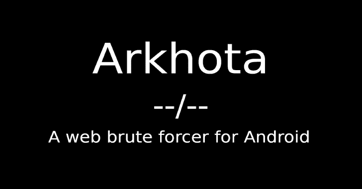
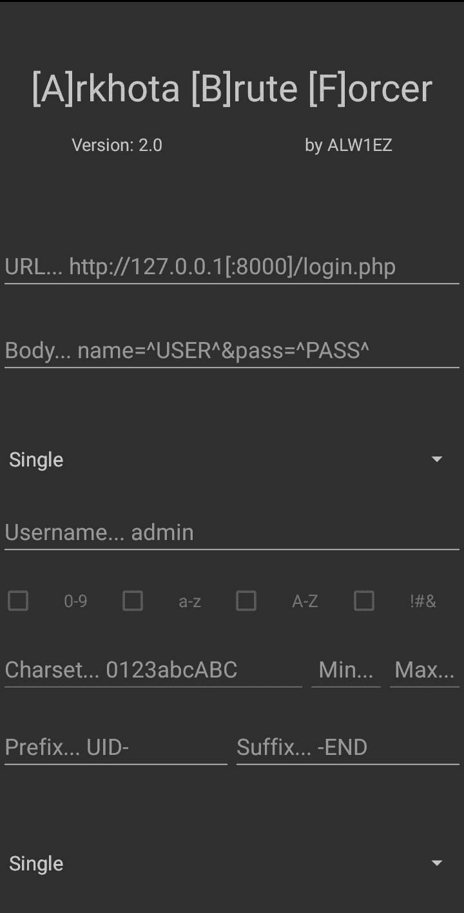
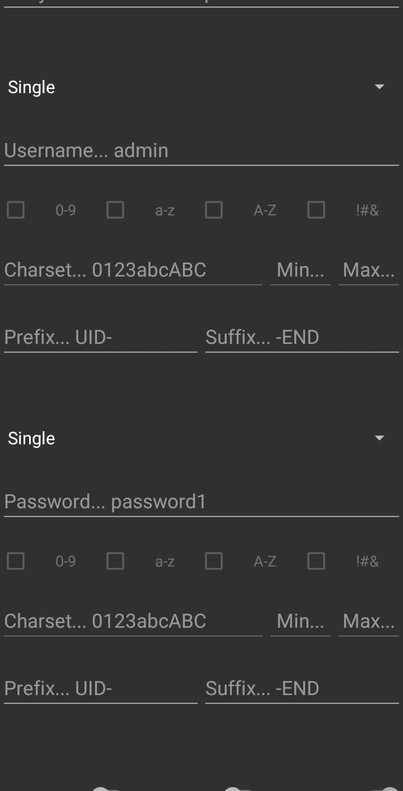
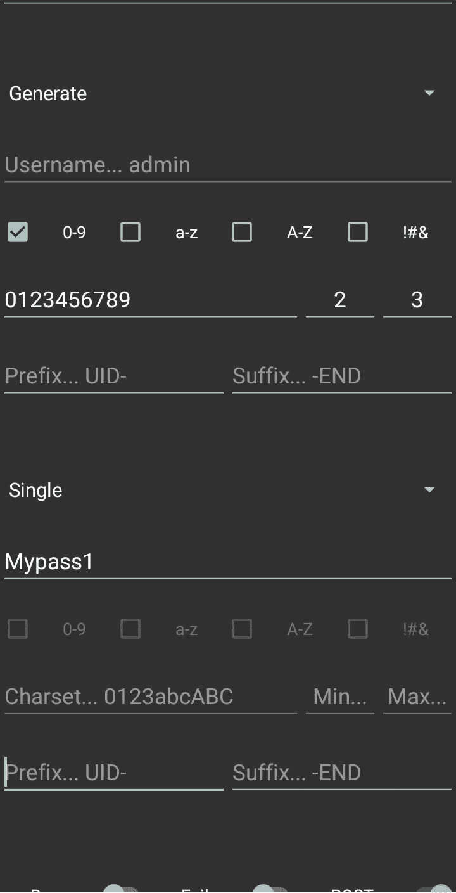
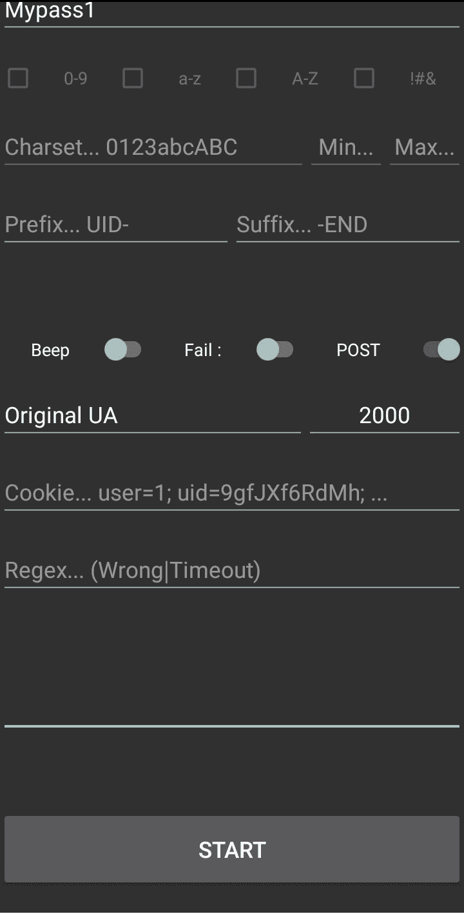
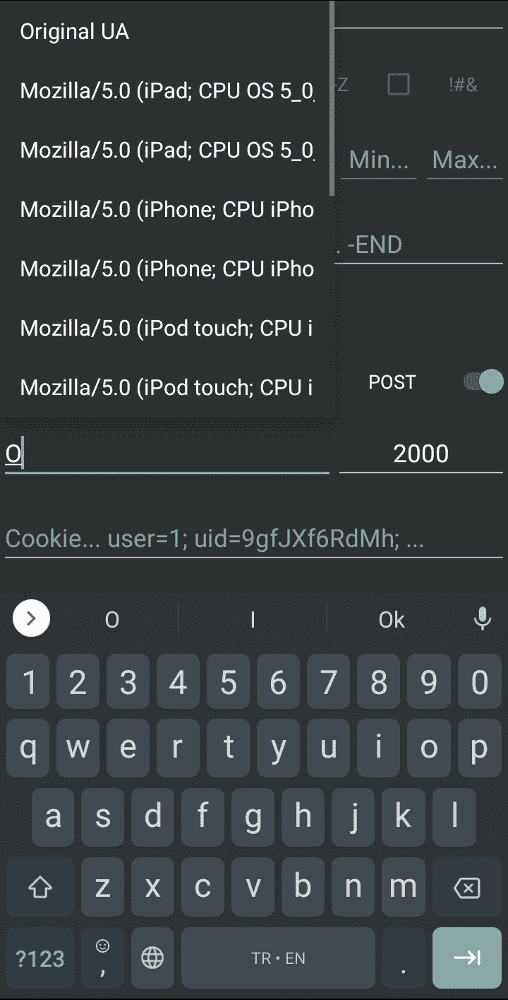
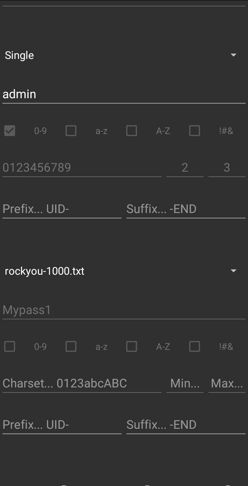
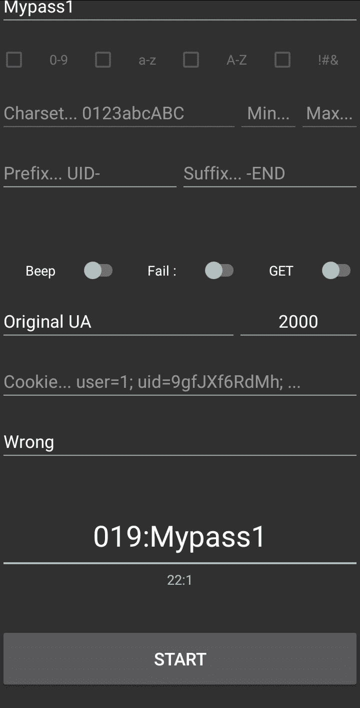
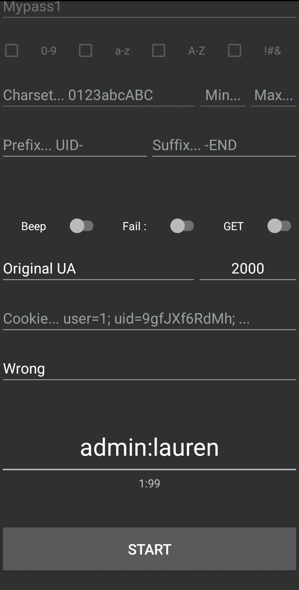
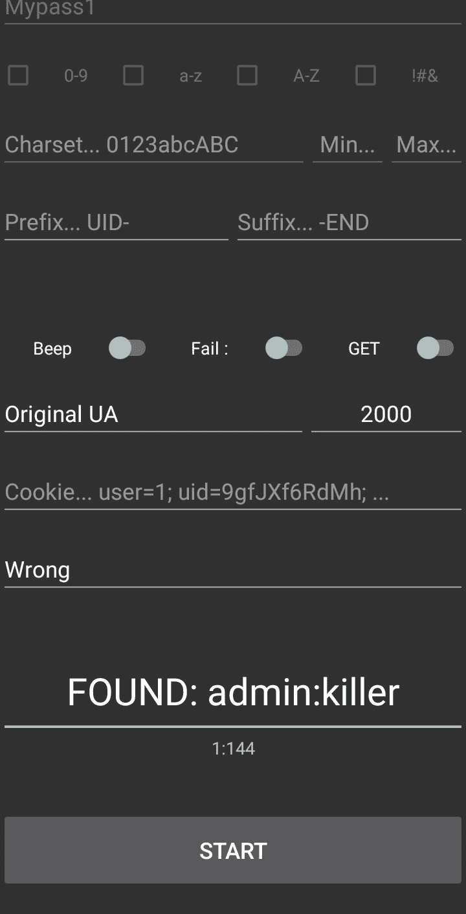

# ark hota:Android 的网络蛮力

> 原文：<https://kalilinuxtutorials.com/arkhota/>

Arkhota 是一个用于 Android 的 web (HTTP/S)暴力破解程序。出于显而易见的原因，网络暴力破解者总是在黑客的电脑里。有时攻击需要快速或/和最少的设备准备。此外，手机比笔记本电脑更不受关注。对于这种情况，这里是 Arkhota。

**用途**

解释是按照 APK 中的物体从上到下的顺序进行的。

##### **横幅**

*   横幅、版本和作者

可以长按**版本**查看关于页面。

##### **连接**

*   URL(必填)

发出请求的 URL。

*   身体

如果您要发出 POST 请求，您需要指定一个主体**。**

##### 用户列表/单词列表

*   用户列表选择器

*单个:设置单个用户名*

*生成:用给定的选项*生成运行时

*单词表:设置准备好的单词表*

*自定义词表:您可以将自定义词表放入/sdcard/ABF/*

*那么这个选择器将拥有它(如果给定了所需的权限。).*

*   用户名框

如果您选择了单个，您需要指定一个用户名**。**

*   字符集选择器

[W] *你需要指定 charset，min & max length 来生成运行时。*

**如果您选择了生成**，复选框将帮助您选择。_

*   前缀和后缀

*您可以指定前缀&后缀添加到您的用户名*

##### 密码部分也是如此。

##### **配置**

*   哔声开关

如果攻击成功，会发出哔哔声。

*   失败/成功开关

*决定如何对连接响应做出反应*

*   POST/GET 开关

*决定连接类型*

*   用户代理

_ 为连接设置用户代理。

**如果**“原始 UA”设置，则原始用户代理设置

**Othervise** 给定文本将设置为用户代理 _

##### **提示:它有几个用户代理的自动完成功能，它们都以“Mozilla”开头，如果你不想暴露你原来的用户代理，但你不知道该设置什么**，键入并选择一个

*   超时

*设置连接超时，单位为毫秒*

*   饼干

*为连接*设置 cookie 值

*   正则表达式(必需)

*决定在连接响应中查看什么*

*   空盒子

尝试用户名:密码对&的结果会显示在那里。

*   [W]开始

*开始攻击！*

**重要**

URL & Body: **`^USER^` & `^PASS^`是用户名和密码的占位符。**您需要将它们放在 url 或正文中(取决于您选择的连接类型)

Regex & Fail/Success switch:这两个决定了攻击的结果。

如果 switch 指向" Fail ",并且如果在响应中找到给定的 regex，这就意味着，这是一次失败，继续攻击。

如果 switch 指向" Success ",并且如果在响应中找到了给定的正则表达式，这意味着这是成功的！，将结果写入空框(格式为“发现:用户名:密码”)并停止攻击。

复制:长按空框将复制内容。如果找到密码，则以`**username:password**`格式复制，否则复制全部内容。

如果攻击结束并且不成功，它只是停止在最后一个用户:密码。

**截图&视频**

#### **警告**

**运行时可变参数**

每个参数在攻击期间都是可编辑的，但是在攻击期间除了两个参数之外，没有一个参数是可改变的。“失败/成功”和“嘟嘟”开关。

这意味着:如果你开始攻击，并想改变一个参数(如字符集)，编辑不会改变任何东西，这种变化适用于按下开始按钮。但是，如果您启动攻击时启动了 beep 选项，并且您想要更改它。你不需要重新开始攻击，只需点击开关，它不会在攻击成功时发出哔哔声。

**关于【生成】&自定义词表**

生成选项是**而不是**推荐的运行时生成&解析对于一部手机来说确实是一项艰苦的工作。它也不稳定，所有可能的单词都会生成，但可能不是连续的。如果你真的需要选择它，保持一切最小化。如果你的手机死机或崩溃，你知道选择的选项不适合你的手机处理器。

不要把大单词表放到/ABF/目录中。这将导致冰冻&崩溃。

不要忘记，标准智能手机的处理器能力远远低于电脑，这个项目是为了小规模快速攻击。

**关于速度**

取决于你的网络和远程主机的速度。

**如何阻止攻击**

这个版本的 Arkhota 不支持“停止攻击”。但是这并不意味着你不能停下来。只需将“失败/成功”开关切换到相反的方向，并等待另一个请求。这将导致假阳性故意停止。或者您可以简单地关闭并重新打开应用程序。