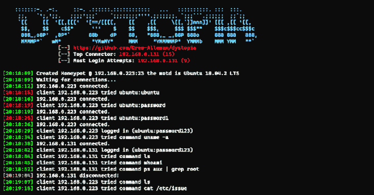
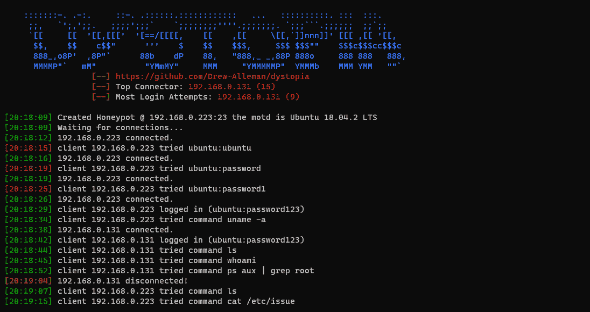
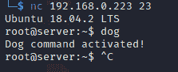

# 反面乌托邦:用 Python 编码的中低多线程 Ubuntu 核心蜜罐

> 原文：<https://kalilinuxtutorials.com/dystopia/>

用 Python 编写的中低版本 Ubuntu 核心蜜罐。

**特性**

*   可选登录提示
*   记录谁连接以及他们做了什么
*   将会话捕获到 pcap 文件
*   自动下载攻击者使用的链接
*   自定义 MOTD、端口、主机名以及一次可以连接的客户端数量(默认为无限制)
*   地理定位(使用 ipstack)
*   保存并加载配置
*   为过多的命令添加支持

**待办事项**

*   更好的记录
*   服务
*   电子邮件提醒
*   图表和图形等见解
*   添加默认配置
*   优化/修复代码

**安装**

chmod 755 setup.sh
sudo。/setup.sh
[+] Tcpdump 用于捕捉反乌托邦会话！
[+]您想安装“Tcpdump”吗？[Y/n]Y
[+]1->为 Arch Linux 安装
[+]2->为 Debian 用户安装
1
【sudo】为 drew 设置密码:
解析依赖项…
查找冲突包…
包(1) tcpdump-4.99.0-1
总安装大小:1.35 MiB
净升级大小:0.00 MiB
::继续[Y/n] y
(1/1)检查钥匙圈中的钥匙[# # # # # # # # # # # # # # # # # # #]100%
…..
[+]创建需要的目录！
python 3 dyspopy . py

**自变量**

**用法:Dystopia . py[-h][–HOST HOST][–PORT PORT][–motd MOTD][–MAX MAX]
[–log in][–USERNAME 用户名][–PASSWORD 密码]
[–HOSTNAME 主机名][–localhost][–capture]
[–INTERFACE 接口][–SAVE 保存][–LOAD 加载]
[–下载][–版本]
Dystopia |一个 python 蜜罐。
可选参数:
-h，–帮助显示此帮助消息并退出
–主机主机 IP 地址来托管蜜罐。默认:
192 . 168 . 0 . XXX
–PORT PORT，-P PORT 指定要绑定的端口
–motd MOTD，-m MOTD 指定当日消息
–MAX MAX，-m 允许同时连接的最大客户端数量
默认为无限制
–登录，-f 创建假登录提示(不加密)
–用户名，-u 用户名
假登录提示的用户名和
蜜罐会话的用户默认默认:' P @ $ $ W0RD '
–HOSTNAME HOSTNAME，-H HOSTNAME
蜜罐的主机名默认:' localhost '
–localhost，-L 在 localhost 上启动蜜罐
–capture，-c 使用工具 Tcpdump
–INTERFACE，-i INTERFACE
接口捕获流量如果使用了–capture/-c 并且没有配置任何接口，则默认为:
' eth 0’
–SAVE SAVE，-s SAVE -l 从 json 文件加载 load config，例如'–LOAD
settings . JSON '
–download，-a 自动下载攻击者使用的链接
–version print version 并退出**

**如何增加对更多命令的支持**

您可以通过编辑文件“commands.json”来添加对新命令的支持。eg 的格式为命令:输出

**{
“狗”:“狗命令启动！”
}**

**dstat**

**如何运行**

CD tools/
chmod 755 dstat . py
。/dstat . py–report-f report.html
+——————————————+——————+
| IP 地址|连接次数|失败登录|正确登录|
+————————————————————+————————-+
| 192 . 168 . 0 . 239 | 22345 | 1231 | 2 |
| 192.192

**自变量**

**用法:dstat . py[-h][–ADDRESS ADDRESS][–report][–SORT SORT][–update]
[–FILENAME FILENAME]
dstat |反乌托邦统计工具
可选参数:
-h，–help 显示此帮助消息并退出
–ADDRESS ADDRESS，-a ADDRESS
ip 地址调查
–report，-r 显示一般报告
–SORT SORT，-s SORT 按行名对报告表进行排序
–update，-U update geolocation**

[**Download**](https://github.com/Drew-Alleman/dystopia)