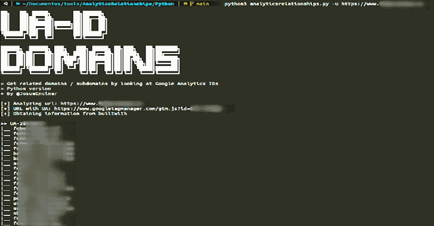
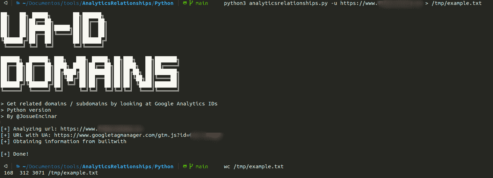
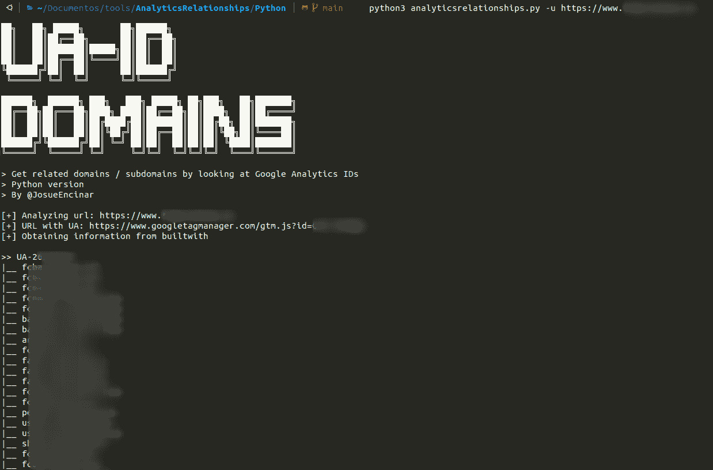

# 分析关系:通过查看谷歌分析 id 获得相关的域/子域

> 原文：<https://kalilinuxtutorials.com/analyticsrelationships/>

[](https://1.bp.blogspot.com/-Qk-MQL_8ZRQ/YMS87OW5nmI/AAAAAAAAJek/TcpA6GHDvN4qEhSp389sDAQJEj6z4W8fACLcBGAsYHQ/s728/AnalyticsRelationships%25281%2529.png)

**AnalyticsRelationships** 是一个通过查看 Google Analytics IDs 来获取相关域/子域的工具。

```
██╗   ██╗ █████╗       ██╗██████╗                        
██║   ██║██╔══██╗      ██║██╔══██╗                       
██║   ██║███████║█████╗██║██║  ██║                       
██║   ██║██╔══██║╚════╝██║██║  ██║                       
╚██████╔╝██║  ██║      ██║██████╔╝                       
 ╚═════╝ ╚═╝  ╚═╝      ╚═╝╚═════╝                        

██████╗  ██████╗ ███╗   ███╗ █████╗ ██╗███╗   ██╗███████╗
██╔══██╗██╔═══██╗████╗ ████║██╔══██╗██║████╗  ██║██╔════╝
██║  ██║██║   ██║██╔████╔██║███████║██║██╔██╗ ██║███████╗
██║  ██║██║   ██║██║╚██╔╝██║██╔══██║██║██║╚██╗██║╚════██║
██████╔╝╚██████╔╝██║ ╚═╝ ██║██║  ██║██║██║ ╚████║███████║
╚═════╝  ╚═════╝ ╚═╝     ╚═╝╚═╝  ╚═╝╚═╝╚═╝  ╚═══╝╚══════╝

> Get related domains / subdomains by looking at Google Analytics IDs
> Python/GO versions
> By @JosueEncinar
```

这个脚本试图通过查看来自 URL 的 Google Analytics IDs 来获取相关的域/子域。首先在网页中搜索 Google Analytics 的 ID，然后用该 ID 请求 **builtwith** 和 **hackertarget** 。

**注意**:它并不适用于所有网站。通过以下表达式进行搜索:

**-【"www.googletagmanager.com/ns.html\ ？id =[A-Z0-9-]+"
->GTM-[A-Z0-9]+
->" UA-\ d+-\ d+"**

**可用版本**

*   [Python](https://github.com/Josue87/AnalyticsRelationships/blob/main/Python)
*   [出发](https://github.com/Josue87/AnalyticsRelationships/blob/main/GO)

**安装**

根据语言安装。

**Python**

**> git 克隆 https://github.com/Josue87/AnalyticsRelationships.git
>CD analytics relationships/Python
>sudo pip 3 install-r requirements . txt**

**出发**

**> git 克隆 https://github.com/Josue87/AnalyticsRelationships.git
>CD analytics relationships/GO
GO build-LD flags "-s-w "**

**码头工人**

**> git 克隆 https://github.com/Josue87/AnalyticsRelationships.git
>CD 分析关系
> docker 构建-t 分析关系:最新。**

**用途**

根据语言的用法

**Python**

**【https://www.example.com】python 3 analytics relationships . py-u**

或将输出重定向到文件(横幅或信息消息被发送到错误输出):

**>python 3 analytics relationships . py-u https://www.example.com>/tmp/example . txt**

**出发**

>**。/analytics relationships–URL https://www.example.com**

或将输出重定向到文件(横幅或信息消息被发送到错误输出):

**>。/analytics relationships–URL https://www.example.com>/tmp/example . txt**

**码头工人**

码头工人运行分析关系:最新 https://www.example.com

或将输出重定向到文件(横幅或信息消息被发送到错误输出):

> **docker run -it 分析关系:最新 https://www.example.com>/tmp/example . txt**

**例题**

**Python**

输出重定向到文件/tmp/example.txt:



没有重定向



**出发**

无重定向:


使用文件重定向就像在 Python 中一样。

[**Download**](https://github.com/Josue87/AnalyticsRelationships)