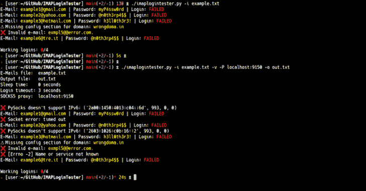
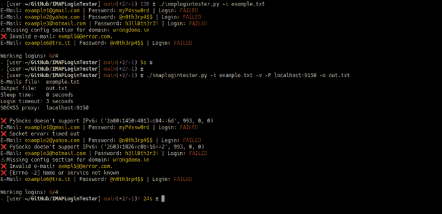

# IMAPLoginTester:读取包含大量电子邮件和密码的文本文件的脚本

> 原文：<https://kalilinuxtutorials.com/imaplogintester/>

**IMAPLoginTester** 是一个简单的 Python 脚本，它读取一个包含大量电子邮件和密码的文本文件，并通过尝试登录各自的 IMAP 服务器来检查这些凭证是否有效。

**用途**

**用法:imaplogintester . py[-h]-I INPUT[-o OUTPUT][-s][-T SLEEP _ TIME][-T TIME out][-P socks 5 _ PROXY][-v]
可选参数:
-h，–help 显示此帮助消息并退出
-i INPUT，–INPUT INPUT
带有电子邮件和密码的输入文件
-o OUTPUT，–OUTPUT
将成功保存到输出文件
-s，–show-success 仅显示成功(不显示失败 –超时超时
设置登录请求超时(秒)
-P SOCKS5_PROXY，–SOCKS5-PROXY socks 5 _ PROXY
使用 socks 5 代理(例如:“localhost:9050”)
-v，–verbose 显示详细消息**

**预览**

[**Download**](https://github.com/rm1984/IMAPLoginTester)