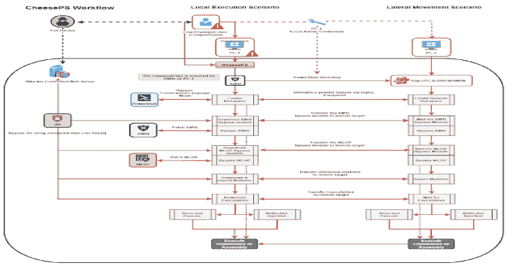
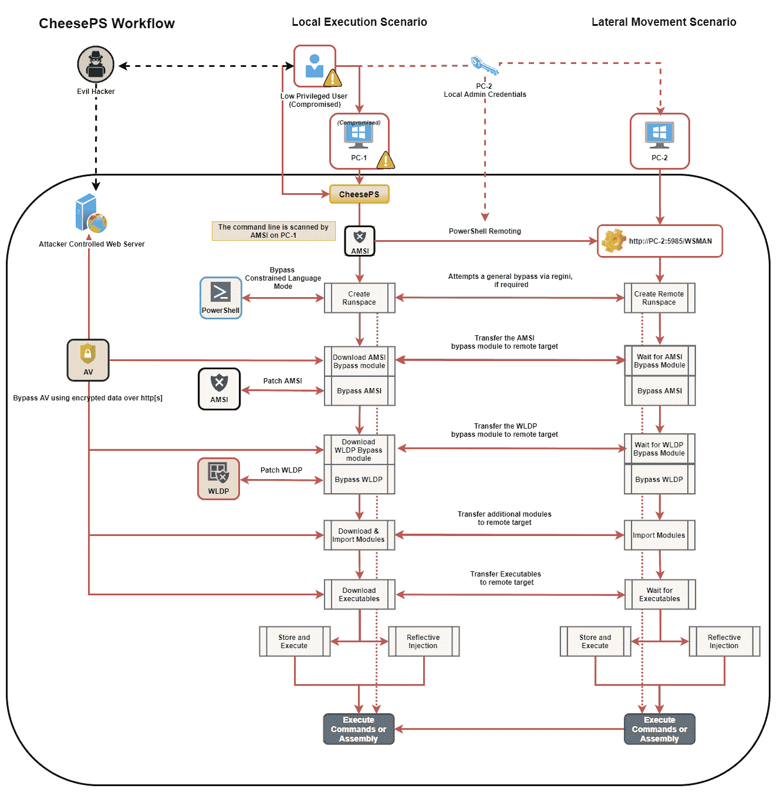

# CheeseTools:自主开发的横向移动/代码执行工具

> 原文：<https://kalilinuxtutorials.com/cheesetools/>

**CheeseTools** 是基于已经存在的 [MiscTool](https://github.com/rasta-mouse/MiscTools) 制作的，所以我要向 [rasta-mouse](https://twitter.com/rasta_mouse) 大声疾呼，感谢他们发布了它们，并给了我开发它们的动力。

CheeseExec

通过类似 PsExec 的功能执行命令/横向移动。必须在特权用户的上下文中运行。该工具基于 [rasta-mouse](https://twitter.com/rasta_mouse) CsExec，但旨在允许对服务创建进行额外控制，具体来说:

*   创建(搜索服务是否存在，如果不存在，则尝试创建它)
*   Start(搜索服务是否存在并已停止，如果是，则尝试启动它；如果没有，尝试创建并启动它)
*   停止(搜索服务是否存在并正在运行，如果存在，则尝试停止服务)
*   删除(搜索服务是否存在并且正在运行，如果存在，则尝试停止服务而不是删除服务，否则删除服务)

**CheeseExec.exe<目标机> <服务名> < binPath > <动作>**

**奶酪**

Cheese PS 是 Command Exec /横向移动框架。它依靠`**System.Management.Automation.PowerShell**`通过 PowerShell 加载并运行任意代码。该工具本身能够绕过在本地或远程目标上创建和使用 PowerShell 运行空间的常见限制。必须在特权用户的上下文中运行(如果使用 PowerShell 远程处理)。

该工具最初是作为对 [rasta_mouse](https://twitter.com/rasta_mouse) CsPosh 的增强而开发的，但是已经发展到足以成为一个独立的框架，并且现在可以用作一个通用的 PowerShell 注入器。

下面的文章总结了该工具背后的思想:

*   [cheeps:滥用 PowerShell Remoting 进行横向移动](https://klezvirus.github.io/RedTeaming/LateralMovement/LateralMovementPSRemoting/)

实现的主要功能有:

*   使用 REGINI 的内置 CLM 旁路
*   在执行任何其他命令之前修补 Amsi 的内置 AmsiBypass
    *   允许为 AMSI 旁路指定备用 PowerShell 脚本
*   在执行程序集之前修补 WLDP 的内置 WldpBypass
    *   允许为 WLDP 旁路指定备用 PowerShell 脚本
*   执行前导入模块和脚本
    *   针对本地目标:通过文件系统、smb 或 http[s]导入模块
    *   针对远程目标:使用 WS-Management 从本地机器直接加载模块
*   下载二进制文件并执行
    *   标准:传输->写入磁盘->执行
    *   反射:传输->从内存执行
*   支持 PS 模块、C#程序集和其他可执行文件的 AES 加密，以逃避检测
    *   所有导入的模块/程序集都可以在传输或静态时加密，并在使用前解密

以下屏幕截图是描述该工具工作流程的相当准确的模式:

**用法:
-t，–Target = VALUE 目标机
-c，–Code = VALUE 要执行的代码
-e，–encoded 表示提供的代码是 base64 编码的
-a，–am-si-bypass = VALUE 使用给定的 PowerShell 脚本绕过 A-M-S-
I (fs，SMB o http[s])
–aX，–encrypted-am-si
表示提供的 A.M.S.I. bypass 是
加密的
-1 –将输出字符串追加到代码
-r，–重定向将标准错误重定向到标准输出
-d，–域=值备用凭证的域
-u，–用户名=值备用凭证的用户名
-p，–密码=值备用凭证的密码
-X，–加密=值用硬编码密钥加密脚本
-D，–解密=值用硬编码密钥测试解密脚本
-n，–跳过=值跳过 A.M –lockdown-escape 使用
REGINI
-w，–wldp-bypass = VALUE 尝试启用 PowerShell 全语言模式使用给定的 PowerShell 脚本绕过 wldp
(fs，SMB o http[s])
–wX，–encrypted-wldp 表示提供的 WLDP 旁路已加密
-x，–executable = VALUE[下载并]执行给定的可执行文件
–xX，–encrypted-executable
表示提供的 Exe/DLL 已加密
–xc NET)
-R，–reflective-injection 使用 Invoke-ReflectivePEInjection 从内存中加载
assembly(需要导入 Invoke-
reflective peinjection！)
-P，–powershell-decrypt 强制使用基于 PowerShell 的解密
-k，–encryption-key = VALUE 使用提供的密钥进行加密/解密
–SSL 强制使用 SSL
-h，-？，–帮助显示帮助**

***注意**:如果在没有目标的情况下执行，脚本将在本地机器上执行*

**使用该工具对抗原始 PowerShell 的优势**

*   更干净、更直观的命令行
*   自动旁路(CLM、AMSI、WLDP)
*   避免从远程目标执行出站连接(所有内容都通过 WS-Management 传输)
*   支持传输中的完全加密

**CheeseDCOM**

指挥执行/通过 DCOM 横向调动。必须在特权用户的上下文中运行。这个工具是基于 [rasta-mouse](https://twitter.com/rasta_mouse) CsDCOM 的，但它已经过改进，增加了额外的方法，以适应 Philip Tsukerman 的新研究。还有一个实验性的方法来“修复”通过 dcomcfg 禁用受影响的 DCOM 对象的最终尝试，但它需要一些先决条件才能正常工作。

下面的文章总结了该工具背后的思想:

*   [CheeseDCOM:滥用 DCOM 横向移动](https://klezvirus.github.io/RedTeaming/LateralMovement/LateralMovementDCOM/)

当前方法:**`MMC20.Application``ShellWindows``ShellBrowserWindow``ExcelDDE``VisioAddonEx``OutlookShellEx``ExcelXLL``VisioExecLine``OfficeMacro`。**

**用法:
-t，–Target = VALUE 目标机
-b，–Binary = VALUE Binary:powershell.exe
-a，–args = VALUE 参数:-enc
-m，–method = VALUE 方法:MMC 20 应用程序，ShellWindows，
ShellBrowserWindow，ExcelDDE，VisioAddonEx，
OutlookShellEx，ExcelXLL，VisioExecLine，
OfficeMacro
-r，–reg，–registry 启用注册表操作
，–帮助显示帮助**

***注意:**如果用`-t .`执行，脚本将在本地机器*上执行

**CheeseRDP**

通过 RDI(反射 DLL 注入)窃取 RDP 凭据。必须在特权用户或具有 SeImpersonatePrivilege 的用户的上下文中运行。这个工具是由 MDSec 在 RdpThief 的基础上构建的，但是它被完全包装在一个 C#中，以使它能够通过。净反射(`**Assembly.Load**`和类似)。这样，就可以通过 Covenant 运行它，而无需在目标系统上上传 DLL。

**用法:
CheeseRDP【操作】
操作:
等待:无限期地监听任何新的 mstsc.exe 进程(用 ctrl-C 停止)
清除:如果存在则删除凭证转储文件
转储:如果存在则转储文件的内容，以压缩格式解析凭证**

***注意:**如果在没有选项的情况下执行，程序会尝试注入一个活动的 mstsc.exe 进程(默认等待时间为 10 秒)*

[**Download**](https://github.com/klezVirus/CheeseTools#cheeseexec)