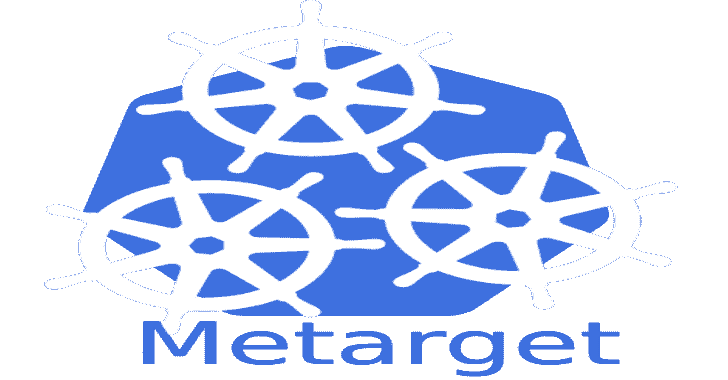

# Metarget:提供易受攻击的基础设施的自动构造的框架

> 原文：<https://kalilinuxtutorials.com/metarget/>

meta target =**`meta-`**+`**target**`，一个提供漏洞基础设施自动构建的框架，用于快速自动部署简单或复杂的漏洞云原生目标。

为什么选择 Metarget？

在安全研究中，我们可能会发现部署易受攻击的环境往往需要很长时间，而测试 PoC 或 ExP 所花费的时间相对较短。在云原生安全领域，由于云原生系统的复杂性，这个问题更加可怕。

开源社区中已经有一些优秀的安全项目，如 [Vulhub](https://github.com/vulhub/vulhub) 、 [VulApps](https://github.com/Medicean/VulApps) ，它们将易受攻击的场景打包成容器映像，以便研究人员利用它们并快速部署场景。

然而，这些项目主要关注应用程序中的漏洞。如果我们需要研究 Docker、Kubernetes 甚至 Linux 内核这样的基础设施中的漏洞怎么办？

因此，我们开发了 Metarget，希望在一定程度上解决上述部署问题。此外，我们还期望 Metarget 能够帮助自动构建**多层**脆弱云原生场景。

**安装漏洞**

在这个项目中，我们提出了类似于*安装漏洞*和*安装易受攻击场景*的概念。为什么不像安装软件一样安装漏洞？我们可以做到这一点，因为我们的目标是安全研究和进攻性安全。

确切地说，我们期望:

*   将 CVE-2019-5736 的 Docker 安装到服务器上。
*   `**metarget cnv install cve-2018-1002105**`将 CVE-2018-1002105 的 Kubernetes 安装到服务器上。
*   将在服务器上安装带有 CVE 2020-2023/2025/2026 的 Kata-containers。
*   `**metarget cnv install cve-2016-5195**`将在服务器上安装一个带有 DirtyCoW 的内核。

很酷，对吧？没有更多的步骤。没有 RTFM。执行一个命令，享受你的咖啡。

此外，我们期望:

*   在 Metarget 的帮助下，道德黑客能够快速部署简单或复杂的云原生目标，并通过入侵云原生环境来学习。
*   **`metarget appv install dvwa`** 将在我们脆弱的基础设施上安装 [DVWA](https://github.com/digininja/DVWA) 目标。
*   `**metarget appv install thinkphp-5-0-23-rce --external**`将利用`**NodePort**`服务在我们易受攻击的基础设施上安装 ThinkPHP RCE 漏洞。

安装新的 Ubuntu 后，只需运行以下 5 个命令，即可获得多层脆弱场景:

**。/meta target CNV 安装 cve-2016-5195 #容器转义用 dirtyCoW
。/meta target CNV 用 docker
安装 cve-2019-5736 #集装箱逃逸。/metarget cnv 用 cve-2018-1002105
安装 cve-2018-1002105 # kubernetes 单节点集群。/meta target CNV install privileged-container #部署一个特权容器
。/meta target appv install dvwa–external # deploy dvwa target**

RCE，集装箱逃脱，横向移动，坚持，他们现在是你的了。

更多牛逼的功能来了！敬请期待🙂

注意:

蒂耶项目旨在为安全研究提供易受攻击的场景。生成场景的安全性得不到保证。不建议**在互联网上使用 Metarget 部署组件或场景。**

**用途**

**基本用法**

**用法:metarget [-h] [-v]子命令…
自动构造易受攻击的基础设施
位置参数:
子命令描述
gadget cloud native gadgets(docker/k8s/…)管理
cnv cloud native 漏洞管理
appv 应用程序漏洞管理
可选参数:
-h，–help 显示此帮助消息并退出
-v，–version 显示程序的版本号并退出**

运行 **`./metarget`** `**gadget list**`查看当前支持的云原生组件。

**管理云原生组件**

**用法:metarget gadget [-h]子命令…
位置参数:
子命令描述
list 列出支持的小工具
安装安装小工具
删除卸载小工具
可选参数:
-h，–help 显示此帮助消息并退出**

**案例:安装指定版本的 Docker**

运行:

**。/meta target 小工具安装 docker–版本 18.03.1**

如果上述命令成功完成，将安装 18.03.1 Docker。

**案例:安装指定版本的 Kubernetes】**

运行:

**。/metarget 小工具安装 k8s–版本 1.16.5**

如果上面的命令成功完成，将会安装 1.16.5 Kubernetes 单节点集群。

**注意**:通常在 Kubernetes 中需要配置很多选项。作为一个安全研究项目，Metarget 提供了一些安装 Kubernetes 的选项:

**-v 版本，–VERSION 版本
小工具版本
–CNI-PLUGIN CNI _ PLUGIN
CNI 插件，默认法兰绒
–POD-NETWORK-cidr POD _ NETWORK _ CIDR
POD NETWORK CIDR，默认 CIDR 为每个插件通过
默认
–taint-master tain 主节点与否**

**meta target 支持多节点集群部署。如果要在集群中添加更多的节点，可以在单节点集群安装成功后，复制** `**tools/install_k8s_worker.sh**` **脚本，在每个工作节点上运行。**

**案例:安装指定版本的 Kata-containers**

运行:

**。/metarget 小工具安装卡塔-版本 1.10.0**

如果上述命令成功完成，将安装 1.10.0 Kata-containers。

注意:

还可以用 **`--kata-runtime-type`** 选项指定 kata 运行时的类型(qemu/clh/fc/…)，默认为`**qemu**`。

**案例:安装指定版本的 Linux 内核**

运行:

**。/metarget gadget 安装内核–版本 5.7.5**

如果上述命令成功完成，将安装 5.7.5 内核。

注意:

目前，Metarget 以两种方式安装内核:

*   恰当的
*   如果 apt 包不可用，请下载*。从 Ubuntu 远程 deb 并尝试安装

成功安装内核后，需要重新启动系统。Metarget 会提示自动重启。

**管理与云原生组件相关的易受攻击场景**

**用法:metarget cnv [-h]子命令…
位置参数:
子命令描述
列表列出支持的云原生漏洞
安装安装云原生漏洞
删除卸载云原生漏洞
可选参数:
-h，–help 显示此帮助消息并退出**

运行`**./metarget cnv list**`查看当前支持的云原生组件相关的易受攻击场景。

**案件:CVE-2019-5736**

运行:

**。/meta target CNV 安装 cve-2019-5736**

如果上述命令成功完成，将安装 CVE-2019-5736 的 Docker。

**案件:CVE-2018-1002105**

运行:

**。/meta target CNV 安装 cve-2018-1002105**

如果上述命令成功完成，将安装 CVE-2018-1002105 的 Kubernetes。

**案例:卡塔集装箱逃逸**

运行:

**。/metarget cnv 安装 kata-escape-2020**

如果上述命令成功完成，将安装 CVE 2020-2023/2025/2026 的 Kata 集装箱。

**案件:CVE-2016-5195**

运行:

**。/meta target CNV 安装 cve-2016-5195**

如果上述命令成功完成，将安装 CVE-2016-5195 内核。

**管理与云原生应用相关的易受攻击场景**

**用法:metarget appv [-h]子命令…
位置参数:
子命令描述
列表列出支持的应用程序漏洞
安装安装应用程序漏洞
删除卸载应用程序漏洞
可选参数:
-h，–help 显示此帮助消息并退出**

运行 **`./metarget appv list`** 查看当前支持的云原生应用相关的易受攻击场景。

**注意**:在部署应用易受攻击的场景之前，要先安装 Docker 和 Kubernetes。您可以使用 Metarget 来安装 Docker 和 Kubernetes。

**案例:DVWA**

运行:

**。/metarget appv 安装 dvwa**

如果上述命令成功完成， [DVWA](https://github.com/digininja/DVWA) 将被部署为当前 Kubernetes 中的*部署*和*服务*资源。

注意:

您可以指定 **`--external`** 选项，那么服务将被公开为 **`NodePort`、**，这样您就可以通过主机节点的 IP 访问它。

默认情况下，服务类型为 **`ClusterIP`。**

**管理易受攻击的云本机目标集群**

正在开发，目前不支持。

**安装**

**要求**

*   Ubuntu 16.04 或 18.04
*   Python >= 3.5
*   pip3

**来源于**

克隆存储库和安装要求:

**git 克隆 https://github.com/brant-ruan/metarget.git
CD metarget/
pip install-r requirements . txt**

开始使用 Metarget，构造易受攻击的场景。例如:

**。/meta target CNV 安装 cve-2019-5736**

**来自 PyPI**

目前不支持。

**场景列表**

**与云原生组件相关的易受攻击场景**

如果一个易受攻击场景的名称后面有一个星号(*)，您需要阅读整个表格下面与之相关的注释以了解更多详细信息。

| 名字 | 班级 | 类型 | CVSS 3.x | 状态 |
| --- | --- | --- | --- | --- |
| [cve-2018-15664](https://github.com/brant-ruan/metarget/blob/master/vulns_cn/docker/cve-2018-15664.yaml) | 码头工人 | 容器 _ 转义 | [7.5](https://nvd.nist.gov/vuln/detail/CVE-2018-15664) | 981 号房 |
| [cve-2019-13139](https://github.com/brant-ruan/metarget/blob/master/vulns_cn/docker/cve-2019-13139.yaml) | 码头工人 | 命令 _ 执行 | [8.4](https://nvd.nist.gov/vuln/detail/CVE-2019-13139) | 981 号房 |
| [cve-2019-14271](https://github.com/brant-ruan/metarget/blob/master/vulns_cn/docker/cve-2019-14271.yaml) | 码头工人 | 容器 _ 转义 | [9.8](https://nvd.nist.gov/vuln/detail/CVE-2019-14271) | 981 号房 |
| [cve-2020-15257](https://github.com/brant-ruan/metarget/blob/master/vulns_cn/docker/cve-2020-15257.yaml) | 坞站/容器 d | 容器 _ 转义 | [5.2](https://nvd.nist.gov/vuln/detail/CVE-2020-15257) | 981 号房 |
| [cve-2019-5736](https://github.com/brant-ruan/metarget/blob/master/vulns_cn/docker/cve-2019-5736.yaml) | 坞站/runc | 容器 _ 转义 | [8.6](https://nvd.nist.gov/vuln/detail/CVE-2019-5736) | 981 号房 |
| [cve-2021-30465*](https://github.com/brant-ruan/metarget/blob/master/vulns_cn/docker/cve-2021-30465.yaml) | 坞站/runc | 容器 _ 转义 | [7.6](https://nvd.nist.gov/vuln/detail/CVE-2021-30465) | 981 号房 |
| [cve-2017-1002101](https://github.com/brant-ruan/metarget/blob/master/vulns_cn/kubernetes/cve-2017-1002101.yaml) | 库伯内特斯 | 容器 _ 转义 | [9.6](https://nvd.nist.gov/vuln/detail/CVE-2017-1002101) | 981 号房 |
| [cve-2018-1002105](https://github.com/brant-ruan/metarget/blob/master/vulns_cn/kubernetes/cve-2018-1002105.yaml) | 库伯内特斯 | 特权 _ 升级 | [9.8](https://nvd.nist.gov/vuln/detail/CVE-2018-1002105) | 981 号房 |
| [cve-2019-11253](https://github.com/brant-ruan/metarget/blob/master/vulns_cn/kubernetes/cve-2019-11253.yaml) | 库伯内特斯 | 拒绝服务 | [7.5](https://nvd.nist.gov/vuln/detail/CVE-2019-11253) | 981 号房 |
| [cve-2019-9512](https://github.com/brant-ruan/metarget/blob/master/vulns_cn/kubernetes/cve-2019-9512.yaml) | 库伯内特斯 | 拒绝服务 | [7.5](https://nvd.nist.gov/vuln/detail/CVE-2019-9512) | 981 号房 |
| [cve-2019-9514](https://github.com/brant-ruan/metarget/blob/master/vulns_cn/kubernetes/cve-2019-9514.yaml) | 库伯内特斯 | 拒绝服务 | [7.5](https://nvd.nist.gov/vuln/detail/CVE-2019-9514) | 981 号房 |
| [cve-2019-9946](https://github.com/brant-ruan/metarget/blob/master/vulns_cn/kubernetes/cve-2019-9946.yaml) | 库伯内特斯 | 流量 _ 拦截 | [7.5](https://nvd.nist.gov/vuln/detail/CVE-2019-9946) | 981 号房 |
| [cve-2020-8554](https://github.com/brant-ruan/metarget/blob/master/vulns_cn/kubernetes/cve-2020-8554.yaml) | 库伯内特斯 | 人在中间 | [5.0](https://nvd.nist.gov/vuln/detail/CVE-2020-8554) | 981 号房 |
| [cve-2020-8555](https://github.com/brant-ruan/metarget/blob/master/vulns_cn/kubernetes/cve-2020-8555.yaml) | 库伯内特斯 | 服务器端请求伪造 | [6.3](https://nvd.nist.gov/vuln/detail/CVE-2020-8555) | 981 号房 |
| [cve-2020-8557](https://github.com/brant-ruan/metarget/blob/master/vulns_cn/kubernetes/cve-2020-8557.yaml) | 库伯内特斯 | 拒绝服务 | [5.5](https://nvd.nist.gov/vuln/detail/CVE-2020-8557) | 981 号房 |
| [cve-2020-8558](https://github.com/brant-ruan/metarget/blob/master/vulns_cn/kubernetes/cve-2020-8558.yaml) | 库伯内特斯 | 服务暴露 | [8.8](https://nvd.nist.gov/vuln/detail/CVE-2020-8558) | 981 号房 |
| [cve-2020-8559](https://github.com/brant-ruan/metarget/blob/master/vulns_cn/kubernetes/cve-2020-8559.yaml) | 库伯内特斯 | 特权 _ 升级 | [6.8](https://nvd.nist.gov/vuln/detail/CVE-2020-8559) | 981 号房 |
| [cve-2016-5195](https://github.com/brant-ruan/metarget/blob/master/vulns_cn/kernel/cve-2016-5195.yaml) | 核心 | 容器 _ 转义 | [7.8](https://nvd.nist.gov/vuln/detail/CVE-2016-5195) | 981 号房 |
| [cve-2016-8655](https://github.com/brant-ruan/metarget/blob/master/vulns_cn/kernel/cve-2016-8655.yaml) | 核心 | 特权 _ 升级 | [7.8](https://nvd.nist.gov/vuln/detail/CVE-2016-8655) | 981 号房 |
| [cve-2017-6074](https://github.com/brant-ruan/metarget/blob/master/vulns_cn/kernel/cve-2017-6074.yaml) | 核心 | 特权 _ 升级 | [7.8](https://nvd.nist.gov/vuln/detail/CVE-2017-6074) | 981 号房 |
| [cve-2017-7308](https://github.com/brant-ruan/metarget/blob/master/vulns_cn/kernel/cve-2017-7308.yaml) | 核心 | 特权 _ 升级 | [7.8](https://nvd.nist.gov/vuln/detail/CVE-2017-7308) | 981 号房 |
| [cve-2017-16995](https://github.com/brant-ruan/metarget/blob/master/vulns_cn/kernel/cve-2017-16995.yaml) | 核心 | 特权 _ 升级 | [7.8](https://nvd.nist.gov/vuln/detail/CVE-2017-16995) | 981 号房 |
| [cve-2017-1000112](https://github.com/brant-ruan/metarget/blob/master/vulns_cn/kernel/cve-2017-1000112.yaml) | 核心 | 特权 _ 升级 | [7.0](https://nvd.nist.gov/vuln/detail/CVE-2017-1000112) | 981 号房 |
| [cve-2018-18955](https://github.com/brant-ruan/metarget/blob/master/vulns_cn/kernel/cve-2018-18955.yaml) | 核心 | 特权 _ 升级 | [7.0](https://nvd.nist.gov/vuln/detail/CVE-2018-18955) | 981 号房 |
| [cve-2020-14386](https://github.com/brant-ruan/metarget/blob/master/vulns_cn/kernel/cve-2020-14386.yaml) | 核心 | 容器 _ 转义 | [7.8](https://nvd.nist.gov/vuln/detail/CVE-2020-14386) | 981 号房 |
| [形-逸-2020](https://github.com/brant-ruan/metarget/blob/master/vulns_cn/kata-containers/kata-escape-2020.yaml) | 形容器 | 容器 _ 转义 | [6.3](https://nvd.nist.gov/vuln/detail/CVE-2020-2023)/[8.8](https://nvd.nist.gov/vuln/detail/CVE-2020-2025)/[8.8](https://nvd.nist.gov/vuln/detail/CVE-2020-2026) | 981 号房 |
| [cap _ DAC _ read _ search-container](https://github.com/brant-ruan/metarget/blob/master/vulns_cn/configs/cap_dac_read_search-container.yaml) | 配置 | 容器 _ 转义 | – | 981 号房 |
| [cap_sys_admin-container](https://github.com/brant-ruan/metarget/blob/master/vulns_cn/configs/cap_sys_admin-container.yaml) | 配置 | 容器 _ 转义 | – | 981 号房 |
| [cap_sys_ptrace-container](https://github.com/brant-ruan/metarget/blob/master/vulns_cn/configs/cap_sys_ptrace-container.yaml) | 配置 | 容器 _ 转义 | – | 981 号房 |
| [特权容器](https://github.com/brant-ruan/metarget/blob/master/vulns_cn/configs/privileged-container.yaml) | 配置 | 容器 _ 转义 | – | 981 号房 |
| [安装-对接-袜子](https://github.com/brant-ruan/metarget/blob/master/vulns_cn/mounts/mount-docker-sock.yaml) | 增加 | 容器 _ 转义 | – | 981 号房 |
| [挂载主机等](https://github.com/brant-ruan/metarget/blob/master/vulns_cn/mounts/mount-host-etc.yaml) | 增加 | 容器 _ 转义 | – | 981 号房 |
| [挂载主机进程](https://github.com/brant-ruan/metarget/blob/master/vulns_cn/mounts/mount-host-procfs.yaml) | 增加 | 容器 _ 转义 | – | 981 号房 |

**注:**

*   对于 **cve-2021-30465** ，在`**cnv install cve-2021-30465**`(安装 Docker)之后，
    *   你最好手动安装一个 K8s，以供利用(如`**cnv install cve-2018-1002105**`或**带元目标)。**

**与云原生应用相关的易受攻击场景**

这些场景主要来源于其他开源项目:

*   [Vulhub](https://github.com/vulhub/vulhub)
*   [DVWA](https://github.com/digininja/DVWA)

我们对以上项目表示诚挚的感谢！

Metarget 将上述项目中的场景转换为 Kubernetes 中的*部署*和*服务*资源(感谢 [kompose](https://github.com/kubernetes/kompose) )。

要列出与 Metarget 支持的云原生应用程序相关的易受攻击的场景，只需运行:

**。/metarget appv 列表**

**开发计划**

*   部署基本的云原生组件(docker、k8s)
*   与云原生组件相关的易受攻击场景的集成
*   容器中 RCE 场景的集成
*   多节点云原生目标集群的自动构建
*   其他云本地易受攻击场景的集成(长期)

**维护人员**

*   [@布兰特-阮](https://github.com/brant-ruan)
*   [@ListenerMoya](https://github.com/ListenerMoya)

**贡献**

Metarget 的目标之一是在漏洞出现时，促进更快速地构建易受攻击的环境。此外，它可以用来构建所有集成的脆弱场景，只要你想。

为了使 Metarget 保持最新，将维护易受攻击的场景列表(包括`**cnv**`和`**appv**`)。

*在 Metarget 中用来描述&集成易受攻击的场景。目前支持两层场景， **`cnv`** (在`**vulns_cn/**`)和`**appv**`(在 **`vulns_app/` )** 。*

 *感谢并欢迎来自社区的维护。希望我们能够在 Metarget 的背景下，收集和分享我们的知识和研究，促进云原生安全的发展。

目前，您可以通过两种方式为 Metarget 做贡献:

1.  提交新的云原生漏洞(cnv)的 YAML 文件。
2.  提交新的云本机应用程序漏洞(appv)的 YAML 文件。

详见[投稿. md](https://github.com/brant-ruan/metarget/blob/master/CONTRIBUTING.md) 。

**关于 Logo**

这不是一个 Kubernetes，而是一个脆弱的基础设施，有三个齿轮，不能很好地工作(脆弱)

[**Download**](https://github.com/brant-ruan/metarget)*