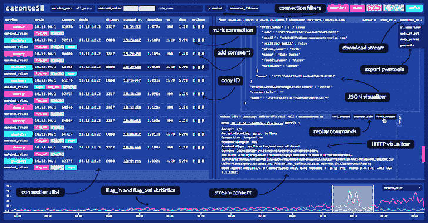
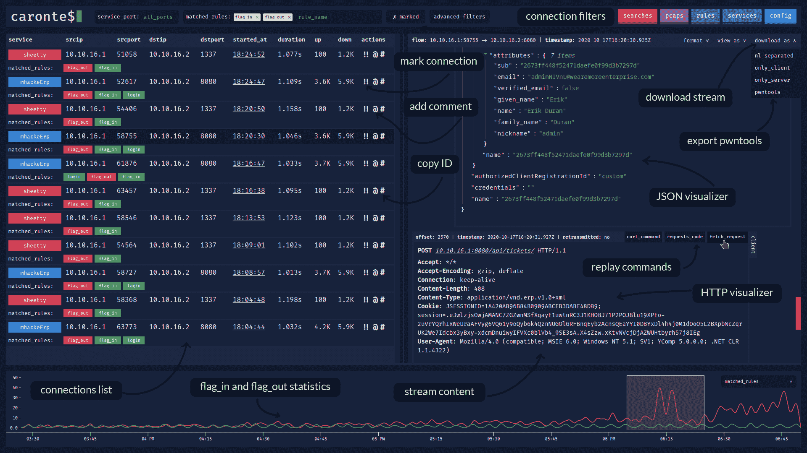
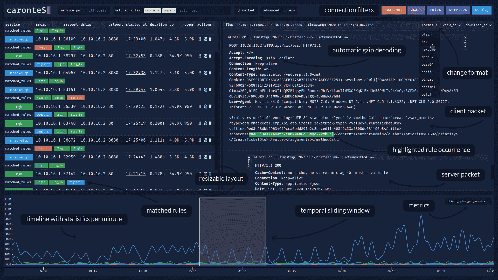
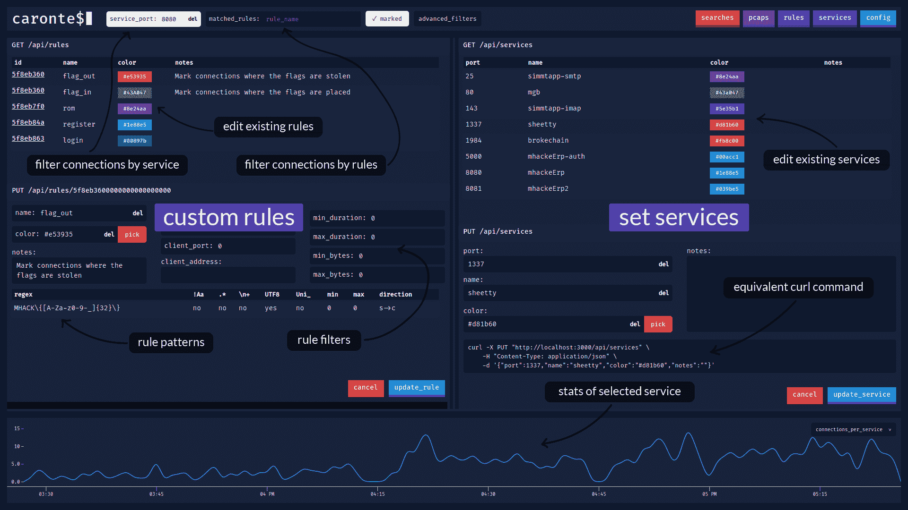
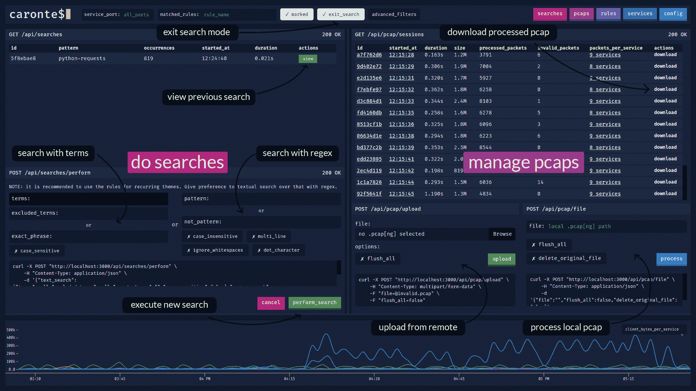

# Caronte:一个分析攻防夺旗比赛中网络流量的工具

> 原文：<https://kalilinuxtutorials.com/caronte/>

**Caronte** 是一个在捕获攻击/防御类型的标志事件时分析网络流量的工具。它重组 pcap 文件中捕获的 TCP 数据包以重建 TCP 连接，并分析每个连接以找到用户定义的模式。这些模式可以定义为正则表达式或使用特定于协议的规则。连接流保存在数据库中，可以通过 web 应用程序可视化。还提供了 REST API。

**特性**

*   使用 docker-compose 立即安装
*   没有配置文件，可以通过 GUI 或 API 更改设置
*   待分析的 pcaps 可通过`curl`本地或远程加载，或通过 GUI 加载
    *   也可以从 GUI 下载 pcap 并查看每个 pcap 的所有分析统计数据
*   可以创建规则来识别包含特定字符串的连接
    *   模式匹配通过正则表达式(regex)完成
    *   也支持 UTF-8 和 Unicode 格式的正则表达式
*   连接可以通过服务类型来标记，由端口号来标识
    *   每个服务可以分配不同的颜色
*   能够按地址、端口、维度、时间、持续时间、匹配规则过滤连接
*   时间线显示每分钟采样的不同指标的统计数据
    *   这些度量中的一些是*连接 _ 每服务*、*客户端 _ 字节 _ 每服务*、*服务器 _ 字节 _ 每服务*、*持续时间 _ 每服务*、*匹配 _ 规则*
        *   使用 *matched_rules* 度量，可以看到 *flag_in* 和 *flag_out* 之间的关系
    *   时间轴包含一个滑动窗口，可用于搜索特定时间间隔内的连接
*   按术语、求反术语、精确短语、正则表达式、求反正则表达式进行高级搜索
    *   执行的搜索被保存，以便在以下时间立即重复
*   自动重建检测到的 HTTP 连接
    *   HTTP 请求可以通过`curl`、`fetch`和`python requests`进行复制
    *   压缩的 HTTP 响应(gzip/deflate)会自动解压缩
*   能够导出和查看各种格式的连接内容，包括十六进制和 base64
*   JSON 内容显示在 JSON 树查看器中，HTML 代码可以在单独的窗口中呈现
*   匹配规则的出现在连接内容视图中突出显示
*   支持 IPv4 和 IPv6 地址
    *   如果为要防御的易受攻击的机器分配了更多地址，可以使用 CIDR 地址

**安装**

有两种安装 Caronte 的方法:

*   用 Docker 和 docker-compose，最快最简单的方法
*   手动安装依赖项并编译项目

**与 Docker 一起运行**

唯一要做的事情是:

*   克隆回购，用`**git clone https://github.com/eciavatta/caronte.git**`
*   在`**caronte**`文件夹中，运行`**docker-compose up -d**`
*   等待图像被编译，并在`**http://localhost:3333**`打开浏览器

**手动安装**

首先要做的是安装依赖项:

*   围棋> = 1.14[https://golang.org/doc/install](https://golang.org/doc/install)
*   节点> = V12[https://nodejs.org/it/download/](https://nodejs.org/it/download/)
*   https://classic.yarnpkg.com/en/docs/install/
*   超级扫描> = V5[https://www.hyperscan.io/downloads/](https://www.hyperscan.io/downloads/)

接下来您需要编译这个项目，它由两部分组成:

*   后端，可以用`**go mod download && go build**`编译
*   前端，可以用`**cd frontend && yarn install && yarn build**`编译

在运行 Caronte 之前，启动一个没有身份验证的 MongoDB[https://docs . MongoDB . com/manual/administration/install-community/](https://docs.mongodb.com/manual/administration/install-community/)实例。*注意不要在公共接口上暴露 MongoDB 端口。*

用 **`./caronte`运行二进制。**可用的配置选项有:

**-bind-address 服务器被绑定的地址(默认为“0 . 0 . 0 . 0”)
-bind-port 服务器被绑定的端口(默认为 3333)
-db-name 要使用的数据库的名称(默认为“ca ronte”)
-mongo-MongoDB 的主机地址(默认为“localhost”)
-mongo-port MongoDB 的端口(默认为 27017)**

**配置**

配置在第一次启动时通过图形界面或 API 在运行时进行。有必要设置:

*   `**server_address**`:易受攻击机器的 ip 地址。必须是 pcaps 中所有连接的目的地址。如果每个易受攻击服务都有自己的 ip，则此参数还接受 CIDR 地址。地址可以是 IPv4 和 IPv6
*   `**flag_regex**`:匹配一个标志的正则表达式。通常在竞赛规则页面上提供
*   `**auth_required**`:如果为真，则启用基本认证以保护分析仪
*   可选的`**accounts**`数组，包含授权用户的凭证

**文档**

后端，用 Go 语言写的，是设计成服务的。它公开了使用 React 编写的前端所使用的 REST API。可用 API 列表及其解释可在此处获得:[https://app.swaggerhub.com/apis-docs/eciavatta/caronte/WIP](https://app.swaggerhub.com/apis-docs/eciavatta/caronte/WIP)

**截图**

下面有一些截图显示了该工具的主要功能。

**主窗口，带有连接列表和流内容**

**主窗口，时间轴展开**

**规则和服务视图**

**搜索和 pcaps 视图**

[**Download**](https://github.com/eciavatta/caronte)