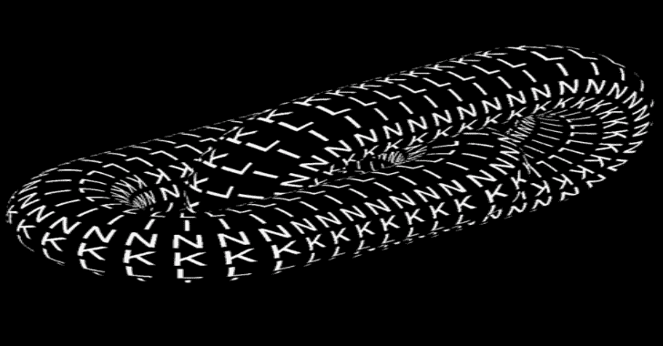

# Link:用 Rust 编写的命令和控制框架

> 原文：<https://kalilinuxtutorials.com/link/>

Link 提供 MacOS、Linux 和 Windows 植入物，这些植入物可能缺少其他更成熟的命令和控制框架所提供的必要的规避技术。

仅在 Linux 上测试。

**特性**

希望这个列表能扩展到人们真正想使用的地方:

*   HTTPS 通信
*   过程注入
*   内存中。NET 程序集执行
*   形状集合工具
*   用于外壳代码生成的 sRDI 实现
*   Windows 链接将 dll 从磁盘重新加载到当前进程中

**构建过程**

*   克隆或下载回购
*   `**cargo run**`如果你现在就想跑
*   **`**cargo build --release**`构建链接服务器可执行文件**

 **更多信息请查看[安装和使用](https://github.com/postrequest/link/wiki/Installation-and-Usage)。

[**Download**](https://github.com/postrequest/link)**