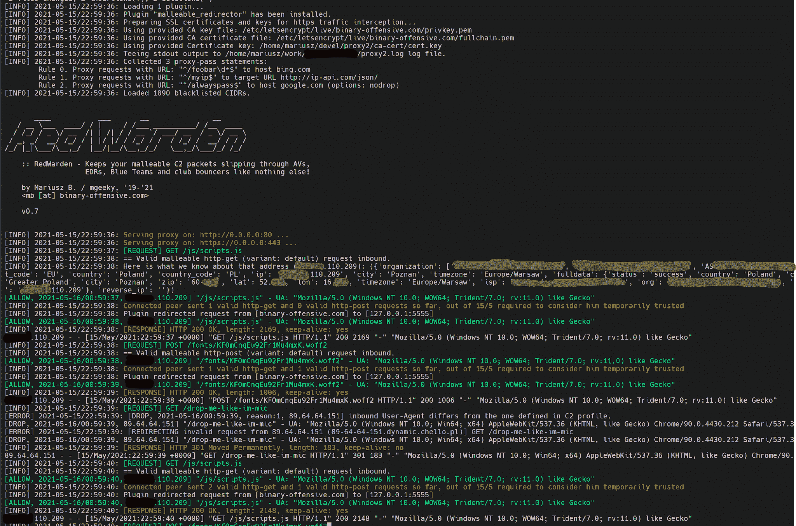
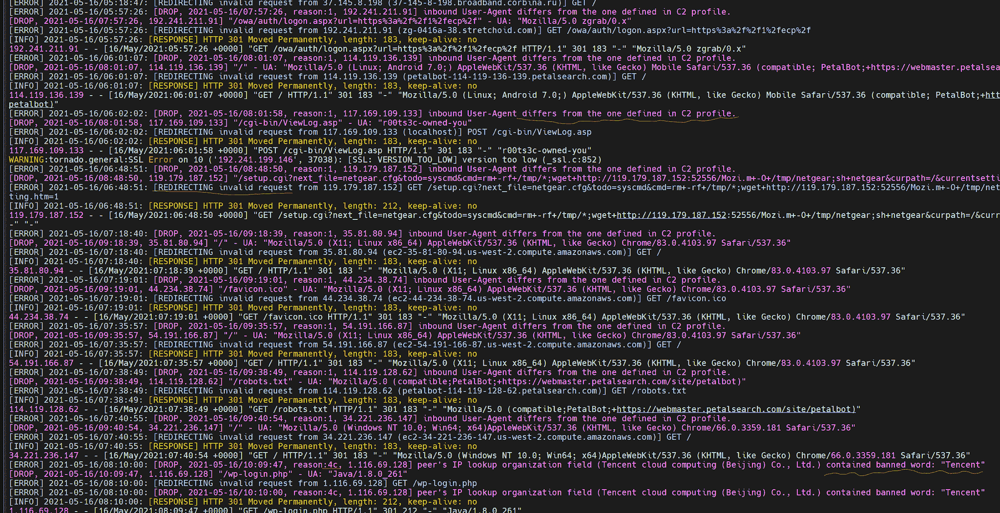
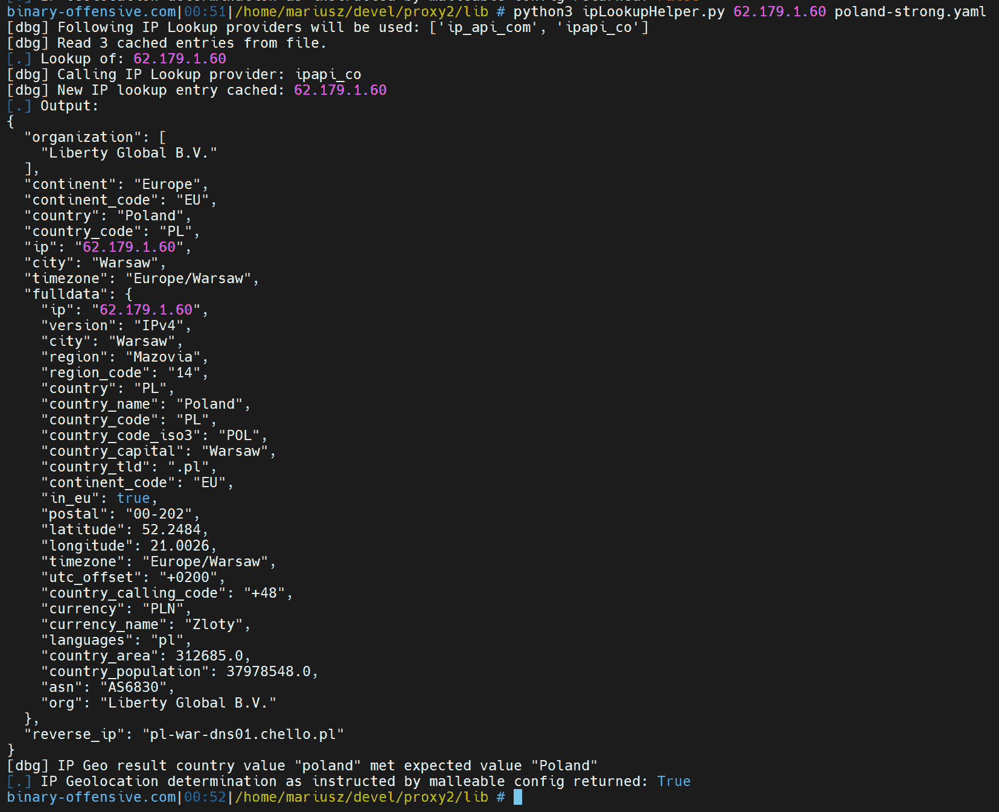

# RedWarden:灵活的 CobaltStrike 韧性转向器

> 原文：<https://kalilinuxtutorials.com/redwarden/>

Red Teaming business 已经看到了[几个](https://bluescreenofjeff.com/2016-04-12-combatting-incident-responders-with-apache-mod_rewrite/) [不同的](https://posts.specterops.io/automating-apache-mod-rewrite-and-cobalt-strike-malleable-c2-profiles-d45266ca642) [伟大的](https://gist.github.com/curi0usJack/971385e8334e189d93a6cb4671238b10)想法，关于如何打击事件响应者并误导他们，同时提供抵抗 C2 重定向网络。

这项工作将许多伟大的想法结合成一个轻量级的实用程序，模仿 Apache2 作为简单 HTTP(S)反向代理的根源。

结合可延展的 C2 配置文件理解、对不良 IP 地址池的了解以及轻松添加新检查和错误路由逻辑的灵活性，产生了一种用于 IR 检查的巧妙的防护器。

如果任何无效的入站数据包到达 RedWarden 您可以`**redirect**`、**、`reset`、**或直接**、**将其带走！

**摘要**

这个程序充当一个 HTTP/HTTPS 反向代理，对入站 C2 HTTP 请求施加了一些限制，选择哪些数据包被定向到 Teamserver，哪些被丢弃，类似于。Apache2 的 **`mod_rewrite`中规定的 htaccess 文件限制。**

**`RedWarden`** 是为了解决 C2 重定向器层的 IR/AV/EDRs/Sandboxes 规避问题而创建的。它旨在取代用于此目的的经典 Apache2 + mod_rewrite 设置。

**特性**

*   延展性 C2 配置文件解析器能够严格按照延展性的合同验证入站 HTTP/S 请求，并在违反时丢弃非法数据包(延展性配置文件 4.0+及其变体)
*   能够取消过滤/修复由代理和缓存(如 CloudFlare)等临时系统添加的意外和不需要的 HTTP 头，以符合有效的可延展合同。
*   已知与 IT 安全供应商相关的 IPv4 池和范围的综合策划的大规模黑名单
*   可更新的输出日志条目(Apache2 组合访问日志和自定义 RedWarden 格式)有助于跟踪对等连接事件/问题
*   能够根据 IP 地理位置/whois 信息查询连接对等方的 IPv4 地址，并使用预定义的正则表达式来排除在可信组织/国家/城市等之外连接的对等方。
*   通过将接受的请求的 MD5 哈希值记录到本地存储的 SQLite 数据库中并阻止以前接受的请求，实施内置重放攻击缓解。
*   允许定义 ProxyPass 语句，将匹配特定 URL 的请求传递到其他主机
*   支持多个团队服务器
*   支持许多反向代理主机/以随机顺序排列的重定向站点，从而实现流量负载平衡或构建更加通用的基础设施
*   可以根据预期的可延展契约修复 HTTP 数据包，以防某些报头在流量中被破坏
*   由于详细的 HTTP(S)请求/响应日志，花在排除“为什么我的信标在 CloudFlare/CDN/Domain Fronting 上不起作用”的故障上的不眠之夜现在结束了

RedWarden 将可塑性强的 C2 个人资料和 teamserver 的`**hostname:port**`作为其输入。然后，它解析提供的有延展性的概要文件部分，以理解契约，并只传递那些满足它的入站请求，同时误导其他请求。

诸如 **`http-stager`、**、`**http-get**`、`**http-post**`的部分以及它们相应的 uri、报头、前置/附加模式、用户代理都用于区分合法信标的请求和不相关的因特网噪声或超出绑定包的 IR/AV/EDRs。

该程序受益于令人惊叹的已知不良 IP 范围来自:curi0usJack 和其他:[https://gist . github . com/curi 0 us jack/971385 e 8334 e 189d 93 a6 CB 4671238 b 10](https://gist.github.com/curi0usJack/971385e8334e189d93a6cb4671238b10)

通过反向 IP DNS 查询和 HTTP 报头检查，使用 IP 地址黑名单以及已知的不良关键字查找，为希望检查攻击者基础设施的未授权对等体带来了可靠性，从而大大提高了重定向器的弹性。

无效数据包可能会根据三种策略被错误路由:

*   **重定向**:简单地将对方重定向到另一个网站，如 Rick Roll。
*   **复位**:立即切断 TCP 连接。
*   **proxy** :从另一个网站获取响应，尽可能模仿被克隆/劫持的网站。

此配置在配置文件中是强制性的:

# **如何处理发起的请求不符合信标、白名单或
#ProxyPass inclusive 语句:
#--"使用(HTTP 301)，
#--"重置"与连接客户端的 TCP 连接
#-"代理"请求，充当指定 action_url 的反向代理
#(如果客户端获取了它不应该看到的内容，可能会很危险！)
#有效值:“重置”、“重定向”、“代理”。
# Default:redirect
drop _ action:redirect**

下面的例子显示了`**redirect**`到**T1:**的结果

明智地使用，保持安全。

**要求**

这个程序只能在 Linux 系统上运行，因为它使用 fork 来产生多个进程。

此外， **`openssl`** 系统命令预计将被安装，因为它用于生成 SSL 证书。

最后，使用以下工具轻松安装 Python3 PIP 的所有需求:

**bash $ sudo pip 3 install-r requirements . txt**

**用途**

**示例用法**

最小的 RedWarden 的 **config.yaml** 配置文件可以包含:

**port:
–80/http
–443/https
profile:jquery-c 2 . 3 . 14 . profile
SSL _ cacert:/etc/letsencrypt/live/attack . com/full chain . PEM
SSL _ cakey:/etc/letsencrypt/live/attack . com/privkey . PEM
teamserver _ URL:
–1.2.3.4:8080
drop _ action:reset**

然后，可以通过给程序一个到配置文件的路径来启动程序:

**bash $ sudo python 3 red warden . py-c config . YAML
[INFO]19:21:42:加载 1 个插件…
[INFO] 19:21:42:插件“malleable _ redirector”已安装。
【INFO】19:21:42:准备用于 https 流量拦截的 SSL 证书和密钥……
【INFO】19:21:42:使用提供的 ca 密钥文件:CA-cert/CA . key
【INFO】19:21:42:使用提供的 CA 证书文件:CA-cert/CA . CRT
【INFO】19:21:42:使用提供的证书密钥:CA-cert/cert . key【T7【INFO】19:21:42:服务
【信息】19:21:42:插件将请求从【code.jquery.com】重定向到【1.2.3.4:8080】
【信息】19:21:42:[响应] HTTP 200 OK，长度:5543
【信息】19:21:45:[请求] GET /jquery-3.3.1.min.js
【信息】19:21:45: ==有效的可延展 http-get 请求入站。
【信息】19:21:45:插件将请求从【code.jquery.com】重定向到【1.2.3.4:8080】
【信息】19:21:45:[响应] HTTP 200 OK，长度:5543
【信息】19:21:46:[请求] GET /
[…]
【错误】19:24:46:[丢弃，原因:1]入站用户代理与 C2 配置文件中定义的不同。
[…]
[INFO]19:24:46:[RESPONSE]HTTP 301 永久移动，长度:212
[INFO]19:24:48:[REQUEST]GET/jquery-3 . 3 . 1 . min . js
[INFO]19:24:48:= =有效的可延展 http-get 请求入站。
【信息】19:24:48:插件将请求从【code.jquery.com】重定向到【1.2.3.4:8080】
[…]**

上面的输出包含一行，指出有一个未经授权的、不符合我们的 C2 配置文件入站请求，该请求由于存在不兼容的用户代理字符串而被丢弃:

**[…]
[丢弃，原因:1]入站用户代理与 C2 配置文件中定义的不同。
[……]**

**用例**

**对您的信标流量发起者实施 IP 地理定位**

你已经很好地完成了你的费西合唱团预演和演出。你现在知道你的目标住在哪里，并有一些线索，交通应该来自哪里，或至少如何检测完全辅助交通。如何对重定向器上的信标请求实施 IP 地理定位？

RedWarden 来帮忙了！

比方说，您只想接受来自欧洲波兰的流量。您在费西合唱团/奥辛那提之前的结果表明:

*   是您的一个目标的合法 IP，来自波兰
*   而这一个不是，它是作为一个普通的互联网噪音包到达您的系统的。

您可以使用 RedWarden 的实用程序 **`lib/ipLookupHelper.py`** 来收集关于这两个地址的 IP 地理元数据:

**bash $ python 3 iplookuphelper . py
用法:。/iplookuphelper . py[maltable-redirector-config]
使用这个小实用程序来收集关于您的目标 IPv4 地址的 IP 查找详细信息，并验证
proxy 2 maltable-redirector-config . YAML 的“ip_geolocation_requirements”部分是否与那个
IP 地址匹配。如果没有给出第二个参数–否**

前者带来:

**bash $ python 3 iplookuphelper . py 89.64.64.150
[dbg]将使用以下 IP 查找提供程序:['ip_api_com '，' ipapi_co']
[。]查找:89.64.64.150
[dbg]调用 ip 查找提供者:ipapi_co
[dbg]调用 IP 查找提供者:ip_api_com
[dbg]新的 IP 查找条目缓存:89.64.64.150
[。]输出:
{
"组织":[
"UPC Polska Sp。z o.o . "、
、【UPC.pl】、
、【AS6830 Liberty Global B.V】、
、
、【大陆】:“欧洲”、
、【大陆 _ 代码】:“欧盟”、
、【国家】:“波兰”、
、【国家 _ 代码】:“pl”、
、【IP】:“89 . 64 . 64 . 150”、
、【城市】:“华沙”、“z o.o . "、
" as ":" as 6830 Liberty Global b . v . "、
" query ":" 89 . 64 . 64 . 150 "
}、
" reverse _ IP ":" 89-64-64-150 . dynamic . chello . pl "
}**

后者给出了:

**bash $ python 3 iplookuphelper . py 59.99.140.76
[dbg]将使用以下 IP 查找提供程序:['ip_api_com '，' ipapi_co']
[dbg]从文件中读取 1 个缓存条目。
【。]查找对象:59.99.140.76
调用 ip 查找提供者:IP _ API _ com
【dbg】新的 IP 查找条目缓存:59.99.140.76
【。]输出:
{
"组织":
"，
"BSNL 互联网"，
"AS9829 国家互联网骨干网"
，
"洲": "亚洲"，
"洲 _ 码": " AS "，
"国家":"印度"，
"国家 _ 码":" IN "，
"ip": "59.99.140.76 "，**

现在你看到前者有`**"country": "Poland"**`而后者有**T1。**有了这些知识，我们就可以用一本厚重的 YAML 词典来设计我们的约束条件了:

**IP _ geolocation _ requirements:
组织:
洲:
洲 _ 代码:
国家:
–波兰
–PL
–波兰
国家 _ 代码:
城市:
时区:**

每个字典条目都接受正则表达式，以便根据确定的入站对等体的 IP 地址的 IP 地理元数据进行匹配。我们在`**country**`属性中使用三个条目来允许请求具有一个指定的值。

在您的配置中进行设置后，您可以使用接受第二个参数的`**ipLookupHelper**`实用程序来验证另一个 IP 地址是否会通过 RedWarden 的 IP 地理位置鉴别器:

最后一行告诉您数据包是被阻止还是被接受。

仅此而已！明智而安全地配置您的 IP 地理位置限制，仔细检查 RedWarden 日志中任何与 IP 地理相关的丢弃条目，并保持您的 C2 流量整洁！

**修复被篡改的信标请求**

如果您碰巧使用 AWS Lambda 或 CloudFlare 等临时系统作为您的域转发/重定向器，那么您肯定会遇到这样的情况:您的一些数据包无法被 Teamserver 接受，因为它们偏离了商定的可延展合同。是被篡改或删除的 HTTP 头，重新排序的 cookies 还是其他什么——我打赌那浪费了你生命中的很多时间。

为了解决 C2 频道设置过程问题和临时系统篡改，RedWarden 提供了修复信标数据包的功能。

它通过检查可延展的配置文件期望数据包是什么来做到这一点，并且可以根据配置文件的要求将配置的 HTTP 报头恢复到它们同意的值。

考虑以下简单的配置文件:

**http-get {
set uri "/API/ABC "；
客户端{
header " Accept-Encoding " " gzip，deflate "；
元数据{
base 64 URL；
NetBIOS；
base 64 URL；
参数“auth”；
}
}
…**

你看这个`**Accept-Encoding**`？每个信标请求都必须带有那个报头和那个值。如果你的信标击中了 CloudFlare 系统，它们发出的请求将从报头中删除，或者将使用 **`Accept-Encoding: gzip`** 代替，会发生什么？Teamserver 会当场放弃请求。

通过在名为`**protect_these_headers_from_tampering**`的 RedWarden 配置部分设置这个头，你可以保护你的连接。：

# **如果 RedWarden 验证入站请求的 HTTP 标头，根据策略# DROP _ maltable _ without _ expected _ header _ value:
# "[IP:DROP，reason:6] HTTP 请求不包含预期的标头值:"
" #并检测到某些标头丢失或被覆盖，则该请求将被丢弃。不过，我们可以稍微放松一下这个策略
，因为在某些情况下，缓存系统(如 Cloudflare)可能会篡改我们的请求，从而
破坏可延展的契约。我们所能做的是指定标题列表，这些标题应该被覆盖回它们在所提供的延展性配置文件中定义的值
。
例如，如果我们的配置文件期望:
header " Accept-Encoding " " gzip，deflate "；
但是我们收到一个请求，它设置了下面的头:
Accept-Encoding: gzip
因为它被一些中间系统(如 web 代理或缓存)篡改了，我们可以
检测到这一点，并将那个头的值设置回延展性配置文件中所期望的值。
为了保护 Accept-Encoding 头，例如，可以使用以下配置:
protect _ these _ headers _ from _ tampering:
–Accept-Encoding
默认:
protect _ these _ headers _ from _ tampering:
–Accept-Encoding**

**示例输出**

让我们看看代理产生的输出。

在`**verbose: True**`选项下，详细度将被设置为 INFO，最多从丢弃的请求中分辨出接受的请求。

如果请求符合 RedWarden 配置文件中配置的所有标准，则该请求可能会被接受。这样的情况会跟随着 **`[ALLOW, ...]`** 的录入日志:

**[INFO]2021-04-24/17:30:48:[REQUEST]GET/js/scripts . js
[INFO]2021-04-24/17:30:48:= =有效的延展性 http-get (variant: default)请求入站。【111.222.223.224】【信息】2021-04-24/17:30:48:[允许，2021-04-24/19:30:48]"/js/scripts . js "-UA:" Mozilla/5.0(Windows NT 10.0；WOW64 三叉戟/7.0；rv:11.0)就像 Gecko "
[INFO]2021-04-24/17:30:48:连接的对等体迄今发送了 2 个有效的 http-get 和 0 个有效的 http-post 请求，在认为他暂时可信所需的 15/5 中
[INFO] 2021-04-24/17:30:48:插件将请求从[attacker.com]重定向到[127.0.0.1:5555]**

如果请求没有通过 RedWarden 对每个请求进行的任何检查，将发出相应的`[DROP, ...]`行，其中包含关于丢弃**原因**的信息。：

**[INFO]2021-04-24/16:48:28:[REQUEST]GET/
[ERROR]2021-04-24/16:48:29:[DROP，2021-04-24/18:48:28，原因:1，128.14.211.186]入站用户代理与 C2 配置文件中定义的用户代理不同。【128.14.211.186】2021-04-24/16:48:29:[滴，2021-04-24/18:48:28]"/"-UA:" Mozilla/5.0(Windows NT 10.0；Win64x64) AppleWebKit/537.36 (KHTML，像壁虎一样)Chrome/60 . 0 . 3112 . 113 Safari/537.36 "
[错误]2021-04-24/16:48:29:[重定向来自 128.14.211.186 的无效请求(ZL-dal-us-gp3-wk 107 . internet-census . org)]GET/**

**撤销政策微调**

有很多原因决定了请求是否可以被放弃。这些检查中的每一项都可以根据需要或在微调或错误决策修正过程中独立开启和关闭:

摘自 **`example-config.yaml` :**

# **细粒度的请求丢弃策略–通过将它们设置为 False，让您决定要强制执行哪些检查
#以及要跳过哪些检查#
#默认:启用所有检查
策略:
#[IP: ALLOW，reason:0]请求符合 ProxyPass 条目(url="…" host="…")。将请求传递到指定的主机
ALLOW _ proxy _ pass:True
#[IP:ALLOW，reason:2]根据允许的请求数将对等方的 IP 动态添加到白名单中
ALLOW _ dynamic _ Peer _ whitelisting:True
#[IP:DROP，reason:1]入站用户代理与 C2 配置文件中定义的不同。
DROP _ invalid _ user agent:True
#[IP:DROP，reason:2] HTTP 头名称包含禁用词
DROP _ HTTP _ banned _ header _ names:True
#[IP:DROP，reason:3] HTTP 头值包含禁用词:
DROP _ HTTP _ banned _ header _ value:True
#[IP:DROP，reason:4b]对等体的反向 IP 查找包含禁用词
DROP _ dangerous _ IP _ reverse _ lookup:True 以通用方式禁止同行。
DROP _ IP geo _ metadata _ containing _ banned _ keywords:True
#[IP:DROP，reason:5] HTTP 请求未包含预期的头
DROP _ maltable _ without _ expected _ header:True
#[IP:DROP，reason:6] HTTP 请求未包含预期的头值:
DROP _ maltable _ without _ expected _ header _ value:True
#[IP:DROP，reason:7] HTTP 请求未包含预期的(元数据| id |输出)段头:) 原因:9]找不到追加模式:
DROP _ malable _ without _ prepend _ pattern:True
#[IP:DROP，reason:10]找不到追加模式:
DROP _ malable _ without _ app pend _ pattern:True
#[IP:DROP，reason:11]请求的 URI 没有对齐任何可延展的已定义变量:
DROP _ malable _ unknown _ URIs:True
#[IP:DROP，reason:12] HTTP 请求应该包含**

默认情况下，所有这些检查都是强制执行的。

转动`**debug: True**`将会用大量的日志行淹没你的控制台缓冲区，这些日志行描述了 RedWarden 在其复杂的决策过程中采取的每一步。如果你想完整地看到你的请求和响应——将`**debug**`和`**trace**`设置为真，然后埋头于日志记录中吧！

**常见问题解答**

没有延展性配置文件，这个程序能运行吗？

是的，它可以。然而，请求检查逻辑将被关闭，其余的应该工作正常:IP 地理位置执行，反向查找逻辑，禁止的 IP 列表等。

这个程序也能很容易地适应其他 C2 框架吗？比如神话，盟约等？

很容易，不。通过一些努力，是的。正如我下面所描述的，这个工具写得很糟糕，会让其他 C2s 改编变得很痛苦。然而，只要花些时间和精力，这是完全可行的。

我的数据包掉线了。为什么？

尽量让**`debug: True`**`**trace: True**`收集尽可能多的日志。然后，您需要查看日志并检查发生了什么。在你的可塑性档案中，这些包看起来和你期望的一模一样吗？或者网络上有一个微妙的篡改，导致 RedWarden 丢弃了这个包(这也可能使 Teamserver 丢弃它？).

**已知问题**

*   它*可能*给交互式睡眠吞吐量增加一点开销
*   ProxyPass 处理逻辑远非完美，而且*真的*有问题(哦，天哪，真难看！).
*   怪异形式的配置文件可能会使 RedWarden 解析器脱轨，并使其抱怨。克服这一点最简单的方法是复制`**example-config.yaml**`并对其进行修改。

哦，我的上帝，为什么这个代码是一堆工程垃圾？

代码是*一个他妈的一塌糊涂的大地狱*——我承认这一点——这也有一个诚实的原因:该项目在实际的红队参与期间开发了 90%。众所周知，这类约定需要做很多事情，几乎没有时间进行适当的复杂工具开发。更不用说这个项目在项目设置中的重要性了。这个工具最初是作为一个用 Python2 编写的简单代理脚本开始的，然后演变成一个带插件的代理，收到了`**malleable_redirector**`插件——从那以后我一直努力保持 **`proxy2`** 向后兼容(可怜的我，我就像微软一样！)和我为它制作的其他插件，并坚持它最初的目的。

是时候放手了，重塑它，并开始修复所有引入的坏代码味道。

综上所述，请在提出问题、提交请求时对我表示一定程度的同情，并尽力帮助而不是评判！🙂谢谢！

[**Download**](https://github.com/mgeeky/RedWarden)