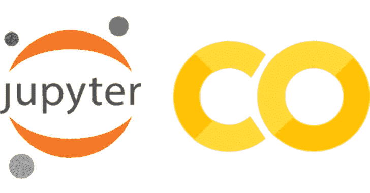

# Penglab:滥用 Google Colab 破解哈希

> 原文：<https://kalilinuxtutorials.com/penglab/>

Penglab 是 Google Colab 上的一个现成的安装程序，可以以惊人的能力破解散列，对 CTFs 非常有用。

**默认安装:**

*   哈希卡特
*   约翰
*   水螅
*   SSH(带 ngrok)

**而现在，它还可以:**

*   启动集成外壳
*   赶紧下载单词表 Rockyou 和 HashesOrg2019！

你只需要一个谷歌账户就可以使用谷歌 Colab，使用 ngrok 进行 SSH。

**怎么用？**

*   继续:[https://colab . research . Google . com/github/MX rch/Peng lab/blob/master/Peng lab . ipynb](https://colab.research.google.com/github/mxrch/penglab/blob/master/penglab.ipynb)
*   选择“**运行时**”、“**改变运行时类型**”，将“**硬件加速器**设置为 **GPU** 。
*   通过在您想要安装的工具上设置“ **True** ”来更改配置。
*   选择**运行时**和**运行全部**

**什么是 Google Colab？**

Google Colab 是一项免费的云服务，基于 Jupyter 笔记本电脑，用于机器学习教育和研究。它提供了一个完全配置用于深度学习的运行时，并免费访问一个强大的 GPU。

**基准**

**Hashcat 基准**

**设备#1:特斯拉 P100-PCIE-16GB，16017/16280 MB，56 MCU
OpenCL API(OpenCL 1.2 CUDA 10 . 1 . 152)–平台#1【英伟达公司】
设备#2:特斯拉 P100-PCIE-16GB，跳过
基准测试相关选项:
–优化-内核-启用
内核支持的最小密码长度:0
内核支持的最大密码长度:55
has# 1…………:27008.0 MH/s(69.17 ms)@ Accel:64 Loops:512 Thr:1024 Vec:8
内核支持的最小密码长度:0
内核支持的最大密码长度:55
hash mode:100——SHA1
速度。# 1………:9590.3 MH/s(48.61 ms)@ Accel:8 Loops:1024 Thr:1024 Vec:1
内核支持的最小密码长度:0
内核支持的最大密码长度:55**

**速度测试**

**来自 Google Cloud (35.203.136.151)的测试……
检索 speedtest.net 服务器列表……
基于 ping 选择最佳服务器……
由 KamaTera INC(加利福尼亚州圣克拉拉市)主持【11.95 公里】:28.346 毫秒
测试下载速度……………………………………………………………………………………………………..
下载:2196.68 Mbit/s
测试上传速度
上传:3.87 Mbit/s**

[**Download**](https://github.com/mxrch/penglab)